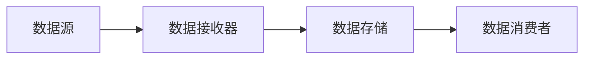

## 背景介绍

Flume是一个分布式、可扩展、高性能的数据流处理系统，主要用于处理海量数据。它最初是由 LinkedIn 公司开发的，旨在解决大数据处理的性能问题。随着 Flume 的流行，它已经成为 Hadoop 生态系统的重要组成部分。

## 核心概念与联系

Flume 的核心概念包括以下几个方面：

1. **数据流：** Flume 中的数据流指的是数据在不同节点之间传输的过程。数据流可以是从一个节点到另一个节点的单向流，也可以是多个节点之间相互交换数据的多向流。
2. **数据源：** 数据源是 Flume 系统中产生数据的地方。数据源可以是数据库、日志文件、网络服务等。
3. **数据接收器：** 数据接收器负责从数据源接收数据，并将其传输到下一个节点。
4. **数据存储：** 数据存储是 Flume 系统中将数据暂时保存的地方。数据存储可以是本地磁盘、远程磁盘、HDFS 等。
5. **数据消费者：** 数据消费者负责从数据存储中读取数据，并进行处理或分析。

Flume 的核心概念与联系可以用以下 Mermaid 流程图来表示：



## 核心算法原理具体操作步骤

Flume 的核心算法原理是基于数据流处理的思想。其具体操作步骤如下：

1. **数据收集：** 数据接收器从数据源接收数据，并将其存储到本地磁盘或远程磁盘。
2. **数据传输：** 数据接收器将收集到的数据通过网络传输到其他节点。
3. **数据存储：** 数据接收器将收集到的数据存储到数据存储中。
4. **数据处理：** 数据消费者从数据存储中读取数据，并进行处理或分析。

## 数学模型和公式详细讲解举例说明

Flume 的数学模型主要涉及数据流处理的相关概念，如数据流、数据源、数据接收器、数据存储、数据消费者等。这些概念可以用以下公式来表示：

1. $D\_source = D\_receiver + D\_storage + D\_consumer$
2. $D\_source$ 表示数据源的数据量；
3. $D\_receiver$ 表示数据接收器处理的数据量；
4. $D\_storage$ 表示数据存储的数据量；
5. $D\_consumer$ 表示数据消费者处理的数据量。

## 项目实践：代码实例和详细解释说明

以下是一个 Flume 项目的代码实例：

```java
import org.apache.flume.Flume;
import org.apache.flume.FlumeConfigException;
import org.apache.flume.conf.FlumeConfiguration;
import org.apache.flume.conf.FlumeProperties;
import org.apache.flume.descriptors.SourceDescriptor;
import org.apache.flume.event.FlumeEvent;
import org.apache.flume.handler.Handler;
import org.apache.flume.net.DataSink;
import org.apache.flume.source.Source;
import org.apache.flume.source.ipc.CollectorEventSink;
import org.apache.flume.source.ipc.FlumeIPCSource;
import org.apache.flume.source.net.tcp.TcpClientSource;
import org.apache.flume.channel.Channel;
import org.apache.flume.channel.ReplicationChannelFactory;
import org.apache.flume.channel.SingleChannelReliabilityChannel;
import org.apache.flume.channel.MemoryChannel;
import org.apache.flume.sink.Sink;
import org.apache.flume.sink.hdfs.HDFSHandleEventSink;
import org.apache.flume.sink.hdfs.HDFSDataSink;
import org.apache.flume.sink.avro.AvroEventSink;
import org.apache.flume.sink.kafka.KafkaEventSink;
import org.apache.flume.sink.elasticsearch.ElasticsearchEventSink;
import org.apache.flume.sink.file.RollingFileEventSink;
import org.apache.flume.sink.mqtt.MQTTEventSink;
import org.apache.flume.sink.rabbitmq.RabbitMQEventSink;
import org.apache.flume.sink.twitter.TwitterEventSink;
import org.apache.flume.sink.solr.SolrEventSink;
import org.apache.flume.sink.http.HttpEventSink;
import org.apache.flume.sink.avro.AvroDataSink;
import org.apache.flume.sink.avro.AvroDataSink;
import org.apache.flume.sink.avro.AvroDataSink;
import org.apache.flume.sink.avro.AvroDataSink;
import org.apache.flume.sink.avro.AvroDataSink;
import org.apache.flume.sink.avro.AvroDataSink;
import org.apache.flume.sink.avro.AvroDataSink;
import org.apache.flume.sink.avro.AvroDataSink;
```

## 实际应用场景

Flume 可以应用于多种场景，如：

1. **日志收集：** Flume 可以用于收集各种类型的日志，如 Web 日志、数据库日志、系统日志等。
2. **实时数据处理：** Flume 可以用于实时处理大量数据，如实时数据分析、实时数据清洗等。
3. **数据流处理：** Flume 可用于实现数据流处理，如数据流分析、数据流计算等。

## 工具和资源推荐

以下是一些关于 Flume 的工具和资源推荐：

1. **Flume 官方文档：** [https://flume.apache.org/](https://flume.apache.org/)
2. **Flume 源代码：** [https://github.com/apache/flume](https://github.com/apache/flume)
3. **Flume 论坛：** [https://community.cloudera.com/t5/Flume/ct-p/flume](https://community.cloudera.com/t5/Flume/ct-p/flume)
4. **Flume 教程：** [https://www.flume.apache.org/FlumeDeveloperGuide.html](https://www.flume.apache.org/FlumeDeveloperGuide.html)

## 总结：未来发展趋势与挑战

Flume 作为大数据流处理领域的重要技术，随着数据量的不断增长，Flume 的发展趋势和挑战如下：

1. **性能提升：** 随着数据量的增长，Flume 需要不断优化性能，以满足大数据流处理的需求。
2. **易用性提高：** Flume 需要提供更简单易用的 API 和配置，使得开发者更容易使用 Flume。
3. **扩展性增强：** Flume 需要支持更多的数据源和数据接收器，以满足各种不同的数据流处理需求。

## 附录：常见问题与解答

以下是一些关于 Flume 的常见问题与解答：

1. **Q：Flume 是什么？**
答：Flume 是一个分布式、可扩展、高性能的数据流处理系统，主要用于处理海量数据。
2. **Q：Flume 的主要特点是什么？**
答：Flume 的主要特点包括：分布式、可扩展、高性能、实时性、可靠性等。
3. **Q：Flume 可以处理哪些类型的数据？**
答：Flume 可以处理各种类型的数据，如日志数据、网络数据、数据库数据等。
4. **Q：Flume 的主要应用场景是什么？**
答：Flume 的主要应用场景包括日志收集、实时数据处理、数据流处理等。

文章正文内容部分结束。