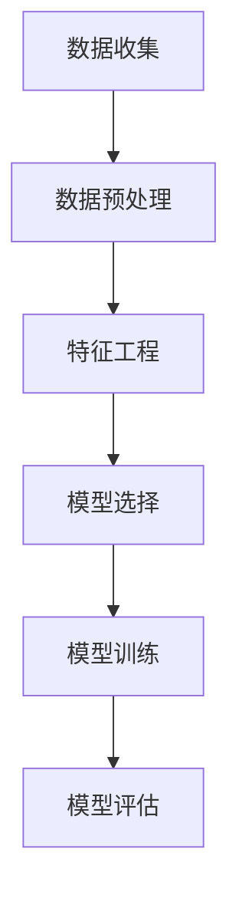

## 1.背景介绍

人工智能（AI）是一个蓬勃发展的领域，它的核心概念是使计算机能够模拟人类的智能行为。机器学习（Machine Learning，简称ML）是人工智能的一个子领域，它研究如何让计算机通过经验学习来做出决策。随着数据量的不断增加，机器学习在各种领域得到了广泛应用，例如医疗、金融、交通等。

## 2.核心概念与联系

机器学习主要包括以下几个核心概念：

1. **数据**：机器学习系统需要大量的数据来训练和测试模型，以便学习和预测。

2. **特征**：特征是数据中可以用来描述和分类的属性，例如人脸识别中的面部特征、语音识别中的音频特征等。

3. **模型**：模型是机器学习系统中的核心部分，通过学习数据和特征来构建预测模型。

4. **算法**：算法是构建和训练模型的方法和步骤，例如梯度下降、支持向量机等。

5. **评估**：评估是用来测量模型性能的方法，例如准确率、召回率等。

## 3.核心算法原理具体操作步骤

以下是一个简单的机器学习流程图：



## 4.数学模型和公式详细讲解举例说明

在本节中，我们将详细讨论一种常用的机器学习算法，例如支持向量机（Support Vector Machine, SVM）。SVM 是一种监督式学习算法，它可以用来解决二分类问题。SVM 的目标是找到一个超平面，可以将不同类别的数据点分开。

假设我们有一个二维空间中的二分类问题，如图 1 所示：


图 1 二分类问题

为了找到一个可以将不同类别的数据点分开的超平面，我们可以使用 SVM 算法。SVM 的目标是找到一个超平面，使得同一类别的数据点到超平面的距离尽可能大。

为了实现这个目标，我们可以使用以下公式：

$$
\min_{w,b} \frac{1}{2}||w||^2 \\
s.t. \quad y_i(w \cdot x_i + b) \geq 1, \quad \forall i
$$

其中，$w$ 是超平面的权重，$b$ 是偏置项，$x_i$ 是数据点，$y_i$ 是数据点的标签。

## 5.项目实践：代码实例和详细解释说明

在本节中，我们将使用 Python 语言和 scikit-learn 库实现 SVM 算法。以下是一个简单的代码示例：

```python
from sklearn import datasets
from sklearn.model_selection import train_test_split
from sklearn.preprocessing import StandardScaler
from sklearn.svm import SVC
from sklearn.metrics import accuracy_score

# 加载数据
iris = datasets.load_iris()
X = iris.data
y = iris.target

# 数据预处理
X_train, X_test, y_train, y_test = train_test_split(X, y, test_size=0.3, random_state=42)
scaler = StandardScaler()
X_train = scaler.fit_transform(X_train)
X_test = scaler.transform(X_test)

# 构建模型
clf = SVC(kernel='linear')

# 训练模型
clf.fit(X_train, y_train)

# 预测
y_pred = clf.predict(X_test)

# 评估
accuracy = accuracy_score(y_test, y_pred)
print("准确率：", accuracy)
```

## 6.实际应用场景

机器学习在实际应用中有很多场景，例如：

1. **推荐系统**：通过分析用户行为和喜好，推荐适合用户的产品和服务。

2. **语音识别**：将语音信号转换为文本，以便与计算机进行交流。

3. **医疗诊断**：通过分析医学影像和数据，辅助医生进行诊断。

4. **金融风险管理**：通过分析金融数据，预测和管理金融风险。

## 7.工具和资源推荐

以下是一些建议的工具和资源，帮助你开始学习和实践机器学习：

1. **Python**：一种流行的编程语言，适合机器学习的开发。

2. **scikit-learn**：一个强大的 Python 库，提供了许多常用的机器学习算法和工具。

3. **TensorFlow**：一种开源的机器学习框架，适合大规模数据处理和深度学习。

4. **Coursera**：一个提供在线课程的平台，提供了许多关于机器学习的课程。

5. **Kaggle**：一个提供机器学习竞赛和数据集的平台，帮助你实践和提高技能。

## 8.总结：未来发展趋势与挑战

随着数据量和计算能力的不断增加，机器学习将在未来继续发展。以下是一些未来发展趋势和挑战：

1. **深度学习**：深度学习是一种基于神经网络的机器学习方法，它在图像识别、自然语言处理等领域取得了显著成果。

2. **自动机器学习**：自动机器学习是一种新的机器学习方法，它可以自动选择和优化算法，以提高模型性能。

3. **数据保护**：随着数据量的增加，数据保护和隐私保护成为一个重要的挑战，需要新的技术和方法来解决。

## 9.附录：常见问题与解答

1. **Q：什么是机器学习？**

A：机器学习是一种人工智能方法，它研究如何让计算机通过经验学习来做出决策。通过使用大量的数据和特征，机器学习可以构建和训练预测模型，以便解决各种问题。

2. **Q：机器学习有什么应用场景？**

A：机器学习在医疗、金融、交通等领域得到了广泛应用，例如推荐系统、语音识别、医疗诊断、金融风险管理等。

3. **Q：如何学习和实践机器学习？**

A：可以通过学习 Python、使用 scikit-learn 等库，参加 Kaggle 竞赛和学习 Coursera 等平台上的课程来学习和实践机器学习。