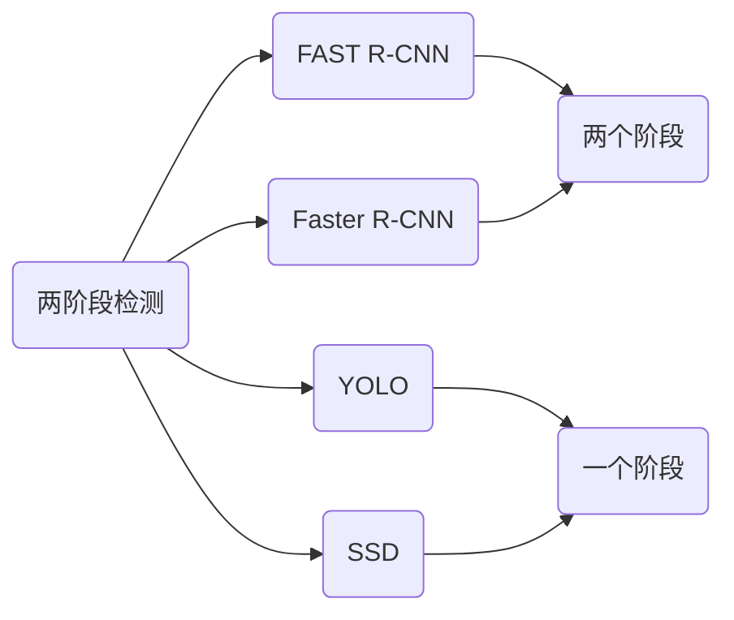
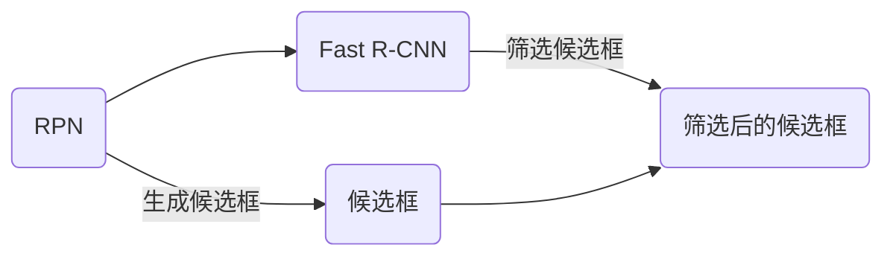

## 背景介绍

近年来，深度学习在计算机视觉领域取得了显著的进展，其中目标检测（Object Detection）技术的发展也引起了广泛关注。目标检测技术的目标是从图像中识别和定位多个物体。它在工业、医疗、安全等多个领域具有广泛的应用前景。本文将从原理、算法、代码实例等方面详细讲解目标检测技术，帮助读者更好地了解和掌握这一技术。

## 核心概念与联系

目标检测技术可以分为两类：两阶段检测和一阶段检测。两阶段检测需要两个阶段进行，首先使用一个检测器生成候选框，然后使用另一个检测器对候选框进行筛选。常见的两阶段检测方法有FAST R-CNN、 Faster R-CNN等。另一类一阶段检测方法使用一个神经网络直接生成候选框和预测类别和位置。常见的一阶段检测方法有YOLO、 SSD等。下图展示了两类检测方法之间的关系：



## 核心算法原理具体操作步骤

Faster R-CNN是一种两阶段目标检测方法，它包括两个主要模块：Region Proposal Network（RPN）和Fast R-CNN。RPN负责生成候选框，Fast R-CNN负责对候选框进行筛选。下图展示了Faster R-CNN的整体流程：



## 数学模型和公式详细讲解举例说明

Faster R-CNN的RPN使用一个共享权重的卷积网络对每个像素点进行卷积，并生成多个anchor框。然后对每个anchor框使用一个全连接层进行分类和回归。下图展示了RPN的数学模型：

```latex
\begin{equation}
f(x_i) = \{W^k * x_i + b^k\}_{k=1}^K
\end{equation}
```

其中\(W^k\)是全连接层的权重，\(b^k\)是全连接层的偏置，\(x_i\)是像素点的特征向量，\(K\)是全连接层的输出大小。

## 项目实践：代码实例和详细解释说明

Faster R-CNN的实现比较复杂，我们可以使用PyTorch和Detectron2库来快速实现一个Faster R-CNN模型。下面是一个简单的代码示例：

```python
import torch
from torchvision.models.detection.faster_rcnn import FastRCNNPredictor

# 加载预训练模型
model = torchvision.models.detection.fasterrcnn_resnet50_fpn(pretrained=True)

# 获取模型的后处理类别和预测器
in_features = model.roi_heads.box_predictor.cls_score.in_features
model.roi_heads.box_predictor.cls_score = nn.Linear(in_features, num_classes)

# 获取预测器
num_classes = len(dataset.dataset.labels)
device = torch.device("cuda" if torch.cuda.is_available() else "cpu")
model.to(device)

# 获取预测器
predictor = FastRCNNPredictor(model.roi_heads.box_predictor, num_classes)

# 进行预测
outputs = predictor(images, proposals)

# 获取预测结果
boxes, scores, labels = outputs[0]["boxes"], outputs[0]["scores"], outputs[0]["labels"]
```

## 实际应用场景

目标检测技术在工业、医疗、安全等多个领域具有广泛的应用前景。例如，在工业生产中，目标检测可以用于识别和定位生产线上的缺陷物料；在医疗领域，目标检测可以用于检测医生在诊断图像中需要关注的区域；在安全领域，目标检测可以用于识别和定位可能威胁公共安全的物体等。

## 工具和资源推荐

对于学习目标检测技术，以下是一些建议的工具和资源：

1. PyTorch：一个开源的深度学习框架，支持GPU加速，可以轻松实现目标检测模型。
2. Detectron2：Facebook AI Research团队开发的一款基于PyTorch的目标检测库，提供了许多预训练模型和示例代码。
3. OpenCV：一个开源的计算机视觉库，提供了丰富的计算机视觉功能，如图像处理、特征提取等。
4. PaddlePaddle：百度AI研究院开发的一款开源深度学习框架，支持目标检测等计算机视觉任务。

## 总结：未来发展趋势与挑战

目标检测技术在计算机视觉领域具有广泛的应用前景，但也面临着许多挑战。未来，目标检测技术可能会更加依赖深度学习和数据驱动方法。同时，目标检测技术可能会面临数据匮乏、计算能力有限等挑战。为了应对这些挑战，我们需要继续研究和优化目标检测算法，同时关注新技术和创新方法。

## 附录：常见问题与解答

1. 目标检测与分类有什么区别？

目标检测与分类是两种不同的计算机视觉任务。目标检测需要同时识别和定位图像中的物体，而分类只需要识别物体的类别。目标检测通常需要更复杂的算法和更大的计算资源。

2. 目标检测有什么应用场景？

目标检测有很多应用场景，例如工业生产中识别缺陷物料、医疗诊断中检测病理区域、公共安全领域识别威胁物体等。

3. 如何提高目标检测的精度？

提高目标检测的精度需要多方面的努力，包括优化算法、增加训练数据、使用更好的数据增强方法、调整超参数等。

4. 目标检测的发展方向是什么？

目标检测的发展方向可能会更加依赖深度学习和数据驱动方法。同时，目标检测技术可能会面临数据匮乏、计算能力有限等挑战。为了应对这些挑战，我们需要继续研究和优化目标检测算法，同时关注新技术和创新方法。