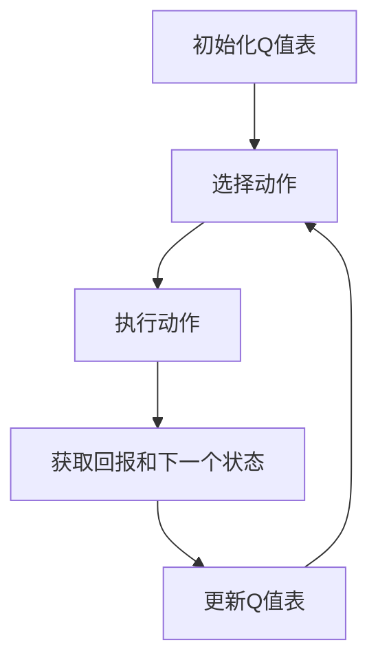

## 背景介绍

Q-Learning（Q学习）是 reinforcement learning（强化学习）的经典算法之一，它的目标是通过与环境的交互学习出最佳的行为策略。Q-Learning 算法能够通过不断地学习和优化Q值来提高智能体的表现。这种算法已经广泛应用于机器学习领域，包括游戏、控制、自然语言处理等领域。

## 核心概念与联系

在 Q-Learning 中，我们关注于一个智能体如何通过与环境的交互学习最佳的行为策略。我们需要定义一个Q值表，用于存储每个状态和动作的价值。Q值表是一个用于表示智能体在每个状态下每个动作的预期回报的二维数组。

Q-Learning 算法的核心思想是：

1. 初始化Q值表，设置所有状态-动作对的Q值为0。
2. 选择一个动作，并执行它。
3. 获取回报和下一个状态。
4. 更新Q值表。

## 核心算法原理具体操作步骤

要实现 Q-Learning，我们需要遵循以下步骤：

1. 初始化Q值表。
2. 选择一个动作。
3. 执行该动作并获得回报和下一个状态。
4. 更新Q值表。
5. 重复步骤2-4，直到达到终止状态。

下面是一个简化的 Q-Learning 算法流程图：



## 数学模型和公式详细讲解举例说明

在 Q-Learning 中，我们使用以下公式来更新Q值：

$$
Q(s, a) \leftarrow Q(s, a) + \alpha [r + \gamma \max_{a'} Q(s', a') - Q(s, a)]
$$

其中：

* $Q(s, a)$ 表示状态 $s$ 和动作 $a$ 的Q值。
* $\alpha$ 是学习率，用于控制更新的速度。
* $r$ 是执行动作 $a$ 后获得的回报。
* $\gamma$ 是折扣因子，用于衡量未来奖励的重要性。
* $\max_{a'} Q(s', a')$ 是下一个状态 $s'$ 中所有动作 $a'$ 的最大Q值。

## 项目实践：代码实例和详细解释说明

下面是一个简单的 Q-Learning 代码示例：

```python
import numpy as np

class QLearning:
    def __init__(self, state_space, action_space, learning_rate=0.1, discount_factor=0.99):
        self.state_space = state_space
        self.action_space = action_space
        self.learning_rate = learning_rate
        self.discount_factor = discount_factor
        self.q_table = np.zeros((state_space, action_space))

    def choose_action(self, state, epsilon=0.1):
        if np.random.uniform(0, 1) < epsilon:
            return np.random.choice(self.action_space)
        else:
            return np.argmax(self.q_table[state])

    def learn(self, state, action, reward, next_state):
        predict = self.q_table[state, action]
        target = reward + self.discount_factor * np.max(self.q_table[next_state])
        self.q_table[state, action] += self.learning_rate * (target - predict)

# 例如，我们可以使用上面的代码实现一个简单的-Qearning agent
```

## 实际应用场景

Q-Learning 已经广泛应用于各种领域，如游戏、控制、自然语言处理等。例如，在游戏中，我们可以使用 Q-Learning 优化智能体的行为策略，从而提高游戏成绩。在控制领域，我们可以使用 Q-Learning 来实现智能控制系统。

## 工具和资源推荐

对于学习 Q-Learning 的读者，我推荐以下资源：

1. 《强化学习》（Reinforcement Learning）—— Richard S. Sutton 和 Andrew G. Barto
2. scikit-learn（[https://scikit-learn.org/](https://scikit-learn.org/))）—— 一个强化学习的Python库
3. OpenAI Gym（[https://gym.openai.com/](https://gym.openai.com/))）—— 一个用于强化学习的环境库

## 总结：未来发展趋势与挑战

Q-Learning 是强化学习领域的一个经典算法，已经广泛应用于各种领域。随着计算能力的提高，Q-Learning 也在不断发展，未来将有更多的应用场景和技术突破。然而，Q-Learning 也面临着一些挑战，例如如何更好地处理连续状态和动作空间、如何解决多-agent 问题等。

## 附录：常见问题与解答

1. Q-Learning 和其他强化学习算法（如 SARSA、Deep Q-Network 等）有什么区别？

答：Q-Learning 是一个基于值函数的强化学习算法，而 SARSA 是一个基于策略梯度的强化学习算法。Deep Q-Network 是一种神经网络实现的 Q-Learning 算法，能够处理连续状态和动作空间。

1. 如何处理 Q-Learning 中的连续状态和动作空间？

答：为了处理连续状态和动作空间，我们可以使用函数逼近（Function Approximation）方法，即使用神经网络等模型来逼近Q值函数。这样，我们可以将连续状态和动作空间映射到一个有限状态和动作空间，并使用 Q-Learning 算法进行训练。

1. 如何解决 Q-Learning 中的多-agent 问题？

答：多-agent 问题可以使用协同学习（Cooperative Learning）方法进行解决。我们可以将多个智能体视为一个整体，使用集体Q值表来表示所有智能体的状态和动作。然后，我们可以使用 Q-Learning 算法来学习集体Q值表，从而实现多-agent 问题的解决。