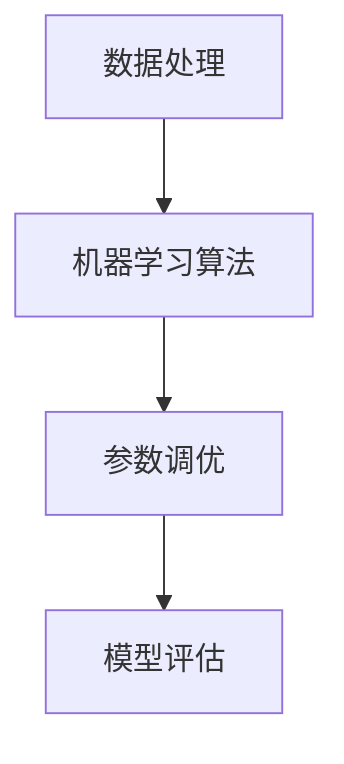

## 背景介绍

随着大数据时代的到来，数据处理和分析的需求越来越迫切。Apache Spark 作为一个顶级的大数据处理框架，拥有强大的计算和存储能力。其中，Spark MLlib 是 Spark 生态系统中的一个重要组成部分，它提供了用于机器学习和统计分析的各种工具和算法。

## 核心概念与联系

Spark MLlib 主要包含以下几个核心概念：

1. 数据处理：包括数据读取、转换和写入等操作。数据处理是机器学习的基础，通过 Spark 的 DataFrame 和 DataStream API 可以实现高效的数据处理。
2. 机器学习算法：包括分类、回归、聚类、推荐等多种算法。这些算法可以帮助我们从数据中提取有价值的信息。
3. 参数调优：机器学习算法通常需要进行参数调优，以获得最佳的性能。Spark MLlib 提供了参数搜索和自动调优的工具。
4. 模型评估：评估模型的性能是机器学习的关键。Spark MLlib 提供了评估指标和测试集等工具。

## 核心算法原理具体操作步骤

以下是一个简单的 Spark MLlib 机器学习流程图：



## 数学模型和公式详细讲解举例说明

在本节中，我们将详细讲解 Spark MLlib 中的一些数学模型和公式。例如，线性回归模型的数学基础如下：

1. 设有 n 个样本 $(x_1, y_1), (x_2, y_2), ..., (x_n, y_n)$，其中 $x_i$ 是输入特征，$y_i$ 是输出目标。
2. 线性回归模型假设有一个线性关系，即 $y = \beta_0 + \beta_1x_1 + \beta_2x_2 + ... + \beta_nx_n + \epsilon$，其中 $\beta_0, \beta_1, ..., \beta_n$ 是模型参数， $\epsilon$ 是误差项。
3. 为了估计模型参数，我们可以使用最小二乘法来解决以下优化问题：$min \sum_{i=1}^{n} (y_i - (\beta_0 + \beta_1x_1 + \beta_2x_2 + ... + \beta_nx_n))^2$。

## 项目实践：代码实例和详细解释说明

在本节中，我们将通过一个实际项目来演示如何使用 Spark MLlib 进行数据处理、机器学习和模型评估。我们将使用 Spark 的 Python API（PySpark）进行编程。

```python
from pyspark.sql import SparkSession
from pyspark.ml.regression import LinearRegression
from pyspark.ml.feature import VectorAssembler
from pyspark.ml.evaluation import RegressionEvaluator

# 创建 Spark 会话
spark = SparkSession.builder.appName("SparkMLlibExample").getOrCreate()

# 读取数据
data = spark.read.format("libsvm").load("data/mllib/sample_linear_regression_data.txt")

# 数据预处理
assembler = VectorAssembler(inputCols=["features"], outputCol="feature_vector")
data = assembler.transform(data)

# 划分训练集和测试集
train, test = data.randomSplit([0.8, 0.2], seed=12345)

# 创建线性回归模型
lr = LinearRegression(featuresCol="feature_vector", labelCol="label", predictionCol="prediction")

# 训练模型
model = lr.fit(train)

# 预测测试集
predictions = model.transform(test)

# 评估模型
evaluator = RegressionEvaluator(metricName="rmse", labelCol="label", predictionCol="prediction")
rmse = evaluator.evaluate(predictions)

print("Root Mean Squared Error (RMSE) on test data = " + str(rmse))
```

## 实际应用场景

Spark MLlib 的应用场景非常广泛，可以用于各种 industries，例如：

1. 金融行业：进行信用评估、风险管理等。
2. 电商行业：进行产品推荐、消费者行为分析等。
3. 医疗行业：进行疾病预测、药物效果评估等。
4. 制造业：进行生产过程优化、质量控制等。

## 工具和资源推荐

如果您想要深入了解 Spark MLlib 和相关的机器学习知识，可以参考以下工具和资源：

1. 官方文档：[Spark 官方文档](https://spark.apache.org/docs/latest/ml-guide.html)
2. 在线课程：[Coursera - Machine Learning](https://www.coursera.org/learn/machine-learning)
3. 图书：[Python Machine Learning](http://shop.oreilly.com/product/0636920023784.do)

## 总结：未来发展趋势与挑战

随着数据量的不断增长，Spark MLlib 在未来将面临更大的挑战。我们需要不断地优化算法、提高性能，并解决新的问题。同时，Spark MLlib 也将与其他技术相结合，为大数据时代的发展提供更好的支持。

## 附录：常见问题与解答

1. **Q：如何选择合适的机器学习算法？**

A：选择合适的算法需要根据问题的特点进行。通常情况下，可以尝试多种算法，并通过交叉验证来选择最佳的算法。

2. **Q：如何解决 Spark MLlib 的内存问题？**

A：可以尝试以下方法来解决 Spark MLlib 的内存问题：

* 调整 Spark 的内存分配策略，如使用 `spark.executor.memory` 和 `spark.driver.memory` 等参数。
* 适当地减少数据的大小，如使用 `dropDuplicates`、`filter` 等操作。
* 使用数据分区和并行处理，如使用 `repartition` 和 `partitionBy` 等操作。

3. **Q：如何处理不平衡的数据集？**

A：处理不平衡的数据集可以尝试以下方法：

* 使用过采样（undersampling）或过抽样（oversampling）技术，如 `RandomForestClassifier` 和 `SMOTE` 等。
* 使用不同的性能指标，如 `F1` 分数、`precision-recall` 曲线等。

# 参考文献

[1] Apache Spark 官方文档。[https://spark.apache.org/docs/latest/ml-guide.html](https://spark.apache.org/docs/latest/ml-guide.html)

[2] Python Machine Learning。[http://shop.oreilly.com/product/0636920023784.do](http://shop.oreilly.com/product/0636920023784.do)

[3] Coursera - Machine Learning。[https://www.coursera.org/learn/machine-learning](https://www.coursera.org/learn/machine-learning)