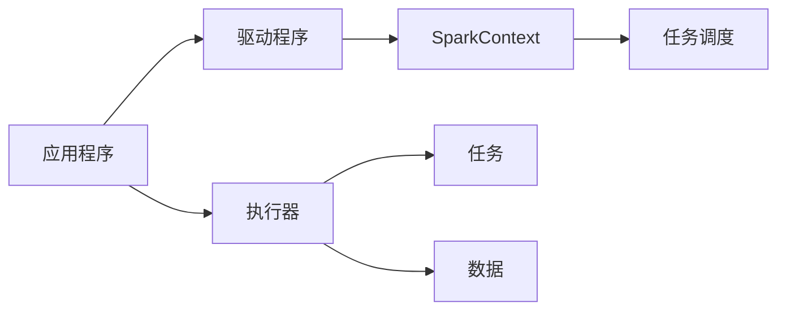

## 1.背景介绍

Apache Spark是一个用于大规模数据处理的开源并行计算系统。Spark提供了一个简单而富有表现力的编程模型，使得应用开发人员可以在大规模数据集上快速地写出并行应用。Spark支持在大规模数据集上的多种数据分析任务，包括查询、搜索、大规模图形处理和机器学习等。在这篇文章中，我们将深入探讨Spark集群的管理与调度。

## 2.核心概念与联系

在开始深入研究之前，我们首先需要理解Spark中的一些核心概念。在Spark中，一个应用程序由一个驱动程序和多个执行器组成。驱动程序负责运行应用程序的main()函数并创建SparkContext。执行器是运行在集群节点上的一种进程，负责运行任务并存储数据。

任务调度是Spark的核心组成部分，它负责在集群的执行器上分配任务。Spark的任务调度有两种模式：FIFO（先进先出）和公平调度。FIFO是默认的调度模式，它按照任务提交的顺序进行调度。公平调度模式则允许多个并行的任务共享集群资源。



## 3.核心算法原理具体操作步骤

Spark的任务调度器使用了一种叫做延迟调度的策略。这种策略的基本思想是，当一个任务准备好运行时，调度器会尝试在存储了该任务需要的数据的节点上运行该任务。这样可以避免网络传输带来的开销。

当一个任务集（stage）中的所有任务都已经完成时，调度器会开始处理下一个任务集。任务集是根据数据依赖关系划分的，同一个任务集中的任务可以并行执行。

## 4.数学模型和公式详细讲解举例说明

在Spark中，任务的调度可以被建模为一个优化问题。我们的目标是最小化任务的完成时间，这可以通过以下公式来表示：

$$min \sum_{i=1}^{n} T_i$$

其中，$T_i$表示第i个任务的完成时间。这个问题的约束条件是集群的资源限制，例如CPU、内存和磁盘空间。

## 5.项目实践：代码实例和详细解释说明

下面是一个简单的Spark应用程序的例子，它使用了Spark的Python API PySpark。这个程序读取一个文本文件，然后计算其中每个单词出现的次数。

```python
from pyspark import SparkContext

sc = SparkContext("local", "Word Count")
text_file = sc.textFile("file:///path/to/file")
counts = text_file.flatMap(lambda line: line.split(" ")) \
             .map(lambda word: (word, 1)) \
             .reduceByKey(lambda a, b: a + b)
counts.saveAsTextFile("file:///path/to/output")
```

在这个例子中，`flatMap`操作将每一行文本分割成单词，`map`操作将每个单词映射为一个键值对，键是单词，值是1。`reduceByKey`操作将所有具有相同键的键值对聚合在一起，通过将值相加来计算每个单词的出现次数。

## 6.实际应用场景

由于Spark的高效性和易用性，它被广泛应用在各种场景中，例如数据挖掘、机器学习、图形处理和流处理等。例如，在机器学习中，Spark可以用来训练大规模的模型；在图形处理中，Spark可以用来执行复杂的图形算法；在流处理中，Spark可以实时处理大量的数据流。

## 7.工具和资源推荐

以下是一些有用的Spark资源和工具：

- Apache Spark官方网站：提供了详细的文档和教程。
- Spark Summit：这是一个专门的Spark会议，提供了很多有关Spark的最新信息和技术分享。
- Spark Packages：这是一个Spark插件的集合，提供了很多用于扩展Spark功能的插件。

## 8.总结：未来发展趋势与挑战

随着数据规模的不断增长，Spark的重要性也在不断提高。然而，Spark也面临着一些挑战，例如如何处理更大规模的数据，如何提高计算效率，以及如何简化编程模型等。未来，我们期待看到更多的研究和技术来解决这些挑战，使Spark成为大规模数据处理的首选工具。

## 9.附录：常见问题与解答

1. **问题：Spark的任务调度模式有哪些？**
答：Spark的任务调度有两种模式：FIFO（先进先出）和公平调度。FIFO是默认的调度模式，它按照任务提交的顺序进行调度。公平调度模式则允许多个并行的任务共享集群资源。

2. **问题：什么是延迟调度？**
答：延迟调度是Spark的一种任务调度策略。当一个任务准备好运行时，调度器会尝试在存储了该任务需要的数据的节点上运行该任务。这样可以避免网络传输带来的开销。

3. **问题：如何优化Spark的任务调度？**
答：优化Spark的任务调度可以从以下几个方面来进行：优化数据布局，优化任务划分，优化资源分配，以及优化任务调度策略。

作者：禅与计算机程序设计艺术 / Zen and the Art of Computer Programming