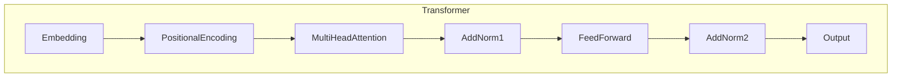

# Transformer大模型实战 BioBERT模型

## 1.背景介绍

### 1.1 生物医学自然语言处理的重要性

在当今的生物医学领域,海量的文献数据和电子健康记录的快速积累,使得自然语言处理(NLP)技术在这一领域的应用变得越来越重要。生物医学NLP旨在从非结构化的自然语言数据(如科研论文、医疗报告等)中提取有价值的结构化信息,为生物医学研究和临床决策提供支持。

### 1.2 生物医学NLP面临的挑战

然而,生物医学领域的语料往往包含大量专业术语、缩写和复杂的语义关系,这给NLP系统带来了巨大挑战。传统的NLP模型通常是在通用领域(如新闻语料)上训练的,难以很好地捕捉生物医学领域的特殊语义。因此,需要专门针对生物医学领域设计和优化NLP模型。

### 1.3 Transformer和BERT模型

近年来,Transformer和BERT等预训练语言模型取得了巨大成功,在多个NLP任务上展现出卓越的性能。Transformer是一种全新的基于注意力机制的序列到序列模型,能够有效地捕捉长距离依赖关系。而BERT则是一种基于Transformer的双向编码器表示,通过在大规模无监督语料上预训练,学习到了丰富的语义知识。

### 1.4 BioBERT模型

针对生物医学领域的特殊需求,研究人员在BERT的基础上,利用大量的生物医学文献语料对模型进行了进一步的预训练,从而得到了BioBERT模型。BioBERT不仅继承了BERT强大的语义表示能力,而且专门针对生物医学领域的语料进行了优化,能够更好地理解和处理生物医学文本。

## 2.核心概念与联系

### 2.1 Transformer模型

Transformer是一种全新的基于注意力机制的序列到序列模型,其核心思想是完全依赖注意力机制来捕捉输入和输出序列之间的长距离依赖关系,避免了RNN和CNN在长序列时容易出现的梯度消失或爆炸问题。

Transformer的主要组成部分包括:

1. **Embedding层**: 将输入词元(token)映射为向量表示。
2. **位置编码(Positional Encoding)**: 因为Transformer没有递归或卷积结构,所以需要一些方式来引入序列的位置信息。
3. **多头注意力机制(Multi-Head Attention)**: 这是Transformer的核心部分,能够有效地捕捉输入序列中任意距离的依赖关系。
4. **前馈全连接网络(Feed-Forward Network)**: 对每个位置的表示进行独立的位置wise的非线性映射。
5. **规范化(Normalization)层**: 用于加速模型收敛并提高性能。

Transformer的编码器(Encoder)和解码器(Decoder)都是由上述几个子层组成的,不同之处在于Decoder还包含一个对已生成的输出序列进行编码的子层。

### 2.2 BERT模型

BERT(Bidirectional Encoder Representations from Transformers)是一种基于Transformer的双向编码器表示模型,通过在大规模无监督语料上进行预训练,学习到了丰富的语义知识。

BERT的主要创新点包括:

1. **双向编码**: 与传统的单向语言模型不同,BERT同时捕捉了序列中每个词元的左右上下文信息。
2. **Masked Language Model(MLM)预训练目标**: 通过随机遮蔽部分输入词元,并预测这些被遮蔽词元的方式进行预训练,有助于BERT学习到更好的语义表示。
3. **Next Sentence Prediction(NSP)预训练目标**: 判断两个句子是否相邻,有助于BERT学习到句子之间的关系。

BERT的预训练过程包括两个阶段:第一阶段在大规模无监督语料上进行MLM和NSP预训练;第二阶段在特定的有监督任务数据上进行微调(fine-tuning),得到针对该任务的BERT模型。

### 2.3 BioBERT模型

BioBERT是在BERT的基础上,利用大量的生物医学文献语料(PubMed抽象、PMC全文)对模型进行进一步预训练,从而获得针对生物医学领域的语言表示模型。

BioBERT的创新之处在于:

1. **领域特定语料预训练**: 使用包含1.4M篇PubMed抽象和4.5M篇PMC全文的大规模生物医学语料进行预训练,使模型能够更好地理解生物医学领域的语义。
2. **词元化(Tokenization)策略优化**: 针对生物医学文本中常见的词元(如基因/蛋白名称)进行了特殊处理,提高了模型对这些专有名词的表示能力。
3. **词汇表(Vocabulary)扩展**: 在原始BERT的30K词汇表基础上,额外添加了2.7K常见的生物医学术语,使模型覆盖面更广。

通过这些优化,BioBERT相比原始BERT在多个生物医学NLP任务上取得了显著的性能提升,成为该领域广为使用的基线模型之一。

## 3.核心算法原理具体操作步骤 

### 3.1 Transformer模型原理

Transformer模型的核心是注意力机制(Attention Mechanism),它能够捕捉输入序列中任意距离的依赖关系。具体来说,注意力机制的计算过程如下:

1. 计算Query、Key和Value向量:
   
   $$Q = X_qW^Q$$
   $$K = X_kW^K$$ 
   $$V = X_vW^V$$

   其中$X_q$、$X_k$、$X_v$分别表示Query、Key和Value的输入,而$W^Q$、$W^K$、$W^V$是可学习的权重矩阵。

2. 计算注意力分数:

   $$\text{Attention}(Q, K, V) = \text{softmax}(\frac{QK^T}{\sqrt{d_k}})V$$

   其中$d_k$是缩放因子,用于防止内积过大导致的梯度消失问题。

3. 多头注意力机制(Multi-Head Attention):
   
   $$\text{MultiHead}(Q, K, V) = \text{Concat}(head_1, ..., head_h)W^O$$
   $$\text{where } head_i = \text{Attention}(QW_i^Q, KW_i^K, VW_i^V)$$

   通过并行计算多个注意力头(head),再将它们的结果拼接起来,可以从不同的子空间关注不同的位置,提高了模型的表达能力。

4. 前馈全连接网络(Feed-Forward Network):
   
   $$\text{FFN}(x) = \max(0, xW_1 + b_1)W_2 + b_2$$
   
   对注意力机制的输出进行两次线性变换,中间加入ReLU激活函数,可以有效捕捉更高阶的特征。

Transformer的编码器由上述注意力子层和前馈网络子层堆叠而成,通过残差连接和层归一化来加速收敛。解码器在此基础上,还引入了对已生成的输出序列进行编码的子层。

### 3.2 BERT模型预训练

BERT的预训练过程包括两个阶段:

1. **Masked Language Model(MLM)预训练**:

   - 随机选取输入序列中的15%的词元进行遮蔽(80%替换为[MASK]标记,10%保持不变,10%替换为随机词元)。
   - 对于每个遮蔽的词元,利用其余的上下文预测该位置的词元。
   - 最小化MLM预训练目标:
     $$\mathcal{L}_\text{MLM} = -\log P(w_t|w_\text{masked})$$

2. **Next Sentence Prediction(NSP)预训练**:

   - 输入由两个句子组成,50%的时候这两个句子相邻,另外50%随机构造。
   - 预测这两个句子是否相邻。
   - 最小化NSP预训练目标:
     $$\mathcal{L}_\text{NSP} = -\log P(y_\text{isNext}|X_1, X_2)$$

3. 将MLM和NSP的损失相加作为最终的预训练目标:

   $$\mathcal{L} = \mathcal{L}_\text{MLM} + \mathcal{L}_\text{NSP}$$

通过上述无监督预训练,BERT能够学习到丰富的语义知识,为下游的有监督任务提供强大的初始化参数。

### 3.3 BioBERT模型优化

BioBERT在BERT的基础上,针对生物医学领域做了以下优化:

1. **领域特定语料预训练**:

   - 使用包含1.4M篇PubMed抽象和4.5M篇PMC全文的生物医学语料进行预训练。
   - 在BERT的MLM和NSP预训练目标的基础上,引入了新的预训练目标:
     - 实体遮蔽(Entity Masking):随机遮蔽生物医学实体(如基因、疾病等),预测被遮蔽的实体。
     - 实体边界预测(Entity Boundary Prediction):预测实体的边界位置。

2. **词元化策略优化**:

   - 针对生物医学文本中常见的词元(如基因/蛋白名称)进行了特殊处理,将它们视为单个词元而不是拆分成多个子词元。
   - 例如,将"BRAF"作为一个整体词元,而不是拆分成"BR"和"##AF"两个子词元。

3. **词汇表扩展**:

   - 在原始BERT的30K词汇表基础上,额外添加了2.7K常见的生物医学术语。
   - 这些术语包括基因/蛋白名称、疾病名称、药物名称等,使模型覆盖面更广。

通过上述优化,BioBERT能够更好地理解和表示生物医学领域的语义,在多个相关的NLP任务上取得了显著的性能提升。

## 4.数学模型和公式详细讲解举例说明

在Transformer和BERT等模型中,注意力机制(Attention Mechanism)是一个非常关键的组成部分。注意力机制的核心思想是,在生成一个元素的表示时,对输入序列中的其他元素进行加权,赋予不同的注意力权重。

### 4.1 Scaled Dot-Product Attention

最基本的注意力机制是Scaled Dot-Product Attention,其计算过程如下:

1. 计算Query、Key和Value向量:

   $$Q = X_qW^Q \in \mathbb{R}^{n \times d_q}$$
   $$K = X_kW^K \in \mathbb{R}^{n \times d_k}$$
   $$V = X_vW^V \in \mathbb{R}^{n \times d_v}$$

   其中$X_q$、$X_k$、$X_v$分别表示Query、Key和Value的输入,而$W^Q$、$W^K$、$W^V$是可学习的权重矩阵,用于将输入映射到Query、Key和Value空间。$n$表示序列长度,而$d_q$、$d_k$、$d_v$分别表示Query、Key和Value的向量维度。

2. 计算注意力分数:

   $$\text{Attention}(Q, K, V) = \text{softmax}(\frac{QK^T}{\sqrt{d_k}})V$$

   首先计算Query和Key的点积,得到一个$n \times n$的注意力分数矩阵。然后对该矩阵的每一行进行softmax操作,使得每一行的元素和为1,得到归一化的注意力权重。最后,将注意力权重与Value相乘,即可得到加权后的Value,作为输出序列的表示。

   其中$\sqrt{d_k}$是一个缩放因子,用于防止内积过大导致的梯度消失问题。

一个简单的例子:设Query为单词"it",Key和Value分别对应输入序列"the dog chased it"中的每个单词的表示,则注意力机制的计算过程如下:

1. 计算Query、Key和Value向量:

   $$Q = \text{Embedding}(\text{"it"})W^Q$$
   $$K = [\text{Embedding}(\text{"the"}), \text{Embedding}(\text{"dog"}), \text{Embedding}(\text{"chased"}), \text{