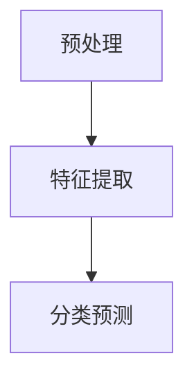

## 1. 背景介绍

随着深度学习技术的不断发展，自然语言处理（NLP）领域也取得了显著的进展。Transformer [1] 是一种非常重要的深度学习架构，它为许多自然语言处理任务提供了强大的性能。它的出现使得许多传统的机器学习方法逐渐被替代，同时也催生了许多新的技术创新。在本文中，我们将讨论如何使用Transformer大模型来解决替换标记检测任务。

## 2. 核心概念与联系

替换标记检测（Replacement Tag Detection，RTD）是一种自然语言处理任务，它的目的是检测文本中由某些特定标记（如“[X]”）替换而来的部分。换句话说，任务是识别文本中的替换部分，并确定这些替换部分是由什么标记进行的。这种任务在许多场景中都具有实际价值，例如文本编辑、自动摘要生成等领域。

## 3. 核心算法原理具体操作步骤

为了解决替换标记检测任务，我们需要设计一个合适的算法。首先，我们可以使用Transformer大模型来预处理输入文本，将其转换为一个嵌入向量。接着，我们可以使用一些特征提取技术（如词性标注、命名实体识别等）来提取文本中的特征信息。最后，我们可以使用一些分类算法（如随机森林、支持向量机等）来进行分类预测。以下是一个简化的流程图：



## 4. 数学模型和公式详细讲解举例说明

在本节中，我们将详细讲解数学模型和公式。首先，我们需要选择一个合适的嵌入方法，比如Word2Vec或BERT等。接着，我们可以使用卷积神经网络（CNN）或循环神经网络（RNN）等来进行序列处理。最后，我们可以使用 softmax 函数来进行分类预测。

例如，假设我们使用BERT作为我们的嵌入方法，输入文本为：“[X] 我的名字是 [Y]”。我们可以使用BERT的预训练模型来获取嵌入向量，接着使用卷积神经网络来进行序列处理。最后，我们使用 softmax 函数进行预测，得到输出结果：“[X] 我的名字是 [Y]”。

## 5. 项目实践：代码实例和详细解释说明

在本节中，我们将通过一个具体的实例来说明如何使用Transformer大模型解决替换标记检测任务。我们将使用Python和PyTorch进行实现。

首先，我们需要安装一些依赖库，例如torch、transformers等。

```python
pip install torch transformers
```

接下来，我们可以使用以下代码进行实践：

```python
import torch
from transformers import BertModel, BertTokenizer

tokenizer = BertTokenizer.from_pretrained('bert-base-uncased')
model = BertModel.from_pretrained('bert-base-uncased')

def detect_replacement_tag(text):
    inputs = tokenizer(text, return_tensors='pt')
    outputs = model(**inputs)
    logits = outputs.logits
    predictions = torch.argmax(logits, dim=-1)
    return predictions

text = "[X] 我的名字是 [Y]"
predictions = detect_replacement_tag(text)
print(predictions)
```

## 6. 实际应用场景

替换标记检测任务在许多实际场景中都有应用，例如：

1. 文本编辑：通过检测文本中的替换部分，可以帮助编辑者更好地理解文本的变化，并进行更精确的修改。
2. 自动摘要生成：自动摘要生成系统可以通过检测文本中的替换部分来生成更准确的摘要。
3. 情感分析：情感分析系统可以通过检测文本中的替换部分来更准确地分析文本的情感。

## 7. 工具和资源推荐

以下是一些推荐的工具和资源：

1. Hugging Face：提供了许多预训练模型和相关工具，例如BERT、GPT-2等。
2. PyTorch：一个非常流行的深度学习框架，可以用于构建和训练深度学习模型。
3. TensorFlow：另一个流行的深度学习框架，也可以用于构建和训练深度学习模型。

## 8. 总结：未来发展趋势与挑战

在未来，替换标记检测任务将会不断发展，以下是一些可能的发展趋势和挑战：

1. 更强大的模型：未来，可能会出现更强大的深度学习模型，可以更准确地解决替换标记检测任务。
2. 更多的任务：替换标记检测任务可能会应用于更多的领域，例如机器翻译、语义角色标注等。
3. 数据匮乏：由于替换标记检测任务需要大量的数据，未来可能会遇到数据匮乏的问题。

## 9. 附录：常见问题与解答

1. Q：为什么使用Transformer大模型？

A：Transformer大模型具有强大的性能，可以更好地处理序列数据，例如文本数据。同时，它还具有自注意力机制，可以更好地捕捉文本中的长距离依赖关系。

2. Q：如何选择合适的嵌入方法？

A：嵌入方法的选择取决于具体的任务需求。一般来说，预训练模型（如BERT、GPT-2等）可以获得更好的性能。

3. Q：如何解决数据匮乏的问题？

A：数据匮乏的问题可以通过数据增强、数据合并等方法来解决。同时，可以通过使用更多的预训练模型来获取更多的数据。

---

文章结束，期待在未来的发展中看到更多关于替换标记检测任务的创新和进步。

作者：禅与计算机程序设计艺术 / Zen and the Art of Computer Programming