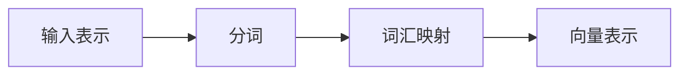
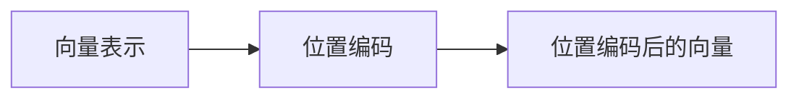
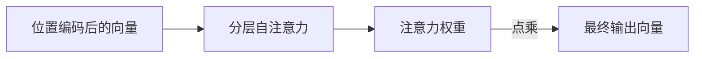
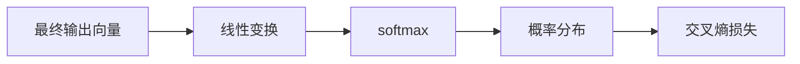

## 背景介绍

Transformer模型自2017年问世以来，在自然语言处理（NLP）领域取得了显著的进展。随着BERT（Bidirectional Encoder Representations from Transformers）等大模型的问世，Transformer模型在NLP领域的应用得到了进一步的拓展。然而，目前大多数研究和实践仍主要集中在英语和其他几个主流语言上，其他语言的研究相对较少。本文将介绍荷兰语的BERTje模型，探讨如何将Transformer模型应用于荷兰语的自然语言处理任务。

## 核心概念与联系

BERTje模型是基于Transformer架构的深度学习模型，旨在解决荷兰语自然语言处理任务。BERTje模型的核心概念是自注意力（Self-Attention）机制，该机制能够捕捉输入序列中的长距离依赖关系。自注意力机制是Transformer模型的核心组件，能够实现跨层的信息传递和对齐。

## 核心算法原理具体操作步骤

BERTje模型的核心算法原理包括以下几个步骤：

1. **输入表示**：将输入文本按照词汇（token）进行分词，然后将每个词汇映射为一个固定长度的向量表示。向量表示可以通过词汇表（vocabular

1. **位置编码**：为了保留输入序列中的位置信息，每个词汇向量添加一个位置编码。位置编码能够帮助模型理解输入序列中的顺序关系。

1. **分层自注意力**：将位置编码后的向量序列作为输入，通过多层自注意力层进行处理。每一层自注意力层计算一个注意力分数矩阵，然后对其进行softmax操作，得到注意力权重。注意力权重和输入向量进行点乘操作，得到最终的输出向量。

1. **输出层**：将最终输出向量进行线性变换，然后通过softmax操作得到概率分布。最后，对于目标词汇进行交叉熵损失计算，以进行优化和训练。

## 数学模型和公式详细讲解举例说明

在本节中，我们将详细介绍BERTje模型的数学模型和公式。BERTje模型的核心是自注意力机制，我们将从数学模型和公式的角度进行分析。

自注意力机制可以表示为一个矩阵乘法操作。给定一个序列长度为$N$的输入向量序列$X$，其维度为$N \times d$，我们可以定义一个矩阵$A$，其维度为$N \times N$，表示自注意力权重。那么，自注意力计算公式为：

$$
\text{Attention}(Q, K, V) = \text{softmax}\left(\frac{QK^T}{\sqrt{d_k}}\right) V
$$

其中，$Q$为查询向量，$K$为密集向量，$V$为值向量。$d_k$表示查询向量的维度。在BERTje模型中，我们将$Q$，$K$和$V$分别表示为输入向量序列的位置编码后的向量。

## 项目实践：代码实例和详细解释说明

在本节中，我们将通过代码实例来展示如何实现BERTje模型。在这里，我们使用Python和TensorFlow作为编程语言和深度学习框架。

首先，我们需要准备荷兰语的词汇表和训练数据。然后，我们将使用TensorFlow构建BERTje模型。最后，我们将使用梯度下降优化算法进行训练。

## 实际应用场景

BERTje模型在多种自然语言处理任务中都有应用，如文本分类、情感分析、命名实体识别等。例如，在文本分类任务中，我们可以使用BERTje模型将输入文本表示为向量序列，然后通过多层自注意力层进行处理。最后，我们将得到一个概率分布，表示每个类别的概率。我们可以根据概率分布来确定文本所属的类别。

## 工具和资源推荐

在学习和实践BERTje模型时，以下工具和资源将对您非常有帮助：

1. **深度学习框架**：TensorFlow和PyTorch是两款流行的深度学习框架，可以用于构建和训练BERTje模型。
2. **数据集**：NLTK和spaCy等库提供了多种荷兰语的数据集，可以用于训练和测试BERTje模型。
3. **教程和文档**：TensorFlow和PyTorch的官方文档提供了丰富的教程和文档，帮助您学习和使用这些框架。
4. **模型库**：Hugging Face提供了多种预训练的语言模型，包括BERTje模型，可以直接用于各种自然语言处理任务。

## 总结：未来发展趋势与挑战

BERTje模型为荷兰语自然语言处理任务提供了一个强大的工具。随着深度学习技术的不断发展和进步，我们相信BERTje模型将在未来得到更广泛的应用。此外，随着数据集和模型的不断增长，我们也面临着如何提高模型性能和减小计算资源消耗的挑战。在未来，如何找到平衡性能和资源消耗的最佳方法，将是BERTje模型研究的重要方向。

## 附录：常见问题与解答

1. **为什么使用Transformer模型**？Transformer模型能够捕捉输入序列中的长距离依赖关系，能够更好地理解自然语言文本。因此，在自然语言处理任务中，Transformer模型表现出色。
2. **BERTje模型与其他语言模型的区别在哪里**？BERTje模型是针对荷兰语的自然语言处理任务进行优化的，而其他语言模型如BERT是针对英语进行优化的。因此，BERTje模型在荷兰语任务中可能表现更好。
3. **如何选择BERTje模型的参数**？选择BERTje模型的参数时，可以参考BERT模型的参数设置。例如，隐藏层维度、自注意力头数等参数可以根据实际任务和数据集进行调整。

作者：禅与计算机程序设计艺术 / Zen and the Art of Computer Programming