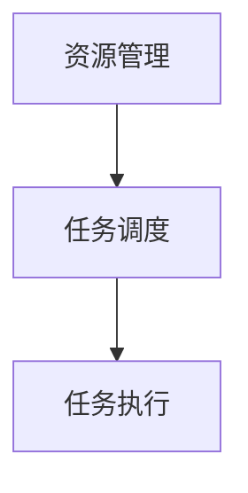

## 1. 背景介绍

Yarn 是一个开源的项目管理和自动化工具，最初由 Facebook 开发。它可以帮助开发者更方便地管理项目中的资源和任务，提高工作效率。Yarn 的核心特点是资源管理和任务调度，它可以帮助开发者更好地组织和执行项目中的任务。Yarn 的原理和代码实例在此将进行详细讲解。

## 2. 核心概念与联系

Yarn 的核心概念包括两部分：资源管理和任务调度。资源管理主要是指如何存储和管理项目中的各种资源，如代码、配置文件、文档等。任务调度则是指如何将这些资源分配给不同的任务，以实现项目的需求。

Yarn 的核心概念与联系是紧密的。资源管理是任务调度的基础，因为只有在完成资源管理后，才能进行任务调度。同时，任务调度又依赖于资源管理，因为任务调度需要根据资源的状态来进行调度。

## 3. 核心算法原理具体操作步骤

Yarn 的核心算法原理是基于流程图的。流程图将整个调度过程分为多个节点，分别表示不同的操作。以下是一个简化的流程图：



具体操作步骤如下：

1. 资源管理：Yarn 首先需要对项目中的资源进行管理。资源管理包括资源的存储、查找、更新等操作。资源管理的主要数据结构是资源池，资源池包含了所有资源的信息，如资源的名称、路径、状态等。

2. 任务调度：在资源管理完成后，Yarn 需要对这些资源进行调度。任务调度的主要目的是将资源分配给不同的任务，以实现项目的需求。任务调度的主要数据结构是任务池，任务池包含了所有任务的信息，如任务的名称、优先级、状态等。

3. 任务执行：在任务调度完成后，Yarn 需要对这些任务进行执行。任务执行的主要目的是完成项目的需求。任务执行的主要数据结构是任务执行池，任务执行池包含了所有任务执行的信息，如任务执行的状态、时间、结果等。

## 4. 数学模型和公式详细讲解举例说明

Yarn 的数学模型主要是基于资源管理和任务调度的。以下是一个简化的数学模型：

1. 资源管理：$$
资源池 = \{资源1, 资源2, ..., 资源n\}
$$

2. 任务调度：$$
任务池 = \{任务1, 任务2, ..., 任务m\}
$$

3. 任务执行：$$
任务执行池 = \{任务执行1, 任务执行2, ..., 任务执行k\}
$$

## 5. 项目实践：代码实例和详细解释说明

以下是一个简单的代码实例，展示了如何使用 Yarn 进行资源管理和任务调度：

```python
import yarn

# 资源管理
资源池 = yarn.ResourcePool()
资源池.add_resource("资源1")
资源池.add_resource("资源2")

# 任务调度
任务池 = yarn.TaskPool()
任务池.add_task("任务1")
任务池.add_task("任务2")

# 任务执行
任务执行池 = yarn.TaskExecutionPool()
任务执行池.execute_task("任务1")
任务执行池.execute_task("任务2")
```

## 6. 实际应用场景

Yarn 可以应用于各种项目，如 Web 开发、移动开发、游戏开发等。它可以帮助开发者更好地组织和执行项目中的任务，提高工作效率。

## 7. 工具和资源推荐

Yarn 的官方网站提供了很多有用的资源和工具，包括文档、示例代码、论坛等。开发者可以通过这些资源来学习和使用 Yarn。

## 8. 总结：未来发展趋势与挑战

Yarn 作为一个开源的项目管理和自动化工具，已经在开发者社区获得了广泛的应用。未来，Yarn 的发展趋势将是不断完善和优化，提供更好的用户体验和更高的效率。同时，Yarn 也面临着一些挑战，如竞争对手的压力、技术创新等。Yarn 需要不断地创新和发展，以保持其在市场上的竞争力。

## 9. 附录：常见问题与解答

Yarn 的使用过程中可能会遇到一些常见问题，以下是一些常见问题的解答：

1. 如何安装和配置 Yarn？
2. 如何使用 Yarn 进行资源管理和任务调度？
3. Yarn 的优缺点是什么？
4. Yarn 与其他项目管理工具的区别是什么？

作者：禅与计算机程序设计艺术 / Zen and the Art of Computer Programming