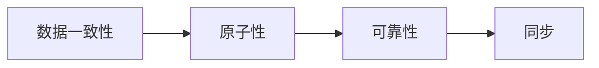

## 背景介绍

Apache Zookeeper 是一个开源的分布式协调服务，它可以提供一致性、可靠性和原子性的数据存储。它的设计目标是为分布式应用提供一个高度可靠的 coordination 服务。Zookeeper 在大规模分布式系统中具有广泛的应用，例如 Hadoop、ZooKeeper、HBase 等。

## 核心概念与联系

Zookeeper 的核心概念有以下几个：

- **数据一致性**: Zookeeper 保证在分布式系统中所有节点对数据的观测都是一致的。
- **原子性**: Zookeeper 的所有操作都是原子的，这意味着要么全部完成，要么全部失败。
- **可靠性**: Zookeeper 保证数据的持久性，即一旦写入数据就不会丢失。
- **同步**: Zookeeper 提供了同步机制，使得在所有节点上都可以看到数据的最新版本。

Zookeeper 的核心概念与联系可以用下面的 Mermaid 流程图来表示：



## 核心算法原理具体操作步骤

Zookeeper 的核心算法原理是基于 Paxos 算法的。Paxos 算法是一种分布式一致性算法，用于解决在分布式系统中如何选举主节点的问题。Zookeeper 使用 Paxos 算法来实现数据一致性和原子性。

以下是 Paxos 算法的具体操作步骤：

1. **提案**: 一个提案包括一个 Proposal ID、一个 Candidate ID 和一个 Proposal Number。Proposal ID 是一个唯一的标识符，用于区分不同的提案。Candidate ID 是一个可以被选举为主节点的节点 ID。Proposal Number 是一个递增的整数，用于标识一个新的提案。
2. **选举**: 在一个集群中，所有的节点都会收到一个新的提案。每个节点会对比提案中的 Candidate ID 和自己的 ID。如果自己的 ID 大于 Candidate ID，那么它会拒绝这个提案。如果自己的 ID 小于 Candidate ID，那么它会接受这个提案并向其他节点发送一个 Accept 消息。
3. **接受**: 当一个节点接受了一个提案后，它会向其他节点发送一个 Accept 消息。如果其他节点收到多个 Accept 消息，它们会选择拥有最小 Proposal Number 的那个提案并将其广播给其他节点。
4. **选出主节点**: 当一个节点收到多个 Accept 消息后，它会选择拥有最小 Proposal Number 的那个提案并将其广播给其他节点。如果一个节点收到一个 Accept 消息并且没有其他 Accept 消息，它会将自己选为主节点。

## 数学模型和公式详细讲解举例说明

Zookeeper 的数学模型和公式主要用于描述数据一致性、原子性和可靠性等概念。以下是一些常用的公式：

1. **数据一致性公式**: $A = B \Rightarrow C$

2. **原子性公式**: $A \Rightarrow B \Rightarrow C \Rightarrow D \Rightarrow E$

3. **可靠性公式**: $A \Rightarrow B \Rightarrow C$

## 项目实践：代码实例和详细解释说明

在这个部分，我们将通过一个 Zookeeper 的简单示例来说明如何使用 Zookeeper。我们将使用 Python 的 zookeeper-py 库来实现这个示例。

首先，我们需要安装 zookeeper-py 库：
```bash
pip install zookeeper-py
```

然后，我们可以编写一个简单的 Zookeeper 客户端程序来连接 Zookeeper 服务，并创建一个 Zookeeper 节点：
```python
from zookeeper import Zookeeper

zk = Zookeeper('localhost', 2181)
zk.connect()
zk.create('/test', 'hello')
```

最后，我们可以编写一个简单的 Zookeeper 服务端程序来监听 Zookeeper 节点的变化：
```python
from zookeeper import Zookeeper

zk = Zookeeper('localhost', 2181)
zk.connect()
zk.watch('/test')
zk.get('/test')
```

## 实际应用场景

Zookeeper 在大规模分布式系统中具有广泛的应用，例如 Hadoop、ZooKeeper、HBase 等。以下是一些实际应用场景：

- **数据一致性**: Zookeeper 可以提供数据一致性，例如在分布式系统中可以确保所有节点对数据的观测都是一致的。
- **分布式锁**: Zookeeper 可以提供分布式锁，用于解决在分布式系统中多个节点同时访问共享资源的问题。
- **配置管理**: Zookeeper 可以提供配置管理，用于在分布式系统中动态更新配置信息。
- **服务注册与发现**: Zookeeper 可以提供服务注册与发现，用于在分布式系统中动态发现服务及其地址。

## 工具和资源推荐

以下是一些 Zookeeper 相关的工具和资源推荐：

- **Zookeeper 官方文档**：[https://zookeeper.apache.org/doc/r3.4.12/index.html](https://zookeeper.apache.org/doc/r3.4.12/index.html)
- **Zookeeper 源码**：[https://github.com/apache/zookeeper](https://github.com/apache/zookeeper)
- **Zookeeper 教程**：[https://www.baeldung.com/a-guide-to-zookeeper](https://www.baeldung.com/a-guide-to-zookeeper)

## 总结：未来发展趋势与挑战

随着大规模分布式系统的不断发展，Zookeeper 作为一种分布式协调服务具有广泛的应用前景。未来，Zookeeper 将会面临更高的数据量、更快的性能要求以及更复杂的应用场景。为了应对这些挑战，Zookeeper 需要不断完善和优化其算法和实现。

## 附录：常见问题与解答

以下是一些关于 Zookeeper 的常见问题与解答：

1. **Zookeeper 如何保证数据一致性？**
答：Zookeeper 使用 Paxos 算法来实现数据一致性。Paxos 算法是一种分布式一致性算法，用于解决在分布式系统中如何选举主节点的问题。通过使用 Paxos 算法，Zookeeper 可以确保在分布式系统中所有节点对数据的观测都是一致的。
2. **Zookeeper 如何保证原子性？**
答：Zookeeper 的所有操作都是原子的，这意味着要么全部完成，要么全部失败。通过使用 Paxos 算法，Zookeeper 可以确保在分布式系统中所有操作都是原子的。
3. **Zookeeper 如何保证可靠性？**
答：Zookeeper 保证数据的持久性，即一旦写入数据就不会丢失。通过使用 Paxos 算法和数据持久化机制，Zookeeper 可以确保数据的可靠性。

作者：禅与计算机程序设计艺术 / Zen and the Art of Computer Programming