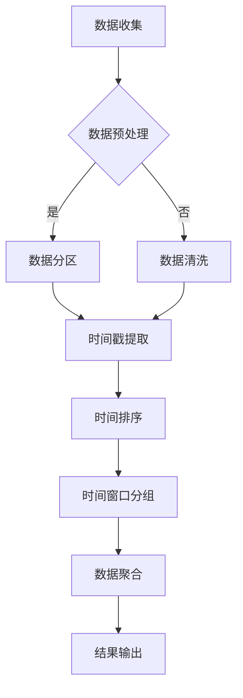

## 背景介绍

随着大数据和人工智能技术的不断发展，事件时间（Event Time）在数据处理和分析领域越来越受到关注。事件时间是指数据发生事件的实际时间，它与数据处理时间（Processing Time）和系统时间（System Time）不同。事件时间可以帮助我们更准确地分析数据，评估算法性能，并解决数据处理过程中的问题。

## 核心概念与联系

事件时间与数据处理时间、系统时间的关系：

1. 数据处理时间：指数据处理系统处理数据的时间。
2. 系统时间：指操作系统记录的时间。
3. 事件时间：指数据发生事件的实际时间。

事件时间与数据处理时间、系统时间的关系如下：

1. 数据处理时间可能与事件时间相差较大，尤其是在大数据处理场景下。
2. 系统时间可能与事件时间相差较大，尤其是在分布式系统中。
3. 事件时间是数据处理和分析的基石，其他时间概念都是基于事件时间的。

## 核心算法原理具体操作步骤

要实现事件时间的处理，需要设计合适的算法和数据结构。以下是一个简单的事件时间处理流程图：



## 数学模型和公式详细讲解举例说明

事件时间处理中常用的数学模型是时间窗口分组（Time Window Grouping）和数据聚合（Data Aggregation）。以下是一个简单的时间窗口分组和数据聚合的数学公式：

时间窗口分组：

$$
W(t) = \{e_i | t - \Delta t \leq e_i.time \leq t + \Delta t\}
$$

数据聚合：

$$
agg(W(t)) = \sum_{e_i \in W(t)} e_i.value
$$

## 项目实践：代码实例和详细解释说明

以下是一个简单的Python代码示例，演示如何实现事件时间处理：

```python
import pandas as pd

# 数据收集
data = [
    {'event': 'A', 'time': 1, 'value': 10},
    {'event': 'B', 'time': 2, 'value': 20},
    {'event': 'C', 'time': 3, 'value': 30},
]

# 数据预处理
df = pd.DataFrame(data)

# 数据分区
df['time'] = pd.to_datetime(df['time'])

# 时间排序
df = df.sort_values('time')

# 时间窗口分组
time_window = 2
df['window'] = (df['time'] - df['time'].min()).dt.total_seconds() // time_window

# 数据聚合
df_grouped = df.groupby('window').sum()

print(df_grouped)
```

## 实际应用场景

事件时间处理广泛应用于大数据分析、人工智能、物联网等领域。以下是一些典型的应用场景：

1. 网络流量分析：通过事件时间处理，分析网络流量的变化趋势，评估网络性能。
2. 电商数据分析：分析电商订单数据，评估订单处理速度，优化订单流程。
3. 交通运输分析：分析交通流量数据，评估交通状况，优化交通流程。

## 工具和资源推荐

以下是一些常用的数据处理和分析工具和资源：

1. Python：Python是大数据处理和分析的常用语言，具有丰富的数据处理库，如Pandas、NumPy等。
2. Apache Flink：Flink是一个流处理框架，支持事件时间处理，可以处理大规模数据流。
3. Apache Storm：Storm是一个分布式流处理框架，支持事件时间处理，可以处理大规模数据流。
4. SQL：SQL是一种查询语言，用于处理和分析关系型数据库数据，可以实现基本的事件时间处理。

## 总结：未来发展趋势与挑战

事件时间处理是大数据和人工智能技术发展的重要组成部分。随着数据量的持续增长，事件时间处理的需求也在不断增加。未来，事件时间处理将面临更高的性能要求和更复杂的数据结构挑战。同时，事件时间处理也将与其他技术相结合，推动大数据和人工智能技术的不断发展。

## 附录：常见问题与解答

1. 事件时间处理与数据处理时间的区别是什么？

事件时间处理与数据处理时间的区别在于，事件时间是数据发生事件的实际时间，而数据处理时间是数据处理系统处理数据的时间。事件时间可以帮助我们更准确地分析数据，评估算法性能，并解决数据处理过程中的问题。

2. 如何实现事件时间处理？

要实现事件时间处理，需要设计合适的算法和数据结构。一个简单的事件时间处理流程包括数据收集、数据预处理、数据分区、时间戳提取、时间排序、时间窗口分组、数据聚合和结果输出。

3. 事件时间处理在实际应用场景中有哪些？

事件时间处理广泛应用于大数据分析、人工智能、物联网等领域。典型的应用场景包括网络流量分析、电商数据分析、交通运输分析等。

作者：禅与计算机程序设计艺术 / Zen and the Art of Computer Programming