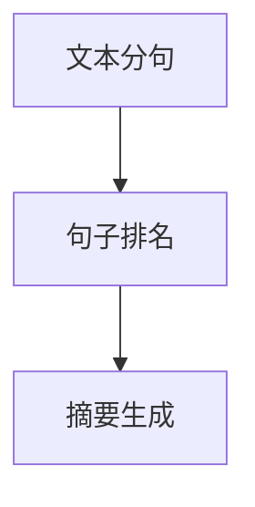

## 背景介绍

随着大型语言模型（如GPT-3）的问世，大模型时代已然到来。与传统机器学习模型不同，大模型具有强大的预训练能力，可以通过大量数据进行自主学习，从而提高其在各种自然语言处理（NLP）任务上的表现。然而，大模型的复杂性和规模也给开发者带来了新的挑战。在本篇博客中，我们将深入探讨LangChain编程，它是开发大模型应用的一种新兴范式。

## 核心概念与联系

LangChain编程是一种基于语言模型的编程范式，旨在让开发者更轻松地构建大模型应用。LangChain编程的核心概念是将自然语言处理任务视为一种“链式”操作，通过组合和连接不同的语言模型和工具来实现任务的自动化。LangChain编程与传统的编程范式有以下几个联系：

1. **编程抽象**：LangChain编程提供了更高级的抽象，使得开发者可以更加专注于任务的实现，而不是纠结于底层的技术细节。
2. **模块化**：LangChain编程鼓励将任务拆分为多个独立的模块，这使得开发者可以更容易地维护和扩展代码。
3. **可组合性**：LangChain编程使得不同模块之间可以轻松组合，这为开发者提供了更大的灵活性。

## 核心算法原理具体操作步骤

LangChain编程的核心算法原理是通过组合和连接多种语言模型来实现任务的自动化。以下是LangChain编程的具体操作步骤：

1. **选择语言模型**：首先，开发者需要选择一个合适的预训练语言模型，如GPT-3或BERT等。
2. **定义任务**：接下来，开发者需要定义任务的输入和输出，以便指示模型进行处理。
3. **构建任务链**：然后，开发者需要将任务拆分为多个子任务，并为每个子任务选择合适的模型。这些子任务将组合成一个“任务链”，实现任务的自动化。
4. **训练和优化**：最后，开发者需要训练和优化任务链，以确保其在实际应用中能够达到预期效果。

## 数学模型和公式详细讲解举例说明

LangChain编程的数学模型主要涉及到自然语言处理任务的数学表示。以下是一个简单的例子：

假设我们要实现一个情感分析任务，输入是一个句子，输出是一个情感分数。我们可以将这个任务拆分为以下子任务：

1. **句子表示**：将句子映射到一个向量空间，表示句子的特征。
2. **情感判断**：根据句子的向量表示判断其情感分数。

为了实现这些子任务，我们可以使用以下数学模型：

1. **句子表示**：可以使用词向量（如Word2Vec或GloVe）或句子向量（如BERT或GPT）来表示句子。
2. **情感判断**：可以使用逻辑回归（Logistic Regression）或支持向量机（SVM）等分类算法来判断情感分数。

## 项目实践：代码实例和详细解释说明

在本节中，我们将通过一个具体的例子来展示LangChain编程的实际应用。假设我们要实现一个句子摘要任务，输入是一个长文本，输出是一个简短的摘要。

1. **选择语言模型**：我们选择了一个预训练的GPT-3模型作为我们的语言模型。
2. **定义任务**：任务输入是一个长文本，输出是一个简短的摘要。我们将这个任务拆分为以下子任务：
	* **文本分句**：将长文本拆分为多个句子。
	* **句子排名**：对拆分的句子进行排序，以便选择最重要的句子。
	* **摘要生成**：使用GPT-3模型生成摘要。
3. **构建任务链**：我们将上述子任务组合成一个任务链，如下所示：

1. **训练和优化**：我们训练了任务链，并对其进行了优化，以确保其在实际应用中能够达到预期效果。

## 实际应用场景

LangChain编程在多个实际应用场景中都具有广泛的应用空间，以下是一些典型应用场景：

1. **情感分析**：通过构建一个情感分析任务链，我们可以轻松地将句子映射到情感空间，并进行情感判断。
2. **句子摘要**：通过构建一个句子摘要任务链，我们可以将长文本拆分为多个句子，并根据重要性生成摘要。
3. **机器翻译**：通过构建一个机器翻译任务链，我们可以将源语言文本映射到目标语言文本，以实现语言间的翻译。

## 工具和资源推荐

LangChain编程需要使用一些工具和资源来进行开发。以下是一些建议：

1. **预训练语言模型**：GPT-3、BERT等预训练语言模型是LangChain编程的基础。您可以通过OpenAI、Hugging Face等平台获取这些模型。
2. **开发环境**：选择一个适合开发的编程环境，如Visual Studio Code、PyCharm等。
3. **工具库**：使用一些工具库来简化LangChain编程，例如PyTorch、TensorFlow、transformers等。

## 总结：未来发展趋势与挑战

LangChain编程作为一种新兴的编程范式，在大模型时代具有重要意义。未来，LangChain编程将继续发展，以下是一些可能的发展趋势和挑战：

1. **更高效的算法**：未来，LangChain编程将不断发展更高效的算法，以满足不断增长的计算需求。
2. **更强大的语言模型**：未来，预训练语言模型将不断发展，提供更强大的能力，以满足各种复杂任务的需求。
3. **更好的可视化**：未来，LangChain编程将提供更好的可视化工具，以帮助开发者更好地理解和调试任务链。

## 附录：常见问题与解答

在本篇博客中，我们讨论了LangChain编程的核心概念、原理、实际应用场景等内容。然而，LangChain编程仍然面临一些挑战和问题。以下是一些建议，以帮助您更好地了解LangChain编程：

1. **如何选择合适的语言模型？**：选择合适的语言模型是LangChain编程的关键一步。您可以根据您的任务需求和计算资源来选择合适的模型。
2. **如何优化任务链？**：优化任务链是提高模型性能的关键。您可以通过调整模型参数、调整任务链结构等方式来优化任务链。
3. **如何解决LangChain编程中的问题？**：在LangChain编程过程中，您可能会遇到一些问题。您可以通过阅读相关文献、咨询专家、参加交流论坛等方式来解决问题。

# 结论

LangChain编程是一种非常有前景的编程范式，它为开发者提供了一个更简洁、更高效的方式来构建大模型应用。通过学习LangChain编程，我们将能够更好地应对大模型时代的挑战，为各种自然语言处理任务提供更好的解决方案。