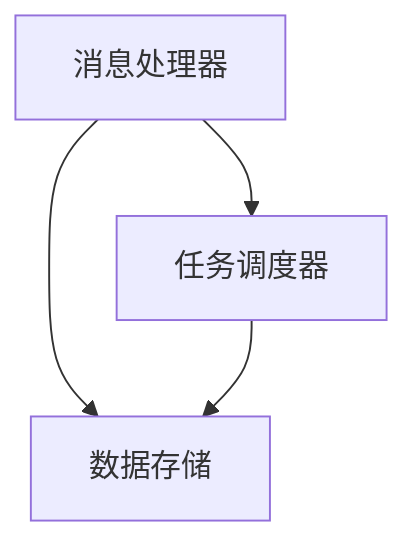

## 背景介绍

LangChain 是一个用于构建高效、可扩展的消息处理系统的开源框架。它为开发者提供了一套简单易用的 API，帮助他们快速构建和部署复杂的消息处理系统。LangChain 允许开发者以代码为基础的方法构建系统，从而避免了传统手动编写配置文件的复杂性。通过使用 LangChain，我们可以轻松地构建和部署高效、可扩展的消息处理系统。

## 核心概念与联系

LangChain 的核心概念是基于一个统一的消息处理框架，它包含以下几个关键组成部分：

1. **消息处理器（Message Processor）：** 负责处理输入消息，并执行一系列预定义的操作。
2. **数据存储（Data Store）：** 用于存储和管理消息处理器生成的数据。
3. **任务调度器（Task Scheduler）：** 负责调度消息处理器和数据存储之间的任务。

LangChain 的核心概念可以通过以下 Mermaid 流程图来展示：



## 核心算法原理具体操作步骤

LangChain 的核心算法原理是基于一个统一的消息处理框架，它包含以下几个关键操作步骤：

1. **接收消息（Receive Message）：** 消息处理器从数据存储中接收输入消息。
2. **处理消息（Process Message）：** 消息处理器执行一系列预定义的操作，如过滤、转换、聚合等，以生成输出消息。
3. **存储消息（Store Message）：** 输出消息被存储到数据存储中，供后续的任务调度器使用。

## 数学模型和公式详细讲解举例说明

LangChain 的数学模型和公式主要涉及到消息处理器的算法，如过滤、转换、聚合等。以下是一个过滤算法的数学模型和公式举例：

过滤算法的作用是从输入消息中筛选出满足一定条件的消息。假设我们有一个输入消息列表 $M = \{m_1, m_2, \dots, m_n\}$，其中每个消息 $m_i$ 都有一个属性集 $A_i = \{a_{i1}, a_{i2}, \dots, a_{in}\}$。

过滤条件可以定义为一个函数 $f: A \to \{0, 1\}$，其中 $A$ 是属性集。如果 $f(a) = 1$，则表示满足条件。过滤算法可以定义为：

$$
F(M) = \{m \in M \mid f(a) = 1, \forall a \in A_m\}
$$

## 项目实践：代码实例和详细解释说明

在本节中，我们将通过一个简单的示例来展示如何使用 LangChain 编程。我们将构建一个简单的消息处理系统，该系统接收一系列数字消息，并将其加权求和。

1. 首先，我们需要定义一个消息处理器，用于接收数字消息并计算其和：

```python
from langchain.message_processors import BaseMessageProcessor

class SumMessageProcessor(BaseMessageProcessor):
    def process_message(self, message):
        numbers = message.get('numbers', [])
        return {
            'sum': sum(numbers)
        }
```

2. 接下来，我们需要定义一个数据存储，用于存储数字消息：

```python
from langchain.data_stores import BaseDataStore

class NumberDataStore(BaseDataStore):
    def __init__(self):
        self.data = []

    def add_message(self, message):
        self.data.append(message)

    def get_messages(self):
        return self.data
```

3. 最后，我们需要定义一个任务调度器，用于调度消息处理器和数据存储之间的任务：

```python
from langchain.task_schedulers import BaseTaskScheduler

class SimpleTaskScheduler(BaseTaskScheduler):
    def schedule(self, message_processor, data_store):
        messages = data_store.get_messages()
        for message in messages:
            result = message_processor.process_message(message)
            data_store.add_message(result)
```

## 实际应用场景

LangChain 可以应用于各种不同的场景，如：

1. **数据清洗：** 使用 LangChain 来清洗和预处理数据，例如删除无效记录、填充缺失值等。
2. **数据分析：** 使用 LangChain 来分析数据，例如计算统计指标、识别模式等。
3. **数据挖掘：** 使用 LangChain 来挖掘数据中的知识，例如发现关联规则、聚类等。

## 工具和资源推荐

对于 LangChain 的学习和实践，我们推荐以下工具和资源：

1. **官方文档：** LangChain 的官方文档提供了详细的教程和示例，帮助开发者快速上手。
2. **开源社区：** LangChain 的开源社区提供了一个活跃的开发者社区，开发者可以在此交流和共享经验。
3. **在线教程：** 有许多在线教程和课程，帮助开发者学习 LangChain 的基础知识和高级技巧。

## 总结：未来发展趋势与挑战

LangChain 作为一个开源框架，在消息处理领域具有广泛的应用前景。随着大数据和人工智能技术的不断发展，LangChain 将面临着越来越多的挑战和机遇。我们相信，LangChain 将持续创新和进步，为开发者提供更高效、可扩展的消息处理解决方案。

## 附录：常见问题与解答

在本节中，我们将回答一些常见的问题，以帮助读者更好地了解 LangChain。

1. **Q：LangChain 与其他消息处理框架有什么区别？**
A：LangChain 与其他消息处理框架的区别在于其简洁、高效的 API，以及支持代码为基础的方法。LangChain 的设计目标是使开发者可以快速构建和部署复杂的消息处理系统，而无需关心底层的实现细节。
2. **Q：LangChain 是否支持分布式部署？**
A：是的，LangChain 支持分布式部署。通过使用任务调度器，我们可以轻松地将消息处理器和数据存储部署在多个节点上，实现高效的并行处理。
3. **Q：LangChain 是否支持自定义算法？**
A：是的，LangChain 支持自定义算法。开发者可以轻松地实现自己的算法，并将其集成到消息处理器中。