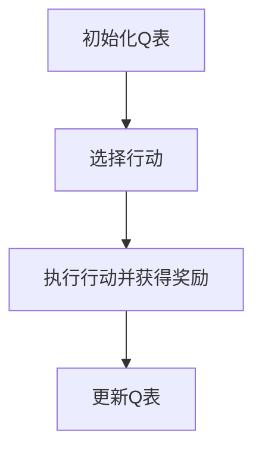

## 1. 背景介绍

随着人工智能（AI）和机器学习（ML）的快速发展，智能制造（Smart Manufacturing）已经成为未来制造业发展的重要趋势。AI Q-learning在智能制造中的探索，成为研究者和产业界关注的焦点。本文将从Q-learning算法原理、数学模型、项目实践、实际应用场景等方面，深入探讨AI Q-learning在智能制造中的应用与发展。

## 2. 核心概念与联系

### 2.1 Q-learning简介

Q-learning是一种强化学习（Reinforcement Learning，RL）方法，用于解决马尔可夫决策问题（Markov Decision Process，MDP）。Q-learning通过迭代地更新Q值（Q-value）来学习最佳行动策略，Q值表示在某个状态下采取某个行动的奖励预期值。

### 2.2 Q-learning与智能制造的联系

智能制造涉及到多个生产环节，需要处理复杂的多变量问题。Q-learning可用于优化生产流程，提高生产效率，降低成本。同时，Q-learning还可以用于智能制造中的自适应控制、故障诊断等方面。

## 3. 核心算法原理具体操作步骤

### 3.1 Q-learning算法流程图



### 3.2 Q-learning具体操作步骤

1. 初始化Q表：为每个状态-action对分配一个初始Q值。
2. 选择行动：根据当前状态，选择一个最优或随机行动。
3. 执行行动并获得奖励：执行选定的行动，并获得相应的奖励。
4. 更新Q表：根据Q-learning更新公式更新Q值。

## 4. 数学模型和公式详细讲解举例说明

### 4.1 Q-learning更新公式

Q-learning更新公式如下：

$$
Q(s, a) \leftarrow Q(s, a) + \alpha [r + \gamma \max_{a'} Q(s', a') - Q(s, a)]
$$

其中，$Q(s, a)$表示状态s下行动a的Q值，$r$表示奖励，$\alpha$表示学习率，$\gamma$表示折扣因子，$s'$表示下一个状态。

### 4.2 Q-learning举例说明

假设智能制造工厂需要优化生产流程，以提高生产效率。我们可以将生产流程视为一个MDP，状态表示生产流程中的各种条件，如机器状态、产品质量等。行动表示可执行的操作，如维修、调整参数等。奖励表示执行行动后的生产效率提升。

## 5. 项目实践：代码实例和详细解释说明

### 5.1 Q-learning代码示例

以下是一个简单的Q-learning代码示例：

```python
import numpy as np

class QLearning:

    def __init__(self, state_space, action_space, learning_rate, discount_factor):
        self.state_space = state_space
        self.action_space = action_space
        self.learning_rate = learning_rate
        self.discount_factor = discount_factor
        self.q_table = np.zeros((state_space, action_space))

    def choose_action(self, state, available_actions):
        if np.random.uniform(0, 1) > epsilon:
            return np.argmax(self.q_table[state])
        else:
            return np.random.choice(available_actions)

    def learn(self, state, action, reward, next_state):
        predict = self.q_table[state, action]
        target = reward + self.discount_factor * np.max(self.q_table[next_state])
        self.q_table[state, action] += self.learning_rate * (target - predict)
```

### 5.2 代码解释说明

QLearning类表示一个Q-learning模型，初始化Q表、学习率和折扣因子。`choose_action`方法根据当前状态选择最优或随机行动。`learn`方法根据Q-learning更新公式更新Q值。

## 6.实际应用场景

### 6.1 自适应生产控制

Q-learning可用于智能制造中的自适应生产控制，根据实时生产数据调整生产参数，提高生产效率。

### 6.2 故障诊断

Q-learning还可用于智能制造中的故障诊断，通过学习故障模式，实现快速、高效的故障诊断。

### 6.3 供应链优化

Q-learning可用于智能制造中的供应链优化，根据需求预测和供应情况，优化供应链配置，降低成本。

## 7.工具和资源推荐

### 7.1 Q-learning工具

- PyTorch：一个流行的深度学习框架，可以用于实现Q-learning算法。
- OpenAI Gym：一个开源的机器学习实验平台，提供了许多预训练的环境，可以用于测试和评估Q-learning算法。

### 7.2 资源推荐

- Sutton, Richard S., and Andrew G. Barto. Reinforcement Learning: An Introduction. MIT press, 2018.
- Q-learning相关论文和教程，可在arXiv和Google Scholar等平台查询。

## 8.总结：未来发展趋势与挑战

未来，AI Q-learning在智能制造领域的应用将得到更广泛的发展。随着数据量和复杂性的不断增加，如何构建高效、可扩展的Q-learning模型成为一个重要挑战。同时，如何在保证安全和隐私的前提下，利用AI Q-learning优化智能制造生产过程也是未来研究的重点。

## 9.附录：常见问题与解答

### 9.1 Q-learning与深度强化学习的区别

Q-learning是一种表格式强化学习方法，适用于具有有限状态和行动空间的环境。深度强化学习（DRL）则可以处理无限状态和行动空间的环境，利用神经网络表示状态和行动。深度强化学习在复杂环境中的表现通常更好，但也需要更多的数据和计算资源。

### 9.2 如何选择学习率和折扣因子

学习率和折扣因子是Q-learning算法中的两个关键参数。选择合适的学习率和折扣因子，可以确保Q-learning学习过程更加稳定、收敛速度更快。通常情况下，学习率选择在0.01到0.1之间，折扣因子选择在0.9到0.99之间。实际应用中，可以通过交叉验证和网格搜索等方法选择合适的参数。

作者：禅与计算机程序设计艺术 / Zen and the Art of Computer Programming