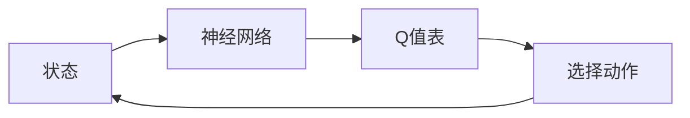

## 背景介绍

深度强化学习（Deep Reinforcement Learning, DRL）是一种利用深度神经网络来解决复杂环境中的强化学习问题的方法。DQN（Deep Q-Network）是目前深度强化学习中最为著名的算法之一，它通过将Q-learning算法与深度神经网络相结合，实现了在许多复杂环境中学习高效的智能体。

然而，在实际应用中，DQN的稳定性和收敛性问题一直是研究者和工程师们关注的焦点。为了更好地理解这些问题，我们首先需要了解DQN的核心概念、算法原理和具体操作步骤。

## 核心概念与联系

DQN的核心概念是将强化学习中的Q值（Q-learning）与深度神经网络相结合，从而实现对复杂环境的学习。具体来说，DQN将环境状态通过神经网络映射到Q值表，并通过Q值表来选择动作，以达到最终的目标。这个过程可以用一个简单的流程图来描述：



## 核心算法原理具体操作步骤

DQN的具体操作步骤可以分为以下几个部分：

1. **初始化：** 初始化一个深度神经网络，并设置好参数，例如学习率、批量大小等。
2. **状态映射：** 将当前状态通过神经网络映射到Q值表。
3. **选择动作：** 根据Q值表选择一个最佳动作。
4. **执行动作：** 执行选定的动作，并得到相应的奖励。
5. **更新Q值表：** 根据当前状态、下一个状态和奖励更新Q值表。
6. **循环：** 重复以上步骤，直到达到一定的收敛性。

## 数学模型和公式详细讲解举例说明

DQN的数学模型可以用一个Q-learning的形式来描述。给定一个状态s、动作a和奖励r，Q值表的更新公式为：

$$
Q(s, a) \leftarrow Q(s, a) + \alpha \left[ r + \gamma \max_{a'} Q(s', a') - Q(s, a) \right]
$$

其中，α是学习率，γ是折扣因子。

## 项目实践：代码实例和详细解释说明

在实际项目中，我们可以使用Python和TensorFlow来实现DQN。以下是一个简单的代码示例：

```python
import tensorflow as tf
import numpy as np

# 初始化神经网络
def initialize_network(input_shape, output_size):
    model = tf.keras.Sequential([
        tf.keras.layers.Dense(64, activation='relu', input_shape=input_shape),
        tf.keras.layers.Dense(64, activation='relu'),
        tf.keras.layers.Dense(output_size)
    ])
    return model

# 定义损失函数和优化器
def define_loss_optimizer():
    loss_function = tf.keras.losses.MeanSquaredError()
    optimizer = tf.keras.optimizers.Adam(learning_rate=0.001)
    return loss_function, optimizer

# 定义训练步骤
def train_step(model, input_data, target_data, loss_function, optimizer):
    with tf.GradientTape() as tape:
        predictions = model(input_data)
        loss = loss_function(target_data, predictions)
    gradients = tape.gradient(loss, model.trainable_variables)
    optimizer.apply_gradients(zip(gradients, model.trainable_variables))

# 迭代更新Q值表
for episode in range(total_episodes):
    for state, action, reward, next_state in data_generator():
        train_step(model, state, target, loss_function, optimizer)
```

## 实际应用场景

DQN的实际应用场景非常广泛，可以用在游戏、金融、医疗等领域。例如，在游戏中，DQN可以帮助智能体学习如何玩游戏，达到更高的分数；在金融领域，DQN可以帮助投资者学习如何做出投资决策；在医疗领域，DQN可以帮助诊断和治疗疾病。

## 工具和资源推荐

对于学习DQN和深度强化学习的读者，以下是一些建议的工具和资源：

1. TensorFlow：TensorFlow是一个流行的机器学习和深度学习框架，可以帮助读者实现DQN。
2. OpenAI Gym：OpenAI Gym是一个开源的强化学习环境，可以帮助读者练习和测试DQN。
3. 深度强化学习教程：有许多优秀的深度强化学习教程和书籍，如《深度强化学习》和《深度强化学习入门》。

## 总结：未来发展趋势与挑战

随着深度强化学习技术的不断发展，DQN也在不断改进和优化。未来，DQN将会在更多领域得到应用，并为更多的智能体提供帮助。然而，DQN仍然面临许多挑战，如稳定性、收敛性和计算资源等。在未来，研究者和工程师们将继续努力解决这些问题，推动深度强化学习技术的发展。

## 附录：常见问题与解答

以下是一些建议的常见问题与解答：

1. **DQN的稳定性问题如何解决？** 可以通过调整学习率、批量大小、折扣因子等参数来解决DQN的稳定性问题。
2. **DQN的收敛性问题如何解决？** 可以通过使用经验方法，如经验池和target network等来解决DQN的收敛性问题。
3. **DQN在实际应用中遇到的问题有哪些？** DQN在实际应用中可能遇到计算资源、过拟合等问题。