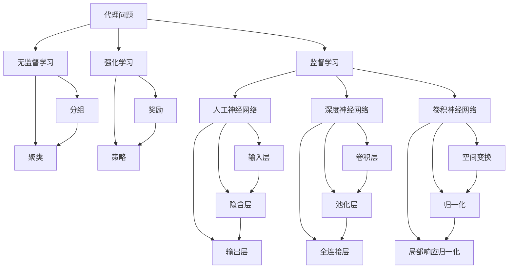

## 1. 背景介绍

人工智能（Artificial Intelligence, AI）是计算机科学的一个分支，研究如何让计算机模拟人类的智能行为。人工智能的研究范围包括但不限于：

1. 机器学习（Machine Learning, ML）：让计算机通过数据分析和模型训练自动学习。
2. 深度学习（Deep Learning, DL）：一种通过神经网络实现的机器学习方法。
3. 自然语言处理（Natural Language Processing, NLP）：让计算机理解、生成和处理人类语言。
4. 计算机视觉（Computer Vision）：让计算机理解和处理图像和视频。
5. 机器人技术（Robotics）：让计算机控制和操作物理设备。

人工智能技术在各个领域得到了广泛应用，如医疗、金融、交通、教育等。

## 2. 核心概念与联系

人工智能的核心概念包括：

1. 代理问题（Agent Problem）：智能体（agent）在环境中进行决策，以实现其目标。
2. 机器学习的三种方法：监督学习（Supervised Learning）、无监督学习（Unsupervised Learning）和强化学习（Reinforcement Learning）。
3. 神经网络的三种类型：人工神经网络（Artificial Neural Network, ANN）、深度神经网络（Deep Neural Network, DNN）和卷积神经网络（Convolutional Neural Network, CNN）。
4. 评价指标：模型的精度、召回率、F1分数等。

人工智能的核心概念与联系可以用以下流程图表示：



## 3. 核心算法原理具体操作步骤

1. 机器学习算法的操作步骤：数据收集、数据预处理、特征选择、模型训练、模型评估、模型优化。
2. 神经网络算法的操作步骤：数据预处理、网络结构设计、训练、测试、优化、部署。

## 4. 数学模型和公式详细讲解举例说明

例如，线性回归（Linear Regression）模型的数学表达式为：

$$
y = wx + b
$$

其中，$w$表示权重，$x$表示输入特征，$b$表示偏置。

## 5. 项目实践：代码实例和详细解释说明

例如，使用Python编写一个简单的线性回归模型：

```python
import numpy as np
from sklearn.linear_model import LinearRegression

# 数据预处理
X = np.array([[1], [2], [3], [4]])
y = np.array([2, 4, 6, 8])

# 模型训练
model = LinearRegression()
model.fit(X, y)

# 预测
y_pred = model.predict(X)

print(y_pred)
```

## 6. 实际应用场景

1. 医疗：基于机器学习的疾病预测和诊断。
2. 金融：基于深度学习的股票预测和风险评估。
3. 交通：基于计算机视觉的交通流量预测和道路监控。
4. 教育：基于自然语言处理的智能助手和教育评估。

## 7. 工具和资源推荐

1. 数据科学：Python、R、Tableau等。
2. 机器学习：TensorFlow、PyTorch、Scikit-learn等。
3. 人工智能平台：Google AI Platform、Microsoft Azure AI、Amazon SageMaker等。

## 8. 总结：未来发展趋势与挑战

未来，人工智能将在各个领域得到更广泛的应用。同时，人工智能也面临着诸多挑战，如数据安全、隐私保护、算法公平性等。

## 9. 附录：常见问题与解答

1. 如何选择合适的机器学习算法？
2. 如何解决过拟合问题？
3. 如何使用自然语言处理进行文本分类？

作者：禅与计算机程序设计艺术 / Zen and the Art of Computer Programming