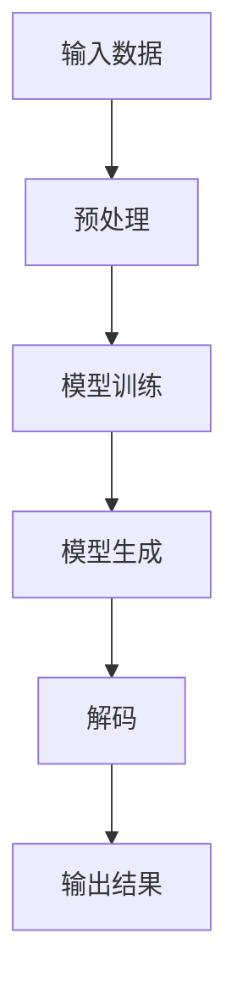

## 背景介绍

自然语言处理（NLP）是计算机科学的一个分支，致力于让计算机理解、生成和处理人类语言。近年来，深度学习技术在NLP领域取得了显著的进展，尤其是大型预训练模型（如BERT、GPT等）在各种自然语言处理任务上的表现超越了传统方法。

本文将探讨如何从零开始开发一个大型自然语言处理模型，并进行微调。我们将重点关注解码器，这是自然语言生成任务中的一种关键组件。我们的目标是提供一个易于理解、易于实现的解码器，从而帮助读者了解如何构建自己的自然语言处理系统。

## 核心概念与联系

在开始探讨解码器之前，我们需要了解两个核心概念：序列生成模型（Sequence Generation Model）和解码策略（Decoding Strategy）。

序列生成模型是一种生成模型，可以生成一系列连续的输出，通常用于自然语言生成任务。常见的序列生成模型有递归神经网络（RNN）、长短期记忆网络（LSTM）和Transformer等。

解码策略是序列生成模型生成输出序列时使用的一种策略。常见的解码策略有贪婪解码（Greedy Decoding）和beam search解码（Beam Search Decoding）等。

## 核心算法原理具体操作步骤

在开始探讨解码器之前，我们需要了解一个自然语言处理任务的基本流程。下面是一个自然语言处理任务的基本流程图：



1. 输入数据：将文本数据作为输入。
2. 预处理：对文本数据进行预处理，如分词、去停用词等。
3. 模型训练：使用序列生成模型（如Transformer）对预处理后的数据进行训练。
4. 模型生成：训练好的模型生成一系列连续的输出。
5. 解码：将生成的输出序列解码为人类可读的文本。
6. 输出结果：得到最终的输出结果。

## 数学模型和公式详细讲解举例说明

在本节中，我们将讨论如何使用解码器对生成的输出序列进行解码。我们将采用贪婪解码策略作为例子。

贪婪解码策略是指选择当前最可能的输出作为下一个输出的策略。在生成过程中，我们将选择输出序列中概率最高的下一个词作为当前输出。

假设我们有一个生成的输出序列$$s = (w_1, w_2, ..., w_n)$$，我们将使用下面的公式进行解码：

$$
p(w_i | w_1, ..., w_{i-1}) = \max_{w'} p(w_i | w_1, ..., w_{i-1}, w')
$$

其中$$p(w_i | w_1, ..., w_{i-1})$$表示在给定上文$$w_1, ..., w_{i-1}$$的情况下，生成词$$w_i$$的概率；$$w'$$表示一个候选词汇集。

## 项目实践：代码实例和详细解释说明

在本节中，我们将通过一个简单的Python代码实例来演示如何使用贪婪解码策略进行解码。

```python
import torch
import torch.nn.functional as F

class GreedyDecoder(torch.nn.Module):
    def __init__(self, vocab_size):
        super(GreedyDecoder, self).__init__()
        self.vocab_size = vocab_size

    def forward(self, logits, input, target, mask):
        # 输入：logits（输出概率矩阵）、input（当前输入序列）、target（目标序列）、mask（掩码）
        # 输出：生成的输出序列
        probs = F.softmax(logits, dim=-1)
        prev_word = input[-1]
        output = [prev_word]
        for _ in range(target.size(0) - 1):
            probs_next = probs[range(target.size(0)), target[:, -1], :]
            probs_next *= mask
            _, word_idx = torch.max(probs_next, dim=-1)
            output.append(word_idx.item())
            prev_word = word_idx
        return torch.tensor(output, dtype=torch.long)

# 使用GreedyDecoder进行解码
decoder = GreedyDecoder(vocab_size)
output = decoder(logits, input, target, mask)
print(output)
```

## 实际应用场景

本文的核心内容是如何从零开始开发一个大型自然语言处理模型，并进行微调。解码器作为生成任务的关键组件，可以帮助我们将生成的输出序列解码为人类可读的文本。我们可以将这个方法应用于各种自然语言处理任务，如机器翻译、文本摘要、问答系统等。

## 工具和资源推荐

如果您想深入了解自然语言处理和解码器，请参考以下资源：

1. "深度学习入门"（"Deep Learning for Coders"）课程：由.fast.ai提供，涵盖了深度学习的基本概念和实践，包括自然语言处理。
2. "自然语言处理入门"（"Natural Language Processing for Coders"）课程：由fast.ai提供，专门讲解自然语言处理的基本概念和方法。
3. "Transformer模型"：论文链接：<https://arxiv.org/abs/1706.03762>
4. "BERT模型"：论文链接：<https://arxiv.org/abs/1810.04805>
5. "GPT模型"：论文链接：<https://arxiv.org/abs/1308.2872>

## 总结：未来发展趋势与挑战

自然语言处理是计算机科学的一个活跃研究领域，随着深度学习技术的不断发展和进步，自然语言处理的性能不断提升。未来，自然语言处理可能会进入一个更高级的阶段，包括更自然的语言理解和生成、更强大的跨语言能力以及更广泛的领域适应性。

然而，自然语言处理仍然面临着许多挑战，如数据匮乏、不确定性、偏见等。我们需要继续努力，推动自然语言处理技术的不断发展和进步。

## 附录：常见问题与解答

1. Q: 为什么需要使用解码器？
A: 解码器的作用是将生成的输出序列解码为人类可读的文本。它是自然语言生成任务中的一种关键组件。
2. Q: 贪婪解码策略的优缺点是什么？
A: 贪婪解码策略的优点是简单易实现，但其缺点是可能导致局部最优解，而不是全局最优解。
3. Q: 如何选择解码策略？
A: 根据任务需求和性能要求选择合适的解码策略。贪婪解码策略简单易实现，但可能导致局部最优解。Beam search解码策略可以得到更准确的输出，但更复杂且计算成本较高。