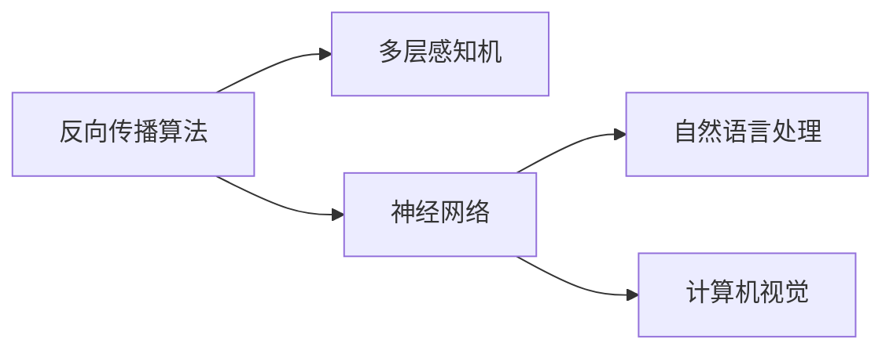

## 背景介绍
随着深度学习技术的飞速发展，大型神经网络模型（如BERT、GPT-3等）在自然语言处理、计算机视觉等领域取得了卓越成绩。这些模型的训练与微调过程中，反向传播算法扮演着举足轻重的角色。今天，我们将探讨反向传播算法的前身历史，揭秘其核心原理与应用场景。

## 核心概念与联系
反向传播算法起源于20世纪60年代，最初用于训练多层感知机（MLP）。其核心思想是通过反向传播误差梯度来调整网络参数，从而最小化损失函数。随着深度学习技术的发展，反向传播算法逐渐演变为神经网络训练的标准方法。下面我们将深入探讨反向传播算法的具体操作步骤和数学模型。



## 核心算法原理具体操作步骤
反向传播算法的核心在于误差反向传播。给定训练集，网络将输入数据映射为输出，并计算输出与目标值之间的误差。误差反向传播过程中，梯度下降法用于优化网络权重，使得损失函数最小化。以下是反向传播算法的具体操作步骤：

1. 前向传播：将输入数据通过网络层-by-layer传播，得到预测输出。
2. 计算误差：比较预测输出与真实目标值之间的差异，即损失函数。
3. 反向传播：根据链式法则计算每个权重的梯度，并更新权重。
4. 循环：重复步骤1-3，直至收敛。

## 数学模型和公式详细讲解举例说明
为了理解反向传播算法，我们需要深入探讨其数学模型。假设输入数据为$x$，真实目标值为$y$，预测输出为$\hat{y}$。损失函数通常采用均方误差（MSE）或交叉熵损失函数。其形式如下：

$$
\text{MSE} = \frac{1}{n}\sum_{i=1}^{n}(y_i - \hat{y}_i)^2
$$

$$
\text{Cross-Entropy Loss} = -\frac{1}{n}\sum_{i=1}^{n}[y_i \log(\hat{y}_i) + (1 - y_i) \log(1 - \hat{y}_i)]
$$

误差反向传播的关键在于计算权重梯度。利用链式法则，我们可以得到权重梯度的闭-form表达式。例如，对于神经网络中的权重$W$，其梯度公式为：

$$
\frac{\partial L}{\partial W} = \frac{\partial L}{\partial \hat{y}} \cdot \frac{\partial \hat{y}}{\partial W}
$$

通过计算梯度，我们可以使用梯度下降法（如SGD、Adam等）来更新权重，使得损失函数最小化。

## 项目实践：代码实例和详细解释说明
为了帮助读者更好地理解反向传播算法，我们将通过一个简单的示例来演示其实现过程。假设我们有一个简单的线性回归问题，目标是找到最佳权重来最小化误差。

```python
import numpy as np
from sklearn.linear_model import SGDRegressor

# 生成随机数据
X = np.random.rand(100, 1)
y = 2 * X + 1 + np.random.randn(100, 1) * 0.1

# 训练线性回归模型
model = SGDRegressor()
model.fit(X, y)

# 预测新数据
X_new = np.array([[0.5]])
y_pred = model.predict(X_new)
print("预测值：", y_pred)
```

在这个例子中，我们使用了scikit-learn中的SGDRegressor实现线性回归模型。通过运行上述代码，我们可以看到模型在训练数据上的表现。实际上，SGDRegressor背后的原理正是反向传播算法。

## 实际应用场景
反向传播算法广泛应用于各种领域，如自然语言处理、计算机视觉、推荐系统等。例如，在自然语言处理中，反向传播算法用于训练和微调Transformer模型，实现了BERT、GPT-3等大型模型的成功应用。计算机视觉领域也广泛采用反向传播算法，实现了SVM、CNN等算法的训练与优化。

## 工具和资源推荐
为了深入了解反向传播算法和深度学习技术，以下是一些建议的工具和资源：

1. TensorFlow：Google开源的深度学习框架，支持反向传播算法的实现和训练。
2. PyTorch：Facebook开源的深度学习框架，具有动态计算图和强大的自动求导功能。
3. Coursera：提供深度学习相关课程，如“深度学习”和“深度学习工程师入门”等。
4. Stanford University：提供深度学习课程资源，如CS231n和CS224n等。

## 总结：未来发展趋势与挑战
随着深度学习技术的不断发展，反向传播算法在各个领域的应用将不断扩大。未来，深度学习将面临诸多挑战，如数据稀疏性、计算资源限制、模型 interpretability等。同时，研究者们将继续探索新的算法和技术，以应对这些挑战，为深度学习领域的发展注入新的活力。

## 附录：常见问题与解答
1. Q: 反向传播算法的训练速度为什么比较慢？
A: 反向传播算法的训练速度受数据规模、网络复杂度等因素影响。为了提高训练速度，可以采用mini-batch训练、预训练、剪枝等方法。
2. Q: 为什么有些神经网络模型训练不稳定？
A: 当然，网络参数初始化、正则化、学习率调参等因素都可能影响神经网络的稳定性。在实际应用中，需要进行多次实验和调整以找到最佳参数组合。