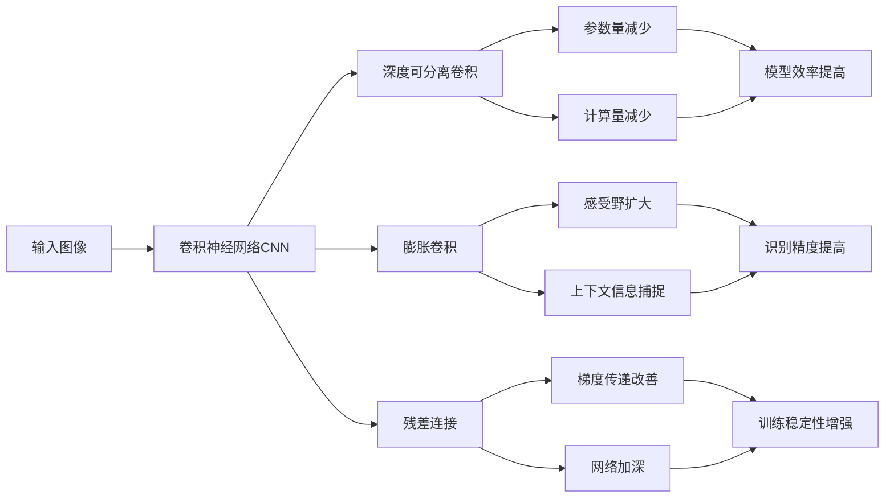

# 从零开始大模型开发与微调：实战：基于深度可分离膨胀卷积的MNIST手写体识别

## 1. 背景介绍
### 1.1 手写体识别的重要性
在当今数字化时代,手写体识别技术在各个领域发挥着越来越重要的作用。无论是在银行支票处理、邮政编码识别、历史文献数字化,还是在移动设备的手写输入等场景中,准确高效地识别手写字符和数字已成为一项关键技术。特别是随着人工智能和深度学习的飞速发展,手写体识别的准确率不断提高,使其在更广泛的应用领域崭露头角。

### 1.2 MNIST数据集简介
在手写体识别研究领域,MNIST数据集可谓家喻户晓。它由美国国家标准与技术研究所(NIST)收集整理,包含了60,000张训练图像和10,000张测试图像。每张图像都是28x28像素的灰度图,其中包含了0到9的手写数字。这些图像来自不同书写风格的人,因此具有一定的多样性。MNIST数据集已成为衡量机器学习和深度学习算法性能的基准之一。

### 1.3 深度可分离膨胀卷积的优势
传统的卷积神经网络在处理图像识别任务时,通常采用标准卷积操作,即利用卷积核对输入特征图进行滑动窗口式的卷积计算。然而,标准卷积存在计算量大、参数冗余等问题。为了解决这些问题,研究者们提出了一系列改进方案,其中深度可分离膨胀卷积(Depthwise Separable Dilated Convolution)就是一种非常有效的方法。

深度可分离膨胀卷积将标准卷积拆分为两个步骤:深度卷积(Depthwise Convolution)和逐点卷积(Pointwise Convolution)。深度卷积针对每个输入通道单独进行卷积操作,而逐点卷积则用于组合不同通道的特征。同时,引入膨胀因子(Dilation Factor)可以扩大卷积核的感受野,捕捉更大范围的上下文信息。这种分离和膨胀的设计大大减少了模型的参数量和计算复杂度,同时还能保持甚至提高识别精度。

## 2. 核心概念与联系
### 2.1 卷积神经网络(CNN)
卷积神经网络是一种专门用于处理网格拓扑结构数据(如图像)的深度学习模型。它通过卷积层、池化层和全连接层的堆叠,逐步提取输入数据的高级特征,并最终输出分类或预测结果。CNN在图像识别、目标检测、语义分割等任务上取得了巨大成功。

### 2.2 深度可分离卷积(Depthwise Separable Convolution) 
深度可分离卷积是一种改进的卷积操作,它将标准卷积分解为两个步骤:深度卷积和逐点卷积。深度卷积对每个输入通道分别进行卷积,而逐点卷积则用1x1的卷积核组合不同通道的特征。这种分离的设计可以大幅减少模型参数和计算量,提高模型效率。

### 2.3 膨胀卷积(Dilated Convolution)
膨胀卷积在标准卷积的基础上引入了一个膨胀因子,用于控制卷积核内元素之间的间隔。通过设置不同的膨胀因子,可以在不增加参数量的情况下扩大卷积核的感受野,捕捉更大范围的上下文信息。这对于提高模型的识别精度非常有帮助。

### 2.4 残差连接(Residual Connection)
残差连接是一种在神经网络中引入捷径(shortcut)的技术。它将输入直接传递到后面的层,与中间层的输出相加。这种设计可以缓解梯度消失问题,使得网络可以训练得更深。残差连接已成为许多先进CNN模型(如ResNet)的标准组件。

下图展示了这些核心概念之间的联系:



## 3. 核心算法原理与具体操作步骤
### 3.1 深度可分离膨胀卷积的原理
深度可分离膨胀卷积是将标准卷积操作拆分为深度卷积和逐点卷积两个步骤,同时引入膨胀因子来扩大感受野。具体而言:
1. 深度卷积:对输入特征图的每个通道分别进行卷积操作,卷积核的通道数与输入通道数相同。这一步可以提取每个通道的空间特征。
2. 逐点卷积:使用1x1的卷积核对深度卷积的输出进行卷积,用于组合不同通道的特征。这一步可以实现通道之间的信息融合。
3. 膨胀因子:在卷积核内引入间隔,扩大卷积核的感受野。膨胀因子为1时,等同于标准卷积;膨胀因子大于1时,卷积核内的元素间隔相应增大。

### 3.2 深度可分离膨胀卷积的数学表达
假设输入特征图为$X \in \mathbb{R}^{H \times W \times C}$,卷积核为$K \in \mathbb{R}^{k \times k \times C}$,膨胀因子为$d$,深度可分离膨胀卷积可以表示为:

$$
\begin{aligned}
Y_{depth}[c] &= X[c] * K[:,:,c] \\
Y_{point} &= Y_{depth} * K_{1 \times 1}
\end{aligned}
$$

其中,$Y_{depth} \in \mathbb{R}^{H \times W \times C}$表示深度卷积的输出,$Y_{point} \in \mathbb{R}^{H \times W \times C'}$表示逐点卷积的输出,$*$表示膨胀卷积操作,$K_{1 \times 1} \in \mathbb{R}^{1 \times 1 \times C \times C'}$表示1x1卷积核。

### 3.3 深度可分离膨胀卷积的具体操作步骤
1. 对输入特征图的每个通道分别进行深度卷积,得到中间特征图$Y_{depth}$。
2. 对$Y_{depth}$进行逐点卷积,得到输出特征图$Y_{point}$。
3. 根据需要,对$Y_{point}$进行激活、池化等后续操作。
4. 重复以上步骤,直到获得所需的特征表示。

## 4. 数学模型和公式详细讲解举例说明
### 4.1 标准卷积与深度可分离膨胀卷积的对比
假设输入特征图大小为$H \times W \times C$,卷积核大小为$k \times k \times C \times C'$,其中$C$和$C'$分别表示输入和输出通道数。标准卷积的计算复杂度为:

$$
O(H \times W \times k^2 \times C \times C')
$$

而深度可分离膨胀卷积的计算复杂度为:

$$
O(H \times W \times k^2 \times C) + O(H \times W \times C \times C')
$$

可以看出,深度可分离膨胀卷积将计算复杂度从输入输出通道数的乘积降低到了输入通道数和输出通道数的和,大大减少了计算量。

### 4.2 膨胀卷积的感受野计算
假设卷积核大小为$k \times k$,膨胀因子为$d$,则膨胀卷积的感受野大小为:

$$
(k + (k-1)(d-1)) \times (k + (k-1)(d-1))
$$

例如,当$k=3$,$d=2$时,膨胀卷积的感受野大小为$5 \times 5$。这意味着,在不增加参数量的情况下,膨胀卷积可以捕捉更大范围的上下文信息。

### 4.3 残差连接的数学表达
残差连接可以表示为:

$$
y = F(x) + x
$$

其中,$x$表示输入,$F(x)$表示中间层的映射函数,$y$表示残差连接的输出。通过将输入$x$直接传递到后面的层,残差连接可以缓解梯度消失问题,使得网络可以训练得更深。

## 5. 项目实践：代码实例和详细解释说明
下面是使用PyTorch实现基于深度可分离膨胀卷积的MNIST手写体识别的示例代码:

```python
import torch
import torch.nn as nn
import torch.optim as optim
from torchvision import datasets, transforms

# 定义深度可分离膨胀卷积层
class DepthwiseSeparableDilatedConv(nn.Module):
    def __init__(self, in_channels, out_channels, kernel_size, dilation=1):
        super(DepthwiseSeparableDilatedConv, self).__init__()
        self.depthwise = nn.Conv2d(in_channels, in_channels, kernel_size, dilation=dilation, groups=in_channels)
        self.pointwise = nn.Conv2d(in_channels, out_channels, 1)

    def forward(self, x):
        x = self.depthwise(x)
        x = self.pointwise(x)
        return x

# 定义残差块
class ResidualBlock(nn.Module):
    def __init__(self, in_channels, out_channels, dilation=1):
        super(ResidualBlock, self).__init__()
        self.conv1 = DepthwiseSeparableDilatedConv(in_channels, out_channels, 3, dilation=dilation)
        self.bn1 = nn.BatchNorm2d(out_channels)
        self.relu = nn.ReLU(inplace=True)
        self.conv2 = DepthwiseSeparableDilatedConv(out_channels, out_channels, 3, dilation=dilation)
        self.bn2 = nn.BatchNorm2d(out_channels)

    def forward(self, x):
        identity = x
        x = self.conv1(x)
        x = self.bn1(x)
        x = self.relu(x)
        x = self.conv2(x)
        x = self.bn2(x)
        x += identity
        x = self.relu(x)
        return x

# 定义网络模型
class Net(nn.Module):
    def __init__(self):
        super(Net, self).__init__()
        self.conv1 = DepthwiseSeparableDilatedConv(1, 16, 3)
        self.bn1 = nn.BatchNorm2d(16)
        self.relu = nn.ReLU(inplace=True)
        self.res1 = ResidualBlock(16, 32, dilation=2)
        self.res2 = ResidualBlock(32, 64, dilation=4)
        self.pool = nn.AdaptiveAvgPool2d((1, 1))
        self.fc = nn.Linear(64, 10)

    def forward(self, x):
        x = self.conv1(x)
        x = self.bn1(x)
        x = self.relu(x)
        x = self.res1(x)
        x = self.res2(x)
        x = self.pool(x)
        x = torch.flatten(x, 1)
        x = self.fc(x)
        return x

# 加载MNIST数据集
transform = transforms.Compose([transforms.ToTensor(), transforms.Normalize((0.1307,), (0.3081,))])
train_dataset = datasets.MNIST('data', train=True, download=True, transform=transform)
test_dataset = datasets.MNIST('data', train=False, transform=transform)
train_loader = torch.utils.data.DataLoader(train_dataset, batch_size=64, shuffle=True)
test_loader = torch.utils.data.DataLoader(test_dataset, batch_size=1000, shuffle=False)

# 初始化模型和优化器
model = Net()
optimizer = optim.Adam(model.parameters(), lr=0.001)
criterion = nn.CrossEntropyLoss()

# 训练模型
epochs = 10
for epoch in range(epochs):
    model.train()
    for batch_idx, (data, target) in enumerate(train_loader):
        optimizer.zero_grad()
        output = model(data)
        loss = criterion(output, target)
        loss.backward()
        optimizer.step()

    model.eval()
    with torch.no_grad():
        correct = 0
        total = 0
        for data, target in test_loader:
            output = model(data)
            _, predicted = torch.max(output.data, 1)
            total += target.size(0)
            correct += (predicted == target).sum().item()

        print(f"