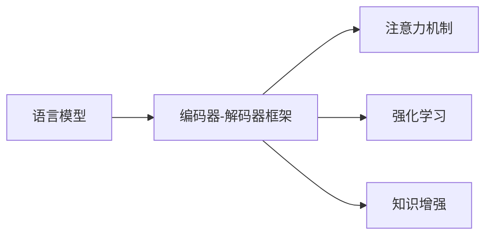

# 内容生成(Content Generation) - 原理与代码实例讲解

## 1. 背景介绍
### 1.1 内容生成的定义与意义
#### 1.1.1 内容生成的定义
内容生成(Content Generation)是指利用人工智能技术,特别是自然语言处理(NLP)和机器学习(ML)技术,自动或半自动地创建各种形式的内容,如文本、图像、音频、视频等。内容生成系统通过学习大量的训练数据,掌握特定领域的知识和规律,进而能够根据用户的需求或提示,生成符合要求的内容。

#### 1.1.2 内容生成的意义
内容生成技术具有广泛的应用前景和重要意义:

1. 提高内容创作效率:传统的内容创作往往需要耗费大量的人力和时间,而内容生成系统可以在短时间内生成大量高质量的内容,极大地提高了内容创作的效率。

2. 个性化内容推荐:内容生成技术可以根据用户的兴趣、偏好等特征,自动生成个性化的内容推荐,提升用户体验。

3. 辅助创意决策:内容生成系统可以为创意工作者提供灵感和素材,辅助其进行创意决策和内容创作。

4. 降低内容生产成本:自动化的内容生成可以减少人工成本,降低内容生产的门槛和成本。

### 1.2 内容生成的发展历程
#### 1.2.1 早期的内容生成系统
早期的内容生成系统主要基于规则和模板,通过预先定义的规则和模板,结合少量的变量,生成特定格式的内容。这类系统生成的内容通常比较简单和固定,缺乏灵活性和创造力。

#### 1.2.2 基于深度学习的内容生成
随着深度学习技术的发展,特别是循环神经网络(RNN)、长短期记忆网络(LSTM)等模型的出现,内容生成系统开始利用深度学习方法,从大规模数据中学习知识和规律,生成更加自然、流畅、富有创意的内容。

#### 1.2.3 预训练语言模型的应用
近年来,以 BERT、GPT 系列为代表的预训练语言模型取得了显著进展。这些模型在海量文本数据上进行预训练,学习到了丰富的语言知识和生成能力。通过微调或提示工程,预训练语言模型可以应用于各种内容生成任务,生成质量和效果大幅提升。

## 2. 核心概念与联系
### 2.1 语言模型
语言模型是内容生成的核心概念之一。它用于刻画自然语言中词语或字符序列的概率分布,即在给定前文的情况下,预测下一个词语或字符的概率。通过语言模型,内容生成系统可以根据上下文生成连贯、自然的文本内容。常见的语言模型包括 N-gram 模型、RNN、LSTM、Transformer 等。

### 2.2 编码器-解码器框架
编码器-解码器(Encoder-Decoder)框架是内容生成中常用的架构。编码器将输入文本编码为一个固定维度的向量表示,捕捉输入的语义信息;解码器根据编码器的输出,逐步生成目标内容。这种框架广泛应用于机器翻译、文本摘要、对话生成等任务。

### 2.3 注意力机制
注意力机制(Attention Mechanism)是一种用于提升内容生成质量的技术。它允许解码器在生成每个词语或字符时,根据当前的隐状态,动态地分配不同的注意力权重给编码器的输出,从而更好地利用输入信息。注意力机制增强了内容生成的准确性和连贯性。

### 2.4 强化学习
强化学习(Reinforcement Learning)是一种通过奖励信号来指导模型学习的方法。在内容生成中,强化学习可以用于优化生成结果的质量和多样性。通过设计合适的奖励函数,如基于人工评分或用户反馈的奖励,强化学习算法可以引导内容生成模型生成更加符合要求和用户偏好的内容。

### 2.5 知识增强
知识增强(Knowledge Enhancement)是指在内容生成过程中融入外部知识,以提高生成内容的信息丰富度和准确性。知识增强可以通过知识图谱、知识库、领域词典等形式实现。将这些结构化或半结构化的知识与内容生成模型相结合,可以生成包含更多专业、准确信息的内容。

以下是内容生成核心概念之间的联系 Mermaid 流程图:

## 3. 核心算法原理具体操作步骤
### 3.1 基于 RNN 的文本生成
#### 3.1.1 RNN 的基本原理
循环神经网络(RNN)是一种用于处理序列数据的神经网络模型。在文本生成任务中,RNN 可以根据之前生成的词语,预测下一个词语的概率分布。RNN 的隐状态在每个时间步更新,捕捉了之前词语的信息,使得生成的文本具有上下文相关性。

#### 3.1.2 RNN 文本生成的步骤
1. 准备训练数据:收集大量的文本数据,并进行预处理,如分词、建立词汇表等。
2. 构建 RNN 模型:设计 RNN 的架构,如隐藏层大小、层数等。常见的 RNN 变体有 LSTM、GRU 等。
3. 训练模型:使用准备好的训练数据,通过反向传播算法训练 RNN 模型,优化模型参数。
4. 文本生成:给定初始词语或起始符号,利用训练好的 RNN 模型,逐步生成后续词语,直到生成结束符号或达到预设长度。
5. 采样策略:在每个时间步,根据 RNN 输出的概率分布,采用不同的采样策略(如贪婪搜索、束搜索)选择下一个词语。

### 3.2 Transformer 模型
#### 3.2.1 Transformer 的基本原理 
Transformer 是一种基于自注意力机制的神经网络模型,主要用于处理序列数据。与 RNN 不同,Transformer 不依赖时间步的顺序,而是通过自注意力机制直接建模序列中元素之间的依赖关系。Transformer 由编码器和解码器组成,编码器用于理解输入序列,解码器用于生成输出序列。

#### 3.2.2 Transformer 的具体步骤
1. 输入嵌入:将输入序列中的每个词语或字符映射为固定维度的向量表示。
2. 位置编码:为了引入序列中词语的位置信息,在输入嵌入中加入位置编码向量。
3. 编码器:通过多个编码器层对输入序列进行编码。每个编码器层包括多头自注意力机制和前馈神经网络。
4. 解码器:根据编码器的输出和之前生成的词语,通过多个解码器层生成输出序列。每个解码器层包括多头自注意力机制、编码-解码注意力机制和前馈神经网络。
5. 输出层:将解码器的输出通过线性变换和 softmax 函数,得到下一个词语的概率分布。
6. 生成过程:根据输出概率分布,使用采样策略生成下一个词语,直到生成结束符号或达到预设长度。

### 3.3 BERT 在内容生成中的应用
#### 3.3.1 BERT 的基本原理
BERT(Bidirectional Encoder Representations from Transformers)是一种基于 Transformer 编码器的预训练语言模型。BERT 通过掩码语言建模(MLM)和下一句预测(NSP)任务,在大规模无监督数据上进行预训练,学习到丰富的语言表示。预训练后的 BERT 模型可以通过微调应用于各种下游任务,包括内容生成。

#### 3.3.2 BERT 在内容生成中的应用步骤
1. BERT 预训练:在大规模无监督数据上预训练 BERT 模型,学习通用的语言表示。
2. 微调 BERT:根据具体的内容生成任务,在预训练的 BERT 模型上添加任务特定的输出层,并使用任务相关的有监督数据进行微调。
3. 生成过程:将输入文本(如提示或上文)输入到微调后的 BERT 模型中,通过解码器生成后续的内容。可以使用不同的解码策略,如贪婪搜索、束搜索等。
4. 后处理:对生成的内容进行必要的后处理,如去除重复、矫正语法错误等,以提高生成内容的质量。

## 4. 数学模型和公式详细讲解举例说明
### 4.1 语言模型的概率公式
给定一个词语序列 $w_1, w_2, \ldots, w_n$,语言模型的目标是估计该序列的概率:

$$P(w_1, w_2, \ldots, w_n) = \prod_{i=1}^n P(w_i | w_1, w_2, \ldots, w_{i-1})$$

其中,$P(w_i | w_1, w_2, \ldots, w_{i-1})$ 表示在给定前 $i-1$ 个词语的情况下,第 $i$ 个词语为 $w_i$ 的条件概率。

例如,对于一个简单的句子 "I love natural language processing",其概率可以表示为:

$$P(\text{"I love natural language processing"}) = P(\text{"I"}) \times P(\text{"love"} | \text{"I"}) \times P(\text{"natural"} | \text{"I love"}) \times P(\text{"language"} | \text{"I love natural"}) \times P(\text{"processing"} | \text{"I love natural language"})$$

### 4.2 Softmax 函数
Softmax 函数常用于将神经网络的输出转化为概率分布。对于一个 $n$ 维向量 $\mathbf{z} = (z_1, z_2, \ldots, z_n)$,其 Softmax 函数定义为:

$$\text{softmax}(z_i) = \frac{e^{z_i}}{\sum_{j=1}^n e^{z_j}}$$

其中,$\text{softmax}(z_i)$ 表示第 $i$ 个元素的概率。Softmax 函数将向量中的每个元素映射到 (0, 1) 区间,并且所有元素的概率之和为 1。

例如,对于一个向量 $\mathbf{z} = (1, 2, 3)$,其 Softmax 函数的计算过程如下:

$$\begin{aligned}
\text{softmax}(z_1) &= \frac{e^1}{e^1 + e^2 + e^3} \approx 0.09 \\
\text{softmax}(z_2) &= \frac{e^2}{e^1 + e^2 + e^3} \approx 0.24 \\
\text{softmax}(z_3) &= \frac{e^3}{e^1 + e^2 + e^3} \approx 0.67
\end{aligned}$$

### 4.3 交叉熵损失函数
交叉熵损失函数常用于衡量语言模型的预测概率分布与真实概率分布之间的差异。对于一个词语序列 $w_1, w_2, \ldots, w_n$ 和模型预测的概率分布 $\hat{P}$,交叉熵损失定义为:

$$\mathcal{L}(\hat{P}, w_1, w_2, \ldots, w_n) = -\sum_{i=1}^n \log \hat{P}(w_i | w_1, w_2, \ldots, w_{i-1})$$

其中,$\hat{P}(w_i | w_1, w_2, \ldots, w_{i-1})$ 表示模型在给定前 $i-1$ 个词语的情况下,预测第 $i$ 个词语为 $w_i$ 的概率。

例如,对于一个模型在一个词语序列上的预测概率如下:

$$\begin{aligned}
\hat{P}(\text{"I"}) &= 0.8 \\
\hat{P}(\text{"love"} | \text{"I"}) &= 0.6 \\
\hat{P}(\text{"natural"} | \text{"I love"}) &= 0.4 \\
\hat{P}(\text{"language"} | \text{"I love natural"}) &= 0.7 \\
\hat{P}(\text{"processing"} | \text{"I love natural