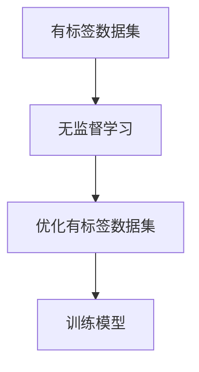

## 背景介绍

半监督学习（Semi-supervised Learning）是一种机器学习方法，它在有标签数据集上进行训练，并利用无标签数据集进行优化。半监督学习的目标是通过利用无标签数据集来提高模型性能，减少标签数据集的需求。半监督学习在许多领域具有实际应用价值，例如图像识别、自然语言处理、生物信息学等。

## 核心概念与联系

半监督学习的核心概念是利用有标签数据和无标签数据来训练模型。有标签数据集是一组已知标签的数据，用于训练模型。无标签数据集是一组未知标签的数据，用于优化模型。半监督学习的核心任务是如何利用无标签数据来提高模型的性能。

半监督学习与监督学习、无监督学习有着紧密的联系。监督学习依靠有标签数据进行训练，而无监督学习则依靠无标签数据进行训练。半监督学习则结合了这两种方法的优点，利用有标签数据和无标签数据进行训练。

## 核心算法原理具体操作步骤

半监督学习的核心算法原理是通过无监督学习算法来优化有标签数据集，并利用有标签数据集来训练模型。以下是一个简单的半监督学习算法流程图：



1. 首先，利用无监督学习算法对无标签数据集进行训练，生成无监督学习模型。
2. 然后，将无监督学习模型应用于有标签数据集，优化有标签数据集。
3. 最后，将优化后的有标签数据集用于训练模型。

## 数学模型和公式详细讲解举例说明

半监督学习的数学模型通常使用基于概率的方法来表示。假设有标签数据集和无标签数据集分别为$D_l$和$D_u$，其中$D_l$包含了已知标签的数据，$D_u$包含了未知标签的数据。半监督学习的目标是找到一个函数$f(x)$，使得在有标签数据集上$f(x)$与真实标签$y$的概率分布相似，并在无标签数据集上$f(x)$与其他数据点的概率分布相似。

半监督学习的损失函数通常使用对数似然函数来表示，例如：

$$
L(\theta) = \sum_{(x,y) \in D_l} -\log p(y | f(x; \theta)) + \lambda \sum_{x \in D_u} -\log \int p(y | f(x; \theta)) p(y | x) dy
$$

其中$\theta$表示模型参数，$\lambda$表示正则化参数。

## 项目实践：代码实例和详细解释说明

半监督学习的实际应用可以使用许多不同的编程语言和库来实现。以下是一个简化的半监督学习项目实例，使用Python和Scikit-learn库：

```python
from sklearn.datasets import load_iris
from sklearn.model_selection import train_test_split
from sklearn.ensemble import RandomForestClassifier
from sklearn.metrics import accuracy_score

# 加载数据集
data = load_iris()
X, y = data.data, data.target

# 分割数据集为有标签数据集和无标签数据集
X_train, X_test, y_train, y_test = train_test_split(X, y, test_size=0.3, stratify=y, random_state=42)

# 训练随机森林分类器
clf = RandomForestClassifier()
clf.fit(X_train, y_train)

# 预测测试集
y_pred = clf.predict(X_test)

# 计算准确率
accuracy = accuracy_score(y_test, y_pred)
print(f"准确率: {accuracy}")
```

在这个例子中，我们使用了Scikit-learn库中的RandomForestClassifier来实现半监督学习。首先，我们从Iris数据集中加载数据，并将其分割为有标签数据集和无标签数据集。然后，我们使用RandomForestClassifier进行训练，并在测试集上进行预测。最后，我们计算准确率来评估模型性能。

## 实际应用场景

半监督学习在许多实际应用场景中具有实际价值。以下是一些典型的应用场景：

1. 图像识别：在图像识别领域，半监督学习可以用于训练深度学习模型。通过利用有标签数据集和无标签数据集，模型可以更好地学习特征和结构，从而提高识别准确率。
2. 自然语言处理：在自然语言处理领域，半监督学习可以用于训练语言模型。通过利用有标签数据集和无标签数据集，模型可以更好地学习语言规律，从而提高翻译、摘要等任务的性能。
3. 生物信息学：在生物信息学领域，半监督学习可以用于分析基因组数据。通过利用有标签数据集和无标签数据集，模型可以更好地学习基因组结构，从而提高基因预测等任务的性能。

## 工具和资源推荐

半监督学习的实际应用需要使用各种工具和资源。以下是一些建议的工具和资源：

1. Python：Python是一种流行的编程语言，具有丰富的机器学习库，如Scikit-learn、TensorFlow、Keras等。Python是学习和使用半监督学习的理想选择。
2. Scikit-learn：Scikit-learn是一个Python机器学习库，提供了许多常用的机器学习算法，如支持向量机、随机森林、梯度提升树等。Scikit-learn可以帮助您轻松实现半监督学习。
3. TensorFlow：TensorFlow是一个开源的机器学习框架，支持深度学习。TensorFlow可以帮助您实现复杂的半监督学习模型，如神经网络。
4. Keras：Keras是一个高级神经网络库，基于TensorFlow。Keras可以帮助您轻松构建和训练深度学习模型，实现半监督学习。

## 总结：未来发展趋势与挑战

半监督学习在过去几年取得了显著的进展，并在许多领域取得了实际应用成功。未来，半监督学习将继续发展，以下是一些可能的发展趋势和挑战：

1. 更深入的深度学习：未来，半监督学习将更加依赖深度学习技术，以实现更高的性能和更好的泛化能力。
2. 更多的数据：半监督学习依赖于大量的数据，因此未来将需要更多的数据来支持半监督学习的发展。
3. 更复杂的模型：未来，半监督学习将需要更复杂的模型，以应对更复杂的任务和挑战。
4. 更强大的算法：未来，半监督学习将需要更强大的算法，以解决更复杂的问题。

## 附录：常见问题与解答

以下是一些关于半监督学习的常见问题和解答：

1. **什么是半监督学习？** 半监督学习是一种机器学习方法，它在有标签数据集上进行训练，并利用无标签数据集进行优化。半监督学习的目标是通过利用无标签数据集来提高模型性能，减少标签数据集的需求。
2. **半监督学习有什么优势？** 半监督学习的优势在于它可以利用无标签数据集来提高模型性能，从而减少标签数据集的需求。此外，半监督学习可以帮助解决数据稀疏的问题，提高模型的泛化能力。
3. **半监督学习有什么局限性？** 半监督学习的局限性在于它依赖于有标签数据集和无标签数据集。 如果无标签数据集不准确或不完整，半监督学习的性能可能会受到影响。此外，半监督学习可能需要更复杂的模型和算法，以解决更复杂的问题。

# 结束语

半监督学习是一种具有实际应用价值的机器学习方法，它可以帮助我们利用无标签数据集来提高模型性能，减少标签数据集的需求。半监督学习在许多领域具有实际应用价值，如图像识别、自然语言处理、生物信息学等。通过学习和使用半监督学习，我们可以更好地解决实际问题，提高技能，成为更优秀的程序员和技术专家。