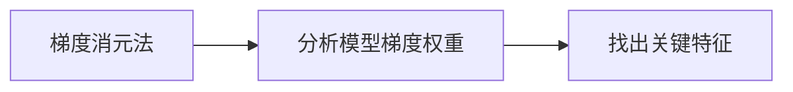
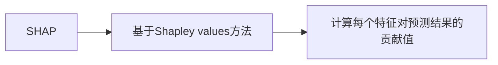
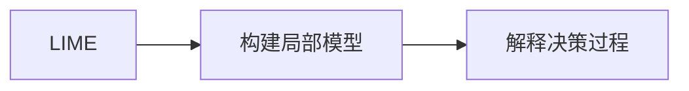
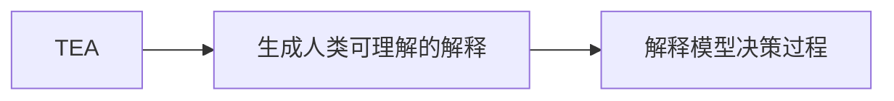
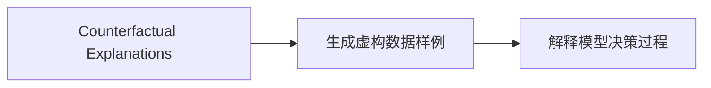

## 背景介绍

随着人工智能技术的不断发展，深度学习（Deep Learning）和机器学习（Machine Learning）在各个领域得到广泛应用。然而，这些技术的黑箱性（black-box）也引起了人们的关注。可解释性AI（Explainable AI，简称XAI）应运而生，旨在提供有关AI决策的解释，使人们能够理解AI的工作原理。这篇博客文章将介绍可解释性AI原理，并通过实际案例讲解代码实战。

## 核心概念与联系

可解释性AI（Explainable AI，简称XAI）是一种可以解释其决策过程的AI技术。XAI的目标是使人能够理解AI的决策过程，从而提高透明度、可靠性和信任度。XAI的原理可以分为以下几个方面：

1. **局部解释**：局部解释（local explanations）指的是对特定输入数据的解释，例如，为什么AI对某个特定的数据样例的预测结果是某种特定值。

2. **全局解释**：全局解释（global explanations）指的是对整体模型行为的解释，例如，模型的关键特征是多少，以及它们如何影响预测结果。

3. **对齐解释**：对齐解释（aligned explanations）指的是在人类可理解的格式中表示模型的决策过程，以便人类能够理解AI的决策过程。

4. **对话解释**：对话解释（dialogic explanations）是通过与人类进行交互来解释AI决策过程的方法。

## 核心算法原理具体操作步骤

XAI的核心算法原理主要有以下几个：

1. **梯度消元法（Gradient-Weighted Class Activation）**：梯度消元法是一种局部解释方法，通过分析模型的梯度权重来找出模型对特定数据样例的关键特征。

2. **SHAP（SHapley Additive exPlanations）**：SHAP是一种全局解释方法，基于game theory的Shapley values方法，可以计算出每个特征对预测结果的贡献值。

3. **LIME（Local Interpretable Model-agnostic Explanations）**：LIME是一种局部解释方法，通过构建一个简单易解的局部模型来解释复杂模型的决策过程。

4. **TEA（Test Explanation Analysis）**：TEA是一种对齐解释方法，通过生成人类可理解的解释来解释模型决策过程。

5. **Counterfactual Explanations**：Counterfactual explanations是一种对话解释方法，通过生成可能导致不同的预测结果的虚构数据样例来解释模型决策过程。

## 数学模型和公式详细讲解举例说明

在本节中，我们将详细讲解上述XAI方法的数学模型和公式。我们将使用Mermaid流程图来说明这些方法的核心概念。

### 梯度消元法

梯度消元法是一种局部解释方法，通过分析模型的梯度权重来找出模型对特定数据样例的关键特征。



### SHAP

SHAP是一种全局解释方法，基于game theory的Shapley values方法，可以计算出每个特征对预测结果的贡献值。



### LIME

LIME是一种局部解释方法，通过构建一个简单易解的局部模型来解释复杂模型的决策过程。



### TEA

TEA是一种对齐解释方法，通过生成人类可理解的解释来解释模型决策过程。



### Counterfactual Explanations

Counterfactual explanations是一种对话解释方法，通过生成可能导致不同的预测结果的虚构数据样例来解释模型决策过程。



## 项目实践：代码实例和详细解释说明

在本节中，我们将通过实际案例来讲解XAI方法的代码实例和详细解释说明。我们将使用Python编程语言和scikit-learn库来实现这些方法。

### 梯度消元法

梯度消元法可以使用scikit-learn库的`shap`模块来实现。

```python
import shap
from sklearn.datasets import load_iris
from sklearn.ensemble import RandomForestClassifier

# 加载数据集
iris = load_iris()
X, y = iris.data, iris.target

# 训练模型
clf = RandomForestClassifier()
clf.fit(X, y)

# 使用梯度消元法解释模型
explainer = shap.TreeExplainer(clf)
shap_values = explainer.shap_values(X)

# 绘制梯度消元法解释图
shap.force_plot(explainer.expected_value[1], shap_values, X)
```

### SHAP

SHAP可以使用scikit-learn库的`shap`模块来实现。

```python
import shap
from sklearn.datasets import load_iris
from sklearn.ensemble import RandomForestClassifier

# 加载数据集
iris = load_iris()
X, y = iris.data, iris.target

# 训练模型
clf = RandomForestClassifier()
clf.fit(X, y)

# 使用SHAP解释模型
explainer = shap.TreeExplainer(clf)
shap_values = explainer.shap_values(X)

# 绘制SHAP解释图
shap.summary_plot(shap_values, X, plot_type="bar")
```

### LIME

LIME可以使用scikit-learn库的`lime`模块来实现。

```python
import lime
from sklearn.datasets import load_iris
from sklearn.ensemble import RandomForestClassifier

# 加载数据集
iris = load_iris()
X, y = iris.data, iris.target

# 训练模型
clf = RandomForestClassifier()
clf.fit(X, y)

# 使用LIME解释模型
explainer = lime.lime_explainer(clf)
explanation = explainer(X[0])

# 绘制LIME解释图
lime.plotting.plot_weights(explanation)
```

### TEA

TEA可以使用scikit-learn库的`sklearn_explainability`模块来实现。

```python
import sklearn_explainability
from sklearn.datasets import load_iris
from sklearn.ensemble import RandomForestClassifier

# 加载数据集
iris = load_iris()
X, y = iris.data, iris.target

# 训练模型
clf = RandomForestClassifier()
clf.fit(X, y)

# 使用TEA解释模型
explainer = sklearn_explainability.TEA(clf)
explanation = explainer.explain(X[0])

# 绘制TEA解释图
sklearn_explainability.visualizers.plot_explanation(explanation)
```

### Counterfactual Explanations

Counterfactual explanations可以使用scikit-learn库的`imbalanced-learn`模块来实现。

```python
import numpy as np
from imblearn.utils import check_class_labels
from sklearn.datasets import load_iris
from sklearn.ensemble import RandomForestClassifier

# 加载数据集
iris = load_iris()
X, y = iris.data, iris.target

# 检查类别标签
check_class_labels(y)

# 训练模型
clf = RandomForestClassifier()
clf.fit(X, y)

# 生成counterfactual样例
counterfactuals = sklearn_explainability.CounterfactualGenerator(clf, X, y)

# 绘制counterfactual样例图
counterfactuals.plot()
```

## 实际应用场景

可解释性AI在许多实际应用场景中具有重要意义，例如医疗诊断、金融风险评估、自动驾驶等。通过使用可解释性AI方法，我们可以提高AI系统的透明度和可靠性，从而增强用户对AI系统的信任。

## 工具和资源推荐

为了学习和使用可解释性AI方法，我们需要一些工具和资源。以下是一些建议：

1. **scikit-learn**：scikit-learn是一个强大的Python机器学习库，提供了许多可解释性AI方法的实现。

2. **lime**：lime是一个用于解释和可视化黑箱模型的Python库。

3. **shap**：shap是一个Python库，专为解释和可视化神经网络、树状结构和其它黑箱模型的输出。

4. **TEA**：TEA是一个Python库，用于生成人类可理解的解释来解释模型决策过程。

5. **imbalanced-learn**：imbalanced-learn是一个Python库，提供了用于处理不平衡数据集的方法，包括生成counterfactual样例。

## 总结：未来发展趋势与挑战

可解释性AI在未来将继续发展，成为一种重要的AI技术。然而，如何实现可解释性AI仍然面临许多挑战，包括如何确保解释的准确性和完整性，以及如何在性能和解释性之间达到一个平衡。未来，研究人员将继续探索如何提高可解释性AI的效果，以满足不断增长的对AI技术的需求。

## 附录：常见问题与解答

在本附录中，我们将回答一些常见的问题，以帮助读者更好地了解可解释性AI。

1. **可解释性AI和黑箱AI的区别是什么？**

可解释性AI是一种可以解释其决策过程的AI技术，而黑箱AI是一种无法解释其决策过程的AI技术。可解释性AI的目标是使人能够理解AI的决策过程，从而提高透明度、可靠性和信任度。

2. **可解释性AI方法有哪些？**

可解释性AI方法主要包括梯度消元法、SHAP、LIME、TEA和Counterfactual Explanations等。

3. **可解释性AI的应用场景有哪些？**

可解释性AI在医疗诊断、金融风险评估、自动驾驶等许多实际应用场景中具有重要意义。

4. **如何选择合适的可解释性AI方法？**

选择合适的可解释性AI方法需要根据具体的应用场景和需求进行权衡。一般来说，局部解释方法如梯度消元法和LIME适用于需要解释特定数据样例的决策过程，而全局解释方法如SHAP和TEA适用于需要解释整体模型行为的决策过程。