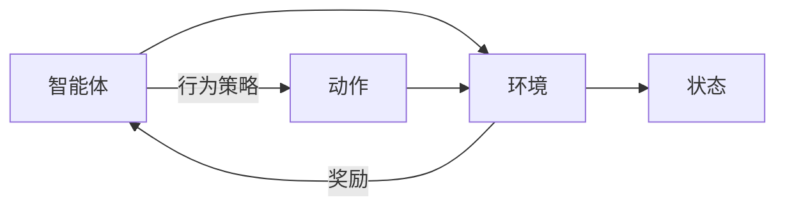
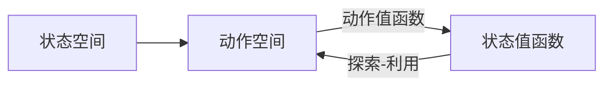

## 背景介绍

增强学习（Reinforcement Learning, RL）是一种机器学习方法，通过与环境的交互来学习和优化行为策略。在增强学习中，智能体（agent）通过与环境的交互来学习最佳行为策略，以达到预定的目标。增强学习与监督学习和无监督学习不同，它不依赖于标记的训练样本，而是通过与环境的交互来学习。

## 核心概念与联系

增强学习的核心概念包括：

1. **智能体（Agent）：** 智能体是与环境进行交互的实体，通过行为策略来达到目标。
2. **环境（Environment）：** 环境是智能体所处的环境，环境会根据智能体的行为提供反馈信息。
3. **状态（State）：** 状态是环境的一种描述，表示智能体所处的当前情况。
4. **行为策略（Policy）：** 行为策略是智能体决定下一步行动的规则，通过行为策略来选择动作。
5. **奖励（Reward）：** 奖励是智能体从环境中获得的反馈信息，用于评估智能体的行为策略。

增强学习的核心概念与联系如下图所示：



## 核心算法原理具体操作步骤

增强学习的核心算法原理包括：

1. **状态空间（State Space）：** 状态空间是所有可能状态的集合，表示环境的一种描述。
2. **动作空间（Action Space）：** 动作空间是所有可能动作的集合，表示智能体可以选择的行动。
3. **状态值函数（State-Value Function）：** 状态值函数是表示智能体在每个状态下所获得的价值的函数。
4. **动作值函数（Action-Value Function）：** 动作值函数是表示智能体在每个状态下选择每个动作所获得的价值的函数。
5. **探索-利用（Exploration-Exploitation）：** 探索-利用是增强学习的基本策略，智能体在探索新状态的同时利用已有知识来选择行动。

增强学习的核心算法原理具体操作步骤如下图所示：



## 数学模型和公式详细讲解举例说明

增强学习的数学模型和公式包括：

1. **马尔可夫决策过程（Markov Decision Process, MDP）：** 马尔可夫决策过程是一种描述环境状态、智能体动作和奖励的概率模型。
2. **Q-学习（Q-Learning）：** Q-学习是一种增强学习算法，通过更新动作值函数来学习最佳行为策略。
3. **深度Q-学习（Deep Q-Learning）：** 深度Q-学习是一种增强学习算法，通过使用神经网络来估计动作值函数。

## 项目实践：代码实例和详细解释说明

在本节中，我们将通过一个简单的增强学习项目实践来展示增强学习的实际应用。我们将使用Python和OpenAI的Gym库来实现一个简单的Q-学习算法。

首先，我们需要安装Gym库：

```bash
pip install gym
```

然后，我们可以使用以下代码来创建一个简单的增强学习项目：

```python
import gym
import numpy as np
import tensorflow as tf

# 创建环境
env = gym.make('CartPole-v0')

# 初始化神经网络
model = tf.keras.Sequential([
    tf.keras.layers.Dense(64, activation='relu', input_shape=(4,)),
    tf.keras.layers.Dense(64, activation='relu'),
    tf.keras.layers.Dense(2)
])

# 训练神经网络
for episode in range(1000):
    state = env.reset()
    state = np.reshape(state, [1, 4])
    done = False
    while not done:
        env.render()
        action = np.argmax(model.predict(state))
        state, reward, done, info = env.step(action)
        state = np.reshape(state, [1, 4])
        model.fit(state, np.array([reward]), epochs=1)
    env.close()
```

## 实际应用场景

增强学习的实际应用场景包括：

1. **游戏AI**: 增强学习可以用于训练游戏AI，例如AlphaGo和AlphaZero，用于在游戏中优化策略。
2. **自动驾驶**: 增强学习可以用于训练自动驾驶系统，通过模拟各种驾驶场景来优化行为策略。
3. **金融投资**: 增强学习可以用于金融投资，通过模拟市场波动来优化投资策略。

## 工具和资源推荐

以下是一些建议的工具和资源，用于学习和实现增强学习：

1. **OpenAI Gym**: OpenAI Gym是一个广泛使用的机器学习库，提供了许多预先训练好的环境，可以用于测试和训练增强学习算法。地址：<https://gym.openai.com/>
2. **TensorFlow**: TensorFlow是一个流行的深度学习框架，可以用于实现增强学习算法。地址：<https://www.tensorflow.org/>
3. **Reinforcement Learning: An Introduction**: 这本书是增强学习的经典教材，提供了详细的理论和实践指导。地址：<http://www.cs.berkeley.edu/~pabbeel/cs288-spring13/slides/reinforcement_learning.pdf>

## 总结：未来发展趋势与挑战

增强学习在未来将会有更多的应用场景，例如医疗、教育等领域。但同时，增强学习也面临着一些挑战，例如数据匮乏、模型复杂性和安全性等。为了克服这些挑战，我们需要继续研究增强学习的理论和技术，同时也需要关注新的技术和工具的发展。

## 附录：常见问题与解答

以下是一些建议的常见问题和解答：

1. **Q：增强学习与监督学习有什么区别？**

A：增强学习与监督学习的主要区别在于训练数据。在监督学习中，训练数据是已知的标签，而在增强学习中，训练数据是通过与环境的交互获得的。增强学习需要学习行为策略，而监督学习需要学习函数映射。

2. **Q：增强学习的优势是什么？**

A：增强学习的优势在于它可以学习复杂的行为策略，不依赖于标记的训练数据。增强学习可以适应不断变化的环境，并且可以用于各种场景，例如游戏AI、自动驾驶和金融投资等。

3. **Q：增强学习的挑战是什么？**

A：增强学习的挑战包括数据匮乏、模型复杂性和安全性等。为了克服这些挑战，我们需要继续研究增强学习的理论和技术，同时也需要关注新的技术和工具的发展。