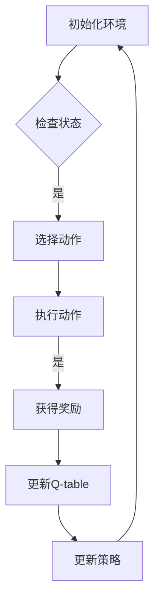

## 背景介绍
强化学习（Reinforcement Learning, RL）是机器学习的重要分支之一，它的主要目标是让算法Agent通过与环境之间的交互学习最佳策略来达到预定的目标。多智能体强化学习（Multi-Agent Reinforcement Learning, MARL）则是在一个环境中有多个Agent的场景下进行强化学习的研究方向。与单智能体强化学习相比，多智能体强化学习需要面对更复杂的决策问题，因为多个Agent之间可能会互相影响，需要协同或竞争来达到最优解。

## 核心概念与联系
在多智能体强化学习中，Agent需要与环境以及其他Agent进行交互，学习最佳策略。为了实现这一目标，需要解决以下几个核心问题：

1. **状态表示**: Agent如何表示环境和其他Agent的状态？
2. **动作选择**: Agent如何选择在给定状态下采取的动作？
3. **奖励分配**: 如何为Agent的动作分配奖励，以便他们学习最佳策略？
4. **策略学习**: 如何通过交互学习Agent的策略？

这些问题的解决方法与单智能体强化学习相似，但需要在多Agent的情况下进行扩展和调整。

## 核心算法原理具体操作步骤
在多智能体强化学习中，常见的算法包括Q-learning、Deep Q-Network (DQN)、Proximal Policy Optimization (PPO)等。以下是一个基于DQN的多智能体强化学习算法的简要流程图：



## 数学模型和公式详细讲解举例说明
在多智能体强化学习中，常用的数学模型是Q-learning。给定一个状态s和一个动作a，Q-learning的目标是学习Q值函数Q(s, a)，其中Q(s, a)表示在状态s下执行动作a的最优值。Q值函数的更新公式为：

$$
Q(s, a) \leftarrow Q(s, a) + \alpha \cdot (r + \gamma \cdot \max_{a'} Q(s', a') - Q(s, a))
$$

其中，α是学习率，γ是折扣因子，r是即时奖励，s'是执行动作a后所处的新状态。

## 项目实践：代码实例和详细解释说明
以下是一个简单的多智能体强化学习项目的代码实例，使用Python的gym库和keras-rl库实现。

```python
import gym
import numpy as np
from keras.models import Sequential
from keras.layers import Dense
from keras.optimizers import Adam
from rl.agents.dqn import DQNAgent
from rl.policy import EpsGreedyQPolicy
from rl.memory import SequentialMemory

# 创建环境
env = gym.make('MultiAgentCartPole-v0')

# 定义模型
model = Sequential()
model.add(Dense(64, input_dim=env.observation_space.shape[0], activation='relu'))
model.add(Dense(64, activation='relu'))
model.add(Dense(env.action_space.n, activation='linear'))

# 定义策略
policy = EpsGreedyQPolicy(eps=0.1)

# 定义记忆
memory = SequentialMemory(limit=50000, window_length=1)

# 创建代理
agent = DQNAgent(model=model, nb_actions=env.action_space.n, memory=memory, nb_steps_warmup=10, target_model_update=1e-2, policy=policy)
agent.compile(Adam(lr=1e-3))

# 训练代理
agent.fit(env, nb_steps=5000, visualize=False, verbose=1)
```

## 实际应用场景
多智能体强化学习在许多实际应用场景中都有广泛的应用，例如：

1. **游戏对抗学（Adversarial Imitation Learning）：** 通过训练一个强化学习Agent与人类或其他Agent进行对抗游戏，从而提高Agent的学习效率和表现。
2. **自动驾驶**: 为实现自动驾驶的智能车辆，需要研究如何让多个传感器（如摄像头、雷达、LIDAR等）协同工作，共同完成检测、跟踪和避让等任务。
3. **无人驾驶飞机协同**: 在无人驾驶飞机协同中，需要研究如何让多个飞机协同工作，共同完成任务，如导航、避让障碍物等。
4. **金融市场交易**: 在金融市场交易中，需要研究如何让多个交易策略协同工作，共同完成收益最大化的目标。

## 工具和资源推荐
以下是一些建议的工具和资源，可以帮助您开始学习多智能体强化学习：

1. **开源库：** Python的gym库和keras-rl库为多智能体强化学习提供了丰富的开源工具，可以帮助您快速开始学习和实验。
2. **教程：** Coursera的《深度强化学习》（Deep Reinforcement Learning）课程和《多智能体系统》（Multi-Agent Systems）课程为学习多智能体强化学习提供了详细的教程和案例。
3. **书籍：** 《多智能体系统：理论和应用》（Multi-Agent Systems: Theory and Applications）和《深度强化学习》（Deep Reinforcement Learning）为学习多智能体强化学习提供了丰富的理论和实际案例。

## 总结：未来发展趋势与挑战
多智能体强化学习作为一个前沿的研究方向，在未来会持续发展。随着深度学习和计算能力的不断提高，多智能体强化学习将在越来越多的实际应用场景中得到广泛应用。然而，多智能体强化学习仍然面临许多挑战，如复杂性、可解释性等。未来，研究者们将继续探索新的算法、模型和方法，以解决这些挑战，为多智能体强化学习的发展做出贡献。

## 附录：常见问题与解答
1. **多智能体强化学习与单智能体强化学习的区别？**
多智能体强化学习与单智能体强化学习的主要区别在于多智能体强化学习涉及到多个Agent之间的交互，而单智能体强化学习则只涉及到Agent与环境的交互。

2. **多智能体强化学习的应用场景有哪些？**
多智能体强化学习的应用场景包括游戏对抗学、自动驾驶、无人驾驶飞机协同、金融市场交易等。

3. **如何选择多智能体强化学习的算法？**
选择多智能体强化学习的算法时，需要根据具体问题和场景进行选择。常见的多智能体强化学习算法包括Q-learning、Deep Q-Network (DQN)、Proximal Policy Optimization (PPO)等。

作者：禅与计算机程序设计艺术 / Zen and the Art of Computer Programming