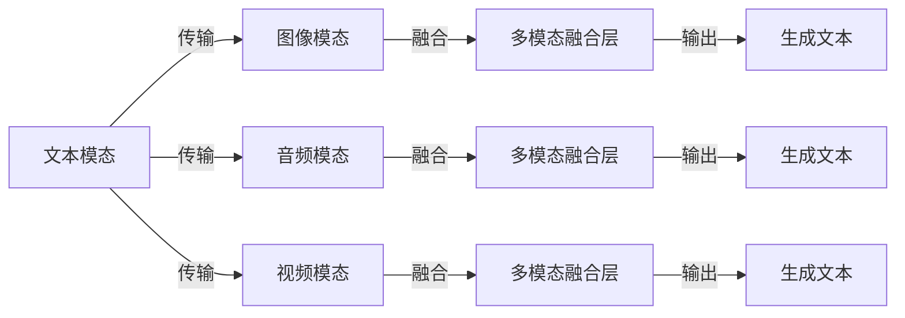

## 1. 背景介绍

多模态大模型(Multi-modal Big Models)是自然语言处理(Natural Language Processing，NLP)领域的一个里程碑。这一技术的出现使得计算机能够理解、生成和推理多种不同类型的数据，从而实现跨领域的知识融合。多模态大模型的核心特点是能够处理多种模态的输入，包括文本、图像、音频和视频等。

## 2. 核心概念与联系

多模态大模型的核心概念是将多种模态的信息整合到一个统一的模型中，以实现跨模态的信息传递和融合。这种融合的效果可以通过下面的Mermaid流程图来展示：



## 3. 核心算法原理具体操作步骤

多模态大模型的核心算法原理是基于深度学习的神经网络架构。以下是具体的操作步骤：

1. **数据预处理：** 将多种模态的数据进行统一的预处理，包括文本的分词、词向量化、图像的 resize 和 normalize 等。
2. **特征提取：** 使用卷积神经网络(CNN)和循环神经网络(RNN)等算法对不同模态的数据进行特征提取。
3. **多模态融合：** 将提取到的特征进行融合处理，例如使用 attention 机制进行权重分配。
4. **输出生成：** 使用神经网络生成对应模态的输出结果，例如生成文本、图像等。

## 4. 数学模型和公式详细讲解举例说明

多模态大模型的数学模型主要涉及到神经网络的前向传播和反向传播。以下是一个简化的前向传播公式：

$$
h_i = f(Wx_i + b)
$$

其中 $h_i$ 是第 $i$ 层的输出，$W$ 是权重矩阵，$x_i$ 是输入数据，$b$ 是偏置项，$f$ 是激活函数。

## 5. 项目实践：代码实例和详细解释说明

以下是一个多模态大模型的简单代码实例，使用 Python 语言和 TensorFlow 框架实现：

```python
import tensorflow as tf

# 定义输入数据
input_text = tf.placeholder(tf.float32, shape=[None, 100])
input_image = tf.placeholder(tf.float32, shape=[None, 224, 224, 3])

# 定义神经网络结构
hidden = tf.nn.relu(tf.matmul(input_text, W) + b)
output = tf.matmul(hidden, W2) + b2

# 定义损失函数和优化器
loss = tf.reduce_mean(tf.nn.sigmoid_cross_entropy_with_logits(labels=y, logits=output))
optimizer = tf.train.AdamOptimizer(learning_rate=0.001).minimize(loss)

# 定义训练过程
with tf.Session() as sess:
    sess.run(tf.global_variables_initializer())
    for step in range(1000):
        sess.run(optimizer, feed_dict={input_text: x_train, input_image: x_image, y: y_train})
```

## 6. 实际应用场景

多模态大模型的实际应用场景有很多，例如：

1. **图像文本检索：** 将图像和文本信息进行融合，实现图像文本的检索和匹配。
2. **智能问答系统：** 通过将问答信息与用户的历史行为进行融合，实现更智能的问答系统。
3. **视频摘要生成：** 通过对视频帧和音频信息进行融合，生成更有意义的视频摘要。

## 7. 工具和资源推荐

为了学习和实践多模态大模型，可以参考以下工具和资源：

1. **TensorFlow：** TensorFlow 是一个开源的机器学习框架，提供了丰富的神经网络组件和工具，可以用于实现多模态大模型。
2. **Keras：** Keras 是一个高级神经网络 API，基于 TensorFlow 构建，可以简化多模态大模型的开发过程。
3. **ImageNet：** ImageNet 是一个大型的图像数据库，可以用于训练和测试多模态大模型的图像识别能力。
4. **LSTM：** LSTM（Long Short-Term Memory）是一种递归神经网络架构，可以用于处理序列数据，例如文本和音频。

## 8. 总结：未来发展趋势与挑战

多模态大模型作为自然语言处理领域的里程碑，将为未来的人工智能发展提供强大的技术支持。然而，这也带来了诸多挑战，例如数据集的收集和处理、计算资源的需求以及模型的泛化能力等。未来，多模态大模型的发展方向将是不断优化算法、扩展应用场景和提高效率。

## 9. 附录：常见问题与解答

1. **多模态大模型与传统机器学习方法的区别在哪里？**

多模态大模型与传统机器学习方法的区别在于多模态大模型可以处理多种模态的输入，而传统机器学习方法通常只处理一种特定类型的数据。

1. **多模态大模型的应用领域有哪些？**

多模态大模型的应用领域包括图像文本检索、智能问答系统、视频摘要生成等。

1. **如何选择多模态大模型的神经网络架构？**

选择多模态大模型的神经网络架构需要根据具体的应用场景和需求进行权衡。例如，对于图像文本检索，可以选择卷积神经网络和循环神经网络进行融合。

作者：禅与计算机程序设计艺术 / Zen and the Art of Computer Programming