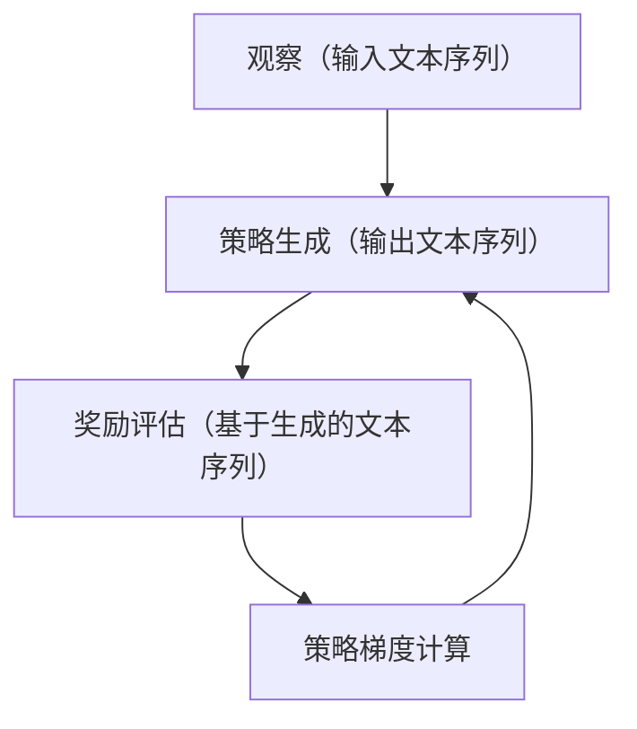

在本篇博客中，我们将深入探讨大规模语言模型的理论和实践，以及策略梯度（Policy Gradients）在语言模型中的应用。我们将从以下几个方面进行讨论：

## 1. 背景介绍

语言模型（Language Model）是自然语言处理（NLP）的核心技术之一，它用于预测给定上下文中的下一个词或词序。随着深度学习技术的发展，基于神经网络的语言模型逐渐成为主流。然而，传统的神经网络模型往往难以处理大规模数据和高维特征。因此，研究大规模语言模型的方法和策略梯度的应用至关重要。

## 2. 核心概念与联系

策略梯度（Policy Gradients）是一种基于强化学习（Reinforcement Learning）的方法，它用于优化一个策略，即一个映射自观察到动作的函数。在大规模语言模型中，我们可以将生成文本的过程视为一个序列生成任务，将模型的输出视为一个动作，输入文本序列和模型的输出序列视为观察。通过策略梯度，我们可以优化生成文本的策略，使其更好地生成符合人类语言的文本。

## 3. 核心算法原理具体操作步骤

策略梯度的核心思想是通过对策略的梯度下降来优化生成文本的策略。在大规模语言模型中，我们通常使用递归神经网络（RNN）或自注意力机制（Attention Mechanism）来建模文本序列。以下是一个简化的策略梯度算法流程图：

## 4. 数学模型和公式详细讲解举例说明

在本节中，我们将详细讲解策略梯度的数学模型和公式。我们将使用概率模型来表示策略，并使用期望和偏差来衡量策略的质量。在大规模语言模型中，我们通常使用交叉熵损失函数（Cross-Entropy Loss）来计算策略的梯度。

## 5. 项目实践：代码实例和详细解释说明

在本节中，我们将通过一个具体的代码实例来展示如何实现大规模语言模型和策略梯度。在这个例子中，我们将使用Python和TensorFlow来实现一个基于RNN的语言模型。

## 6. 实际应用场景

大规模语言模型和策略梯度在许多实际应用场景中有广泛的应用，如机器翻译、文本摘要、问答系统等。我们将通过一些具体的例子来展示这些技术在实际应用中的优势。

## 7. 工具和资源推荐

在学习大规模语言模型和策略梯度的过程中，以下是一些建议的工具和资源：

## 8. 总结：未来发展趋势与挑战

总之，大规模语言模型和策略梯度在自然语言处理领域具有重要意义。随着深度学习技术的不断发展，我们相信大规模语言模型将在未来取得更多的进步。然而，在实际应用中仍然存在许多挑战，例如计算资源的限制、模型的泛化能力等。我们希望本篇博客能为读者提供有用的参考和启发。

## 9. 附录：常见问题与解答

在本附录中，我们将回答一些常见的问题，如如何选择模型结构、如何处理数据、如何调参等。

作者：禅与计算机程序设计艺术 / Zen and the Art of Computer Programming