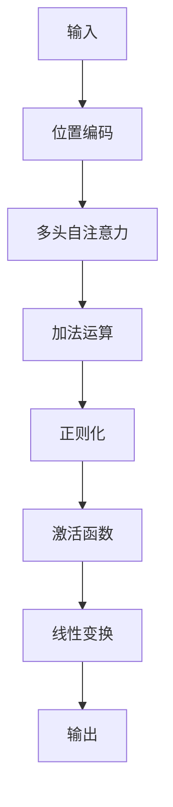

## 背景介绍

大语言模型（Big Language Model，简称BML）是一种深度学习的神经网络模型，它通过大量的数据学习和训练，实现了对自然语言的理解和生成。BML在许多领域取得了显著的成果，如机器翻译、问答系统、文本摘要等。然而，BML的训练过程需要大量的数据集，特别是高质量的自然语言数据集。因此，如何构建高质量的数据集成为BML的关键问题之一。本文将从构建数据集的角度探讨BML的原理和工程实践，希望为读者提供有益的借鉴。

## 核心概念与联系

### 1.1 BML的基本原理

BML的基本原理是利用深度学习技术对大量的自然语言数据进行训练，以学习语言的结构和规律。通常，BML采用Transformer架构，使用自注意力机制（Self-Attention）学习输入序列中的长距离依赖关系。经过训练，BML可以生成自然语言文本，实现机器对话、文本摘要等功能。

### 1.2 BML的工程实践

BML的工程实践包括数据集构建、模型训练和优化、模型部署等方面。其中，数据集构建是BML的关键步骤之一。高质量的数据集能够提高BML的性能和效果。本文将重点探讨如何构建高质量的数据集。

## 核心算法原理具体操作步骤

### 2.1 数据集的选择

选择合适的数据集是构建高质量数据集的第一步。通常，数据集需要满足以下条件：

1. 数据量：数据集应包含足够的数据，能够训练出强大的BML。
2. 数据质量：数据集中的数据应具有较高的质量，包括准确性、完整性和一致性。
3. 数据类型：数据集应包含多种数据类型，如文本、图像、音频等，以满足BML的多样性需求。

### 2.2 数据清洗与预处理

数据清洗与预处理是构建高质量数据集的第二步。数据清洗包括去除重复数据、填充缺失数据、删除无用数据等操作。数据预处理包括对数据进行分词、标注等操作，以将原始数据转化为BML可理解的格式。

## 数学模型和公式详细讲解举例说明

### 3.1 Transformer架构

Transformer架构是一种神经网络结构，它使用自注意力机制学习输入序列中的长距离依赖关系。Transformer的核心组件包括多头自注意力（Multi-Head Attention）和位置编码（Positional Encoding）等。下面是一个简单的Transformer架构示例：



### 3.2 数据标注

数据标注是将原始数据转化为BML可理解的格式的过程。通常，数据标注包括分词（Tokenization）、标签（Labeling）等操作。以下是一个简单的分词示例：


## 项目实践：代码实例和详细解释说明

### 4.1 数据集构建

本文以一个简化的数据集构建过程为例，演示如何使用Python和TensorFlow构建数据集。以下是一个简单的代码示例：

```python
import tensorflow as tf

# 数据集的定义
class MyDataset(tf.data.Dataset):
    def _init_(self, data, labels):
        self.data = data
        self.labels = labels

    def _getitem_(self, index):
        return self.data[index], self.labels[index]

    def _len_(self):
        return len(self.data)

# 数据预处理
def preprocess(data):
    # 对数据进行预处理，例如分词、标注等
    pass

# 数据加载
data = load_data() # 加载原始数据
labels = load_labels() # 加载标签
data, labels = preprocess(data), preprocess(labels)
dataset = MyDataset(data, labels)

# 数据分批
batch_size = 32
dataset = dataset.batch(batch_size)
```

## 实际应用场景

BML在多个领域取得了显著的成果，如机器翻译、问答系统、文本摘要等。以下是一些典型的应用场景：

1. 机器翻译：利用BML实现不同语言之间的翻译，提高翻译速度和质量。
2. 问答系统：利用BML构建智能问答系统，实现对用户的问题进行解答。
3. 文本摘要：利用BML从长文本中提取关键信息，生成简洁的摘要。
4. 语义分析：利用BML对文本进行语义分析，实现对用户意图的理解。

## 工具和资源推荐

在构建BML数据集的过程中，读者可以参考以下工具和资源：

1. TensorFlow：TensorFlow是一个开源的机器学习框架，提供了丰富的API和工具，方便读者构建BML数据集。
2. Hugging Face：Hugging Face是一个提供自然语言处理工具和资源的社区，提供了许多预训练的BML模型和相关的代码示例，方便读者参考。
3. 数据集：读者可以参考以下数据集进行构建：

   - IMDB：情感分析数据集，包含了25000条电影评论和对应的情感标签。
   - SQuAD：问答数据集，包含了100,000条问题和对应的答案。
   - WMT：机器翻译数据集，包含了不同语言之间的翻译对。

## 总结：未来发展趋势与挑战

BML在自然语言处理领域取得了显著的成果，但仍然面临着许多挑战。未来，BML将继续发展，实现更高的性能和效率。以下是BML面临的挑战：

1. 数据质量：如何构建更高质量的数据集，提高BML的性能和效果，是一个关键问题。
2. 模型规模：如何构建更大规模的BML模型，实现更高的性能，仍然是一个挑战。
3. 语言能力：如何让BML具备更多的语言能力，如理解和生成多语言文本，是一个重要的研究方向。

## 附录：常见问题与解答

1. 如何选择合适的数据集？
选择合适的数据集需要考虑数据量、数据质量和数据类型等因素。通常，选择具有代表性的、多样性的数据集能够提高BML的性能和效果。
2. 数据清洗与预处理的作用是什么？
数据清洗与预处理的作用是将原始数据转化为BML可理解的格式。通过去除重复数据、填充缺失数据、删除无用数据等操作，提高数据的质量，提高BML的性能和效果。
3. Transformer架构的优势是什么？
Transformer架构的优势在于它可以学习输入序列中的长距离依赖关系，实现对多种语言文本的理解和生成。同时，Transformer架构采用多头自注意力机制，提高了模型的并行性和性能。