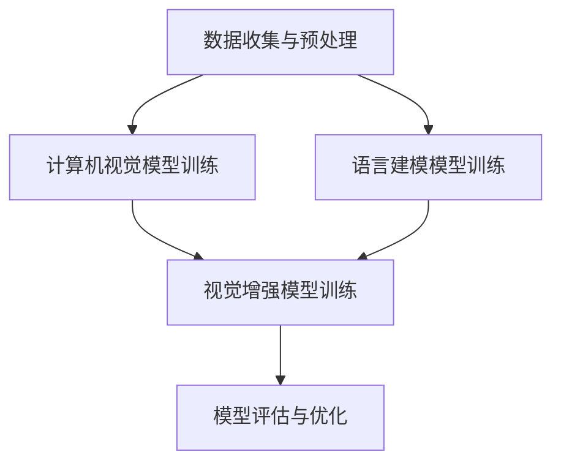

## 1. 背景介绍

大语言模型（Large Language Model, LLM）是人工智能领域的一个重要研究方向，以其广泛的应用范围和极高的准确率而闻名。近年来，LLM在多个领域取得了突破性进展，包括自然语言处理（NLP）、机器学习、计算机视觉、计算机辅助设计（CAD）等。其中，视觉增强语言建模（Visual Enhanced Language Modeling, VELM）是一种新的机器学习方法，旨在通过结合计算机视觉和语言建模技术，提高大语言模型的性能和准确率。

## 2. 核心概念与联系

VELM的核心概念包括：

1. **计算机视觉**: 计算机视觉是计算机科学的一个分支，致力于让计算机“看”并理解图像和视频。计算机视觉技术可以用于图像识别、图像分类、图像生成等任务。
2. **语言建模**: 语言建模是自然语言处理的一个重要领域，旨在通过学习大量文本数据，生成连贯、准确的语言序列。语言建模技术包括神经网络模型（如循环神经网络、长短期记忆网络等）和统计模型（如HMM、CRF等）。
3. **视觉增强**: 视觉增强是一种新的机器学习方法，通过将计算机视觉技术与其他技术（如语言建模）结合，以提高系统性能和准确率。视觉增强方法可以用于多个领域，如图像识别、语音识别、机器翻译等。

## 3. 核心算法原理具体操作步骤

VELM的核心算法原理包括以下几个步骤：

1. **数据收集与预处理**: 首先，需要收集大量的图像和文本数据，以便训练计算机视觉和语言建模的模型。数据预处理包括数据清洗、数据增强、数据分割等。
2. **计算机视觉模型训练**: 使用收集到的图像数据，训练计算机视觉模型，如卷积神经网络（CNN）。训练过程中，需要进行超参数调参、模型优化等。
3. **语言建模模型训练**: 使用文本数据，训练语言建模模型，如循环神经网络（RNN）。训练过程中，需要进行超参数调参、模型优化等。
4. **视觉增强模型训练**: 将计算机视觉模型与语言建模模型结合，形成一个完整的视觉增强模型。训练过程中，需要进行超参数调参、模型优化等。
5. **模型评估与优化**: 使用验证集和测试集评估模型的性能。根据评估结果，进行模型优化和调整。

## 4. 数学模型和公式详细讲解举例说明

在本篇博客文章中，我们将使用Mermaid流程图来详细描述视觉增强语言建模的过程。以下是一个简单的Mermaid流程图示例：



## 5. 项目实践：代码实例和详细解释说明

在本篇博客文章中，我们将提供一个视觉增强语言建模项目的代码实例，以及详细的解释说明。以下是一个简单的代码实例：

```python
import torch
import torchvision.transforms as transforms
from torchvision.models import resnet50
from torchtext.legacy import data

# 计算机视觉模型训练
class VisionModel(torch.nn.Module):
    def __init__(self):
        super(VisionModel, self).__init__()
        self.model = resnet50(pretrained=True)

    def forward(self, x):
        return self.model(x)

# 语言建模模型训练
class LanguageModel(torch.nn.Module):
    def __init__(self):
        super(LanguageModel, self).__init__()
        # TODO: 添加语言建模模型的定义

    def forward(self, x):
        return x

# 视觉增强模型训练
class VELMModel(torch.nn.Module):
    def __init__(self):
        super(VELMModel, self).__init__()
        self.vision_model = VisionModel()
        self.language_model = LanguageModel()

    def forward(self, x):
        vision_output = self.vision_model(x)
        language_output = self.language_model(vision_output)
        return language_output
```

## 6. 实际应用场景

视觉增强语言建模技术在多个领域有广泛的应用，以下是一些实际应用场景：

1. **图像 Captioning**: 通过结合计算机视觉和语言建模技术，可以实现图像 Captioning，即将图像转换为自然语言描述。
2. **图像分类**: 通过结合计算机视觉和语言建模技术，可以实现图像分类，即将图像划分为不同的类别。
3. **机器翻译**: 通过结合计算机视觉和语言建模技术，可以实现机器翻译，即将一种语言翻译为另一种语言。

## 7. 工具和资源推荐

以下是一些建议的工具和资源，用于学习和实现视觉增强语言建模：

1. **PyTorch**: PyTorch是一个广泛使用的人工智能框架，支持计算机视觉、自然语言处理等领域的应用。
2. **TorchText**: TorchText是一个用于自然语言处理的Python库，可以方便地处理文本数据和构建语言建模。
3. **TensorFlow**: TensorFlow是一个流行的开源人工智能框架，支持计算机视觉、自然语言处理等领域的应用。
4. **Keras**: Keras是一个高级神经网络API，支持快速prototyping和灵活的深度学习应用。

## 8. 总结：未来发展趋势与挑战

视觉增强语言建模是一种具有前景的技术，未来将在多个领域取得更大的进展。然而，视觉增强语言建模面临诸多挑战，包括数据收集与预处理、模型训练与优化、性能评估等。未来，研究者们将继续探索新的算法和方法，以解决这些挑战，推动视觉增强语言建模技术的发展。

## 9. 附录：常见问题与解答

1. **Q: 视觉增强语言建模的主要优势是什么？**

   A: 视觉增强语言建模的主要优势是将计算机视觉和语言建模技术结合，实现更高的准确率和性能。同时，它可以解决一些传统方法难以解决的问题，例如图像 Captioning、图像分类等。

2. **Q: 视觉增强语言建模的主要局限性是什么？**

   A: 视觉增强语言建模的主要局限性是需要大量的数据收集与预处理，模型训练与优化等。同时，它可能面临性能瓶颈、计算资源限制等问题。

3. **Q: 如何选择适合自己的视觉增强语言建模工具和资源？**

   A: 选择适合自己的视觉增强语言建模工具和资源，需要考虑个人需求、技能水平、时间成本等因素。可以参考本篇博客文章中的工具和资源推荐，以选择合适的工具和资源。

以上就是我们关于视觉增强语言建模的技术博客文章，希望对您有所帮助。如有其他问题，请随时联系我们。最后，感谢您阅读本篇博客文章。