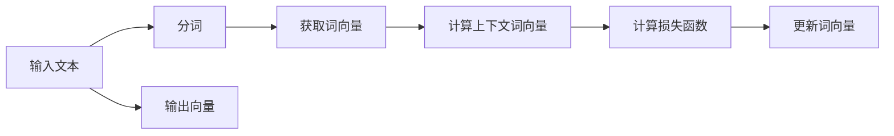
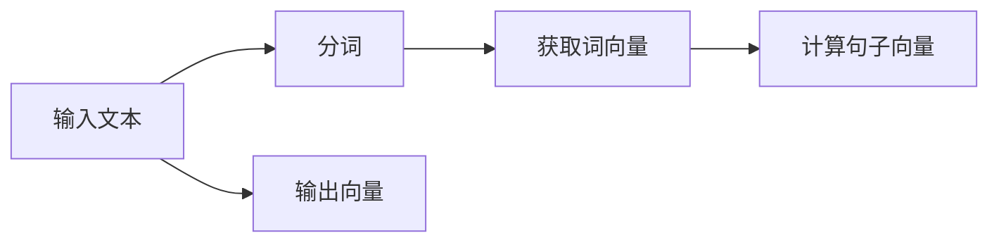

## 1.背景介绍

随着深度学习技术的发展，大语言模型（如BERT、GPT等）在自然语言处理（NLP）领域取得了显著成果。其中，文本向量化（Text Vectorization）是大语言模型的核心技术之一。文本向量化将文本信息映射为高维向量，使得机器能够理解和处理文本信息。为了更好地理解文本向量化，我们首先需要了解以下几个核心概念：词嵌入、语义向量和句子向量。

## 2.核心概念与联系

### 2.1 词嵌入

词嵌入（Word Embeddings）是将一个词汇映射到一个高维向量空间，以便捕捉词汇间的语义关系。常见的词嵌入方法有：词向量（Word2Vec）、GloVe（Global Vectors for Word Representation）和FastText。

### 2.2 语义向量

语义向量（Semantic Vector）是指一个单词或短语在向量空间中的表示。通过将单词映射到向量空间，我们可以计算两个单词之间的相似性度量。例如，使用余弦相似性（Cosine Similarity）来评估两个词向量间的关系。

### 2.3 句子向量

句子向量（Sentence Embeddings）是指一个句子或段落在向量空间中的表示。通过将句子或段落映射到向量空间，我们可以计算两个句子之间的相似性度量。常见的句子向量生成方法有：Average Word Embeddings、Doc2Vec和BERT。

## 3.核心算法原理具体操作步骤

### 3.1 词嵌入的生成

词嵌入的生成过程主要包括：负采样、skip-gram、CBOW（Continuous Bag of Words）等。以下是一个简单的CBOW算法流程图：



### 3.2 句子向量的生成

句子向量的生成过程主要包括：Average Word Embeddings、Doc2Vec和BERT等。以下是一个简单的Average Word Embeddings算法流程图：



## 4.数学模型和公式详细讲解举例说明

### 4.1 词嵌入的数学模型

词嵌入的数学模型主要包括：负采样、skip-gram、CBOW等。这里以skip-gram为例，描述其数学模型。给定一个目标词，skip-gram的目标是找到其上下文词的概率。损失函数为：

$$
J(\theta) = -\sum_{i=1}^{T} \log p(w_{c_i} | w_{t_i}; \theta)
$$

其中，$T$是训练数据集的大小,$w_{c_i}$是上下文词,$w_{t_i}$是目标词,$\theta$是模型参数。

### 4.2 句子向量的数学模型

句子向量的数学模型主要包括：Average Word Embeddings、Doc2Vec和BERT等。这里以Average Word Embeddings为例，描述其数学模型。给定一个句子，Average Word Embeddings的目标是计算其表示为向量的平均值。公式为：

$$
\text{Sent}(s) = \frac{1}{N} \sum_{i=1}^{N} \text{Word}(w_i)
$$

其中，$N$是句子中的单词数，$w_i$是句子中的第$i$个单词，$\text{Word}(w_i)$是单词$w_i$的向量表示，$\text{Sent}(s)$是句子$s$的向量表示。

## 5.项目实践：代码实例和详细解释说明

### 5.1 词嵌入的实践

以Word2Vec为例，展示如何使用Python和Gensim库实现词嵌入。代码如下：

```python
from gensim.models import Word2Vec

# 输入文本
sentences = [['first', 'sentence'], ['second', 'sentence'], ...]

# 训练词嵌入模型
model = Word2Vec(sentences, vector_size=100, window=5, min_count=1, workers=4)

# 获取单词向量
word_vector = model.wv['first']
```

### 5.2 句子向量的实践

以Average Word Embeddings为例，展示如何使用Python和spaCy库实现句子向量。代码如下：

```python
import spacy
from spacy.language import Language

# 加载模型
nlp = Language.load('en_core_web_md')

# 输入文本
text = "This is a sample sentence."

# 分词
doc = nlp(text)

# 计算句子向量
sentence_vector = sum([token.vector for token in doc], dim=0)
```

## 6.实际应用场景

文本向量化在许多实际应用场景中具有广泛的应用，如：

1. 情感分析：通过计算句子向量来评估文本的情感程度。
2. 文本分类：利用文本向量化对文本进行分类，例如新闻分类、邮件过滤等。
3. 文本相似性：计算两个文本之间的相似性度量，以便找出相关的文本。
4. 推荐系统：使用文本向量化来计算用户喜好和产品之间的相似性，从而提供个性化推荐。

## 7.工具和资源推荐

为了深入了解和学习文本向量化，以下是一些建议的工具和资源：

1. **Python库**：gensim、spaCy、nltk等。
2. **教程和指南**：gensim官方文档、spaCy官方文档等。
3. **论文**：Word2Vec（Mikolov et al., 2013）、BERT（Devlin et al., 2018）等。
4. **在线资源**：kdnuggets、towardsdatascience等。

## 8.总结：未来发展趋势与挑战

随着自然语言处理技术的不断发展，文本向量化也将持续发展。未来，我们可以期待以下几点趋势和挑战：

1. **更高维度的表示**：未来文本向量化可能会探索更高维度的表示，以便更好地捕捉文本信息。
2. **更强大的模型**：未来可能会出现更强大的语言模型，例如GPT-3、GPT-4等。
3. **多模态学习**：未来可能会将文本向量化与图像、音频等多模态信息整合，以便更好地理解和处理复杂的数据。
4. **隐私保护**：随着数据 privacy的日益关注，未来可能会出现针对文本向量化的隐私保护技术。

## 9.附录：常见问题与解答

### Q1：词嵌入与句子向量有什么区别？

词嵌入主要关注单词之间的关系，而句子向量关注整个句子或段落的表示。词嵌入可以看作是句子向量的子集。

### Q2：文本向量化与神经网络有什么关系？

文本向量化是神经网络中的一种特殊的表示方法。通过将文本映射到向量空间，我们可以使用神经网络来学习和优化这些向量表示，以便更好地理解和处理文本信息。

### Q3：如何评估文本向量化的效果？

常见的评估方法包括：余弦相似性、聚类评估、分类评估等。通过这些评估方法，我们可以了解文本向量化是否能有效地捕捉文本信息的语义关系。