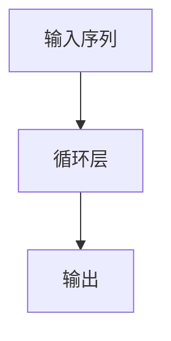

## 背景介绍
随着自然语言处理(NLP)技术的快速发展，大语言模型（如BERT、GPT-3等）已经成为机器学习领域的热点。这些模型通常使用自回归（autoregressive）方法进行训练，以实现强大的语言理解和生成能力。然而，这些模型的模型规模和计算复杂度也越来越大，导致了存储和传输的挑战。因此，在保证性能的同时，如何实现无损压缩成为了研究的热点。

## 核心概念与联系
自回归方法是在序列生成任务中，每个时间步（time step）生成的概率仅依赖于前面的时间步。这种方法在大语言模型中广泛使用，因为它可以利用前文上下文信息，实现更强大的语言生成能力。

无损压缩指的是在保持数据的原始质量的同时，将数据的体积缩小的过程。无损压缩技术在图像、视频、音频等领域有着广泛的应用，也在大语言模型中逐渐受到关注。

## 核心算法原理具体操作步骤
自回归方法在大语言模型中通常采用递归神经网络（RNN）或其变种（如LSTM、GRU等）来实现。模型通过循环层将输入序列逐步传递，生成一个一个的输出。下面是一个简化的自回归模型的示例：



## 数学模型和公式详细讲解举例说明
自回归模型通常使用条件概率来表示，条件概率表示每个时间步的输出仅依赖于前文。例如，在GPT-3中，条件概率可以表示为：

$$
P\left(w_t | w_{1:t-1}\right)
$$

其中，$w_t$表示第$t$个时间步的词汇，$w_{1:t-1}$表示前$t-1$个时间步的词汇。

## 项目实践：代码实例和详细解释说明
我们可以使用PyTorch来实现一个简单的自回归模型。下面是一个简化的示例：

```python
import torch
import torch.nn as nn

class AutoregressiveModel(nn.Module):
    def __init__(self, vocab_size, embed_dim):
        super(AutoregressiveModel, self).__init__()
        self.embedding = nn.Embedding(vocab_size, embed_dim)
        self.rnn = nn.GRU(embed_dim, embed_dim, batch_first=True)
        self.fc = nn.Linear(embed_dim, vocab_size)

    def forward(self, input, hidden):
        embed = self.embedding(input)
        output, hidden = self.rnn(embed, hidden)
        logits = self.fc(output)
        return logits, hidden
```

## 实际应用场景
自回归模型在多种场景下都有应用，例如文本摘要、机器翻译、文本生成等。无损压缩技术也可以应用于大语言模型，减小模型的存储和传输需求，提高模型在实际应用中的效率。

## 工具和资源推荐
对于学习和研究自回归和无损压缩，可以参考以下工具和资源：

1. PyTorch：一个流行的深度学习框架，可以用于实现自回归模型。
2. Hugging Face Transformers：一个提供了多种预训练语言模型的库，可以用于实际应用和研究。
3. "The Annotated Transformer"：阿德里恩·布罗德菲尔德（Adriene Broderick）的讲座笔记，详细介绍了Transformer模型的原理和实现。

## 总结：未来发展趋势与挑战
自回归方法在大语言模型中取得了显著的成功，但随着模型规模的扩大，如何实现高效的无损压缩成为了一个重要的挑战。未来，研究者们将继续探索更高效的压缩技术，提高大语言模型在实际应用中的性能。

## 附录：常见问题与解答
1. 自回归模型的主要优点是什么？
自回归模型的主要优点是能够利用前文上下文信息，实现更强大的语言生成能力。
2. 无损压缩技术的主要目的是什么？
无损压缩技术的主要目的是在保持数据的原始质量的同时，将数据的体积缩小，从而提高存储和传输效率。
3. 自回归和无损压缩在实际应用中的优势是什么？
自回归模型具有强大的语言生成能力，可以应用于文本摘要、机器翻译、文本生成等任务。而无损压缩技术可以减小模型的存储和传输需求，提高模型在实际应用中的效率。