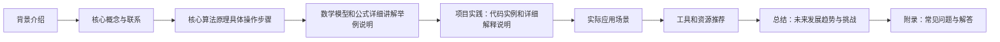

## 1. 背景介绍

随着大语言模型的不断发展，人工智能领域已经取得了前所未有的成就。然而，随之而来的也是各种安全隐患。为了让大语言模型更好地发挥其价值，同时确保用户的安全和隐私，我们需要制定一套防御策略。

## 2. 核心概念与联系

大语言模型防御策略的核心概念包括数据安全、模型安全和隐私保护。这些概念之间有密切的联系，我们需要从多个角度来思考这些问题。

## 3. 核心算法原理具体操作步骤

为了确保大语言模型的安全性，我们需要了解其核心算法原理，并在此基础上制定相应的防御策略。

### 3.1 语义分析

语义分析是一种自然语言处理技术，它可以帮助我们理解自然语言文本的含义。通过语义分析，我们可以识别潜在的安全隐患，并采取相应的防御措施。

### 3.2 模型训练

模型训练是一个重要的过程，我们需要确保模型训练过程中不发生数据泄露和模型劫持等安全问题。

## 4. 数学模型和公式详细讲解举例说明

为了更好地理解大语言模型防御策略，我们需要深入了解其数学模型和公式。以下是一个简单的例子：

### 4.1 信息熵

信息熵是一种度量信息不确定性的指标。在大语言模型防御策略中，我们可以利用信息熵来评估模型的安全性。

## 5. 项目实践：代码实例和详细解释说明

为了让读者更好地理解大语言模型防御策略，我们需要提供具体的代码实例和详细解释说明。

### 5.1 数据加密

数据加密是一种常见的防御策略，我们可以通过代码实例来展示如何实现数据加密。

## 6. 实际应用场景

大语言模型防御策略在实际应用中有很多应用场景，我们需要通过具体的例子来展示其实际应用价值。

### 6.1 网络安全

网络安全是大语言模型防御策略的一个重要应用场景，我们可以通过具体的例子来展示如何利用大语言模型来防御网络安全问题。

## 7. 工具和资源推荐

为了帮助读者更好地了解大语言模型防御策略，我们需要推荐一些相关的工具和资源。

### 7.1 开源库

开源库可以帮助我们更好地理解大语言模型防御策略，我们可以推荐一些相关的开源库。

## 8. 总结：未来发展趋势与挑战

大语言模型防御策略是一个不断发展的领域，我们需要关注其未来发展趋势和挑战。

### 8.1 AI安全

AI安全是大语言模型防御策略的一个重要发展方向，我们需要关注AI安全的未来发展趋势和挑战。

## 9. 附录：常见问题与解答

为了帮助读者更好地理解大语言模型防御策略，我们需要提供一些常见问题与解答。

### 9.1 数据泄露

数据泄露是大语言模型防御策略中一个常见的问题，我们需要提供解决数据泄露的方法和建议。

[Mermaid 流程图]

