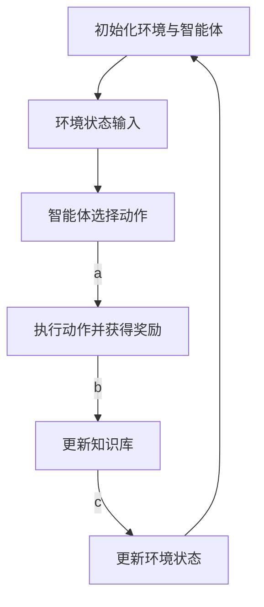

强化学习（Reinforcement Learning，RL）是人工智能（AI）和机器学习（ML）领域的一个重要分支，它研究如何让智能体（agent）通过与环境的互动来学习完成任务。强化学习的学习过程是一个基于试错的过程，智能体通过探索环境并获得奖励来学习最优策略。在强化学习中，学习率（learning rate）是一个非常重要的参数，它决定了智能体在探索环境时如何更新其知识库。因此，学习率调整机制（learning rate scheduling）对于强化学习的性能至关重要。

## 1. 背景介绍

学习率是强化学习算法中一个关键参数，它决定了智能体在探索环境时如何更新其知识库。学习率过大可能导致智能体过快地更新知识库，导致学习不稳定；学习率过小则可能导致学习速度过慢，无法及时调整策略。因此，我们需要找到一个合适的学习率调整策略来提高强化学习的性能。

## 2. 核心概念与联系

学习率调整机制是一种根据时间或者智能体的探索进度来调整学习率的策略。常见的学习率调整策略有以下几种：

1. 线性减少策略：学习率在训练开始时较大，随着训练的进行逐渐减小。
2. 指数衰减策略：学习率在训练开始时较大，随着时间的推移按指数衰减。
3. 余弦衰减策略：学习率在训练开始时较大，随着时间的推移按余弦曲线衰减。
4. 动态调整策略：根据智能体的探索进度动态调整学习率。

## 3. 核心算法原理具体操作步骤

学习率调整机制在强化学习算法中主要体现在更新知识库时的操作步骤。以下是一个简化的强化学习算法流程图，展示了学习率调整机制在算法中的作用。



在这个流程图中，E代表更新知识库的步骤。在这个步骤中，学习率调整机制决定了智能体如何更新其知识库。

## 4. 数学模型和公式详细讲解举例说明

学习率调整机制可以用数学公式来描述。以下是一个简化的学习率调整机制的数学模型。

$$
\theta_t = \theta_{t-1} + \alpha_t * (r_t - \hat{V}(\theta_{t-1}))
$$

其中，$\theta_t$表示知识库在第t次更新后的值，$\theta_{t-1}$表示知识库在第t-1次更新前的值，$\alpha_t$表示学习率在第t次更新后的值，$r_t$表示第t次更新时获得的奖励，$\hat{V}(\theta_{t-1})$表示知识库在第t-1次更新后的预测价值。

## 5. 项目实践：代码实例和详细解释说明

在实际项目中，我们可以使用Python编程语言和TensorFlow库来实现学习率调整机制。以下是一个简单的学习率调整机制的代码示例。

```python
import tensorflow as tf

# 定义学习率初始值和减少率
initial_learning_rate = 1.0
learning_rate_decay = 0.99

# 定义学习率调整函数
def learning_rate_schedule(epoch):
    return initial_learning_rate * (learning_rate_decay ** epoch)

# 定义优化器
optimizer = tf.keras.optimizers.Adam(learning_rate=initial_learning_rate)

# 定义训练过程
for epoch in range(num_epochs):
    # 训练步骤
    optimizer.learning_rate = learning_rate_schedule(epoch)
    # ...
    # 训练完一个周期后，学习率会根据学习率调整函数调整
```

## 6. 实际应用场景

学习率调整机制在实际应用中可以用于解决各种强化学习问题，例如游戏对抗学习、自动驾驶、金融投资等。

## 7. 工具和资源推荐

对于学习强化学习和学习率调整机制，以下是一些建议的工具和资源：

1. TensorFlow：一个流行的机器学习库，可以用于实现学习率调整机制。
2. OpenAI Gym：一个常用的强化学习实验平台，可以用于实验学习率调整机制。
3. 《深度强化学习》：一本介绍强化学习的经典书籍，内容丰富，适合初学者和专业人士。

## 8. 总结：未来发展趋势与挑战

学习率调整机制对于强化学习的性能至关重要。随着AI技术的不断发展，我们可以期待学习率调整机制在未来得到更深入的探索和优化。然而，学习率调整机制仍然面临一些挑战，例如如何在不同的任务和环境中选择合适的学习率调整策略，如何在探索和利用之间找到平衡等。

## 9. 附录：常见问题与解答

1. 学习率调整机制的作用是什么？

学习率调整机制的作用是根据时间或者智能体的探索进度来调整学习率，从而优化强化学习算法的性能。

2. 学习率调整机制有什么好处？

学习率调整机制可以使强化学习算法更快地收敛到最优策略，从而提高算法的性能。

3. 学习率调整机制的缺点是什么？

学习率调整机制的缺点是需要根据不同的任务和环境选择合适的学习率调整策略，可能会增加算法的复杂性。

作者：禅与计算机程序设计艺术 / Zen and the Art of Computer Programming