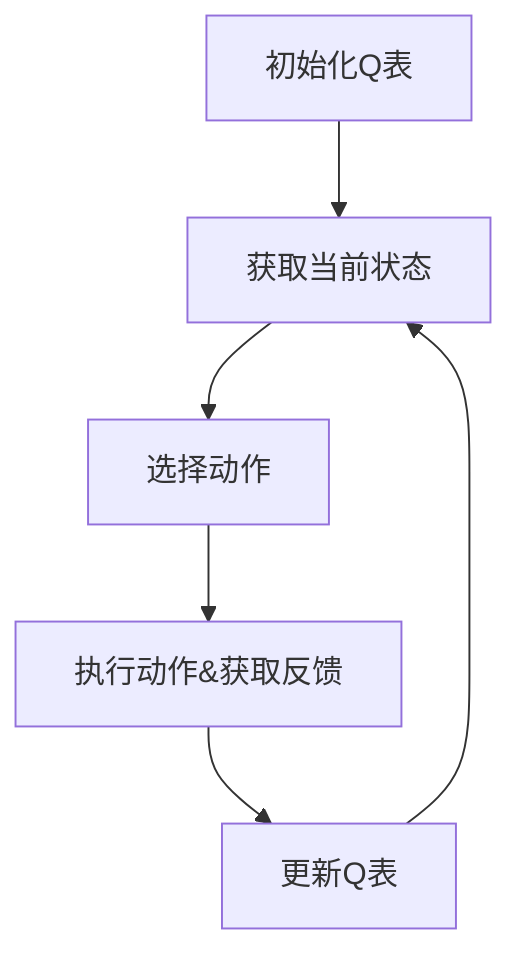

强化学习（Reinforcement Learning, RL）是人工智能领域的重要分支之一，它以模拟人类学习过程为基础，研究如何让智能体（Agent）通过与环境的交互来学习。强化学习的核心目标是使智能体能够在不明确知道环境规律的情况下，通过不断试错学习，实现最佳行为。

## 1. 背景介绍

强化学习的起源可以追溯到1950年代的美国心理学家斯金纳（B.F.Skinner）。斯金纳认为，学习是通过环境反馈来实现的，而强化学习正是这种观点的计算机科学版本。与监督学习和生成式学习不同，强化学习不依赖于大量的示例数据，而是通过与环境的交互来学习。

强化学习通常被分为三个部分：环境（Environment）、智能体（Agent）和行为策略（Behavior Policy）。环境是智能体所处的场景，提供了智能体所需要的信息和反馈；智能体是与环境进行交互的实体，它需要根据环境的反馈来选择最佳行为策略；行为策略是智能体在给定环境状态下选择行为的概率分布。

## 2. 核心概念与联系

强化学习的核心概念是奖励（Reward）。智能体与环境交互时，会获得一定的奖励，这些奖励将指导智能体如何学习。奖励可以是正面的，也可以是负面的。通过不断地试错，智能体会学习如何最大化累积的奖励，从而实现最佳的行为策略。

强化学习与其他机器学习方法的联系在于，它们都需要训练和优化一个模型。然而，强化学习与监督学习和生成式学习的区别在于，强化学习需要与环境进行交互，而监督学习和生成式学习则依赖于示例数据。

## 3. 核心算法原理具体操作步骤

强化学习的核心算法有多种，如Q学习（Q-learning）、深度Q学习（Deep Q-learning）和Policy Gradient方法等。以下我们以Q学习为例，讲解其具体操作步骤。

1. 初始化一个Q表，Q表的每个元素表示一个状态-动作对的价值。
2. 从环境中得到当前状态。
3. 根据状态选择一个动作，执行动作并得到环境的反馈（状态和奖励）。
4. 更新Q表，将新的状态-动作对的价值加入Q表。
5. 重复步骤2-4，直到智能体达到目标状态。

Q学习的过程可以用一个简单的流程图来描述，如下所示：



## 4. 数学模型和公式详细讲解举例说明

Q学习的数学模型可以用以下公式来表示：

$$
Q(s,a) \leftarrow Q(s,a) + \alpha [R + \gamma \max_{a'} Q(s',a') - Q(s,a)]
$$

其中，$Q(s,a)$表示状态s下选择动作a的价值;$R$是当前状态的奖励;$\alpha$是学习率;$\gamma$是折扣因子；$s'$是执行动作a后得到的新状态。

举例说明，假设我们有一个简单的游戏环境，如下所示：

```python
import numpy as np

class Environment:
    def __init__(self):
        self.state = 0

    def step(self, action):
        if action == 0:
            self.state += 1
        elif action == 1:
            self.state -= 1
        reward = self.state
        return self.state, reward

    def reset(self):
        self.state = 0
        return self.state
```

我们可以使用Q学习来训练一个智能体，使其能够最大化累积的奖励。代码如下：

```python
import numpy as np

def q_learning(env, alpha=0.1, gamma=0.9, episodes=1000):
    Q = np.zeros((env.observation_space.n, env.action_space.n))

    for episode in range(episodes):
        state = env.reset()
        done = False

        while not done:
            action = np.argmax(Q[state])
            next_state, reward = env.step(action)
            Q[state, action] += alpha * (reward + gamma * np.max(Q[next_state]) - Q[state, action])
            state = next_state
            if state == env.observation_space.n - 1:
                done = True

    return Q
```

## 5. 项目实践：代码实例和详细解释说明

在上一节中，我们已经看到了一个Q学习的代码示例。现在让我们详细分析一下这个代码。

1. 我们首先定义了一个Environment类，用于模拟游戏环境。环境有一个状态（0或1），并根据选择的动作（0或1）进行转移。每次动作执行后，环境会返回一个奖励值。
2. 接下来，我们定义了一个q\_learning函数，用于训练智能体。函数参数包括环境、学习率、折扣因子和训练episode数。
3. 我们初始化一个Q表，大小为环境的状态数量和动作数量。
4. 在每一个episode中，我们从环境中获取初始状态，然后一直执行动作直到达到目标状态。
5. 对于每个动作，我们执行动作，并根据环境的反馈更新Q表。

## 6. 实际应用场景

强化学习在实际应用中有很多场景，如游戏AI、自动驾驶、金融投资等。以下是几个典型的应用场景：

1. 游戏AI：强化学习可以用于训练游戏AI，使其能够根据游戏环境的反馈来学习最佳的游戏策略。比如，AlphaGo就是通过强化学习训练的，成功击败了世界冠军。
2. 自动驾驶：自动驾驶车辆需要能够根据环境的变化来调整自己的行为。强化学习可以用于训练自动驾驶系统，使其能够学会在各种环境下行驶。
3. 金融投资：金融投资也可以视为一个强化学习问题，投资者需要根据市场的变化来调整投资策略。强化学习可以用于训练投资模型，使其能够根据市场的反馈来学习最佳的投资策略。

## 7. 工具和资源推荐

以下是一些强化学习的工具和资源推荐：

1. TensorFlow Agents（TF-Agents）：TensorFlow Agents是一个开源的强化学习框架，可以帮助开发者轻松构建和训练强化学习模型。[GitHub](https://github.com/tensorflow/tf-agents)
2. OpenAI Gym：OpenAI Gym是一个用于强化学习的环境库，提供了多种不同的游戏和实验环境，方便开发者进行强化学习实验。[GitHub](https://github.com/openai/gym)
3. Spinning Up：Spinning Up是一个强化学习的教程，涵盖了强化学习的基本概念、算法和实现。[GitHub](https://github.com/openai/spinning-up)
4. Sutton and Barto的《强化学习》：这本书是强化学习领域的经典之作，系统介绍了强化学习的基本概念、理论和算法。[Amazon](https://www.amazon.com/Reinforcement-Learning-Second-Edition-Algorithms/dp/1451679682)

## 8. 总结：未来发展趋势与挑战

强化学习在过去几年取得了显著的进展，尤其是在深度强化学习领域。未来，强化学习将继续发展，涉及到更多领域和应用。然而，强化学习也面临着一些挑战，如计算资源的需求、安全性和可解释性等。未来，研究者和工程师需要继续探索新的算法、架构和方法，以解决这些挑战，推动强化学习的进一步发展。

## 9. 附录：常见问题与解答

以下是一些关于强化学习的常见问题和解答：

1. Q：强化学习与监督学习有什么区别？
A：强化学习与监督学习的区别在于，强化学习需要与环境进行交互，而监督学习依赖于示例数据。监督学习的目标是学习从输入数据到输出数据的映射关系，而强化学习的目标是学习如何最大化累积的奖励。
2. Q：深度强化学习与传统强化学习有什么区别？
A：深度强化学习与传统强化学习的区别在于，深度强化学习使用了深度神经网络来表示状态和行为策略，而传统强化学习使用的是表格方法。深度强化学习可以处理具有连续状态空间和高维特征空间的问题，而传统强化学习则适用于具有离散状态空间的问题。
3. Q：强化学习是否适用于所有问题？
A：强化学习适用于那些需要智能体与环境进行交互并学习最佳行为的问题。然而，强化学习可能不适用于那些有明确的输入输出映射关系的问题，这些问题更适合使用监督学习来解决。

作者：禅与计算机程序设计艺术 / Zen and the Art of Computer Programming