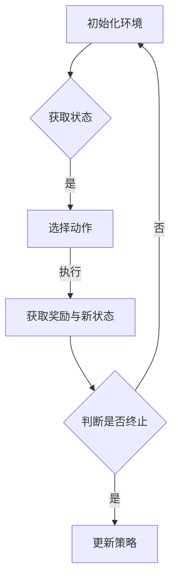

## 背景介绍

近年来，随着物联网（IoT）技术的不断发展和普及，强化学习（Reinforcement Learning, RL）在物联网系统中的应用也逐渐受到重视。强化学习是一种通过交互操作来学习和优化策略的机器学习方法，它的核心思想是通过与环境的互动来学习最佳行为策略。与监督学习和无监督学习相比，强化学习能够在没有明确的指导下学习行为策略，这使得它在物联网系统中的应用具有广泛的可能性。

本文将探讨强化学习在物联网系统中的应用，包括核心概念与联系、核心算法原理、数学模型和公式、项目实践、实际应用场景、工具和资源推荐、未来发展趋势与挑战等方面。

## 核心概念与联系

强化学习是一种由智能体（agent）与环境之间的交互组成的过程。智能体通过与环境的互动来学习和优化其行为策略，目标是最大化累积回报（cumulative reward）。强化学习的主要组成部分包括：

1. 状态（state）：环境的某个特定时刻的条件。
2. 动作（action）：智能体对环境的响应，例如改变速度或方向。
3. 奖励（reward）：智能体在执行动作后得到的反馈，用于评估动作的好坏。
4. 策略（policy）：一个映射，从状态到动作的函数，用于确定智能体在每个状态下所采取的动作。

强化学习与物联网系统的联系在于，物联网系统中的设备和传感器可以被视为智能体，它们与环境之间的互动可以被视为状态、动作和奖励之间的关系。因此，强化学习可以用于优化物联网系统中的设备和传感器的行为策略，从而提高系统的性能和效率。

## 核心算法原理具体操作步骤

强化学习的核心算法原理包括价值函数（value function）和策略梯度（policy gradient）等。以下是一个简化的强化学习算法流程图：



具体操作步骤如下：

1. 初始化环境：创建一个物联网系统的环境模型，包括状态、动作和奖励。
2. 获取状态：从环境中获取当前状态。
3. 选择动作：根据当前状态和策略，选择一个动作。
4. 执行动作：执行所选动作，并得到环境的反馈（奖励和新状态）。
5. 判断是否终止：检查当前状态是否满足终止条件，如果满足，则结束算法。
6. 更新策略：根据所得奖励和新状态，更新策略，以便在未来状态下选择更好的动作。

## 数学模型和公式详细讲解举例说明

强化学习的数学模型通常包括状态值函数（state-value function）和动作值函数（action-value function）。以下是一个简单的Q学习（Q-learning）的数学模型：

$$
Q(s, a) = Q(s, a) + \alpha[r + \gamma \max_{a'} Q(s', a') - Q(s, a)]
$$

其中，$Q(s, a)$表示状态-action值函数，$s$和$a$分别表示状态和动作;$r$表示奖励;$\alpha$表示学习率;$\gamma$表示折扣因子；$s'$表示新状态。

举例说明，假设我们有一个物联网系统，其中的设备需要根据环境的温度来调整自己的温度。我们可以使用强化学习来学习一个适当的策略，以便在不同温度下选择合适的动作（例如，降温或升温）。我们可以将温度视为状态，并将降温或升温视为动作。通过使用Q学习算法，我们可以学习一个适当的状态-action值函数，从而确定设备在不同温度下应该采取的动作。

## 项目实践：代码实例和详细解释说明

以下是一个简单的强化学习项目实例，使用Python和Gym库（一个开源的机器学习实验平台）来实现一个物联网系统中的强化学习算法。

```python
import gym
import numpy as np
import tensorflow as tf

# 创建一个物联网系统的环境
env = gym.make("IoTReinforcement-v0")

# 初始化参数
learning_rate = 0.1
discount_factor = 0.99
num_episodes = 1000

# 初始化Q表
Q_table = np.zeros([env.observation_space.n, env.action_space.n])

# 训练强化学习模型
for episode in range(num_episodes):
    state = env.reset()
    done = False

    while not done:
        # 选择动作
        action = np.argmax(Q_table[state, :])

        # 执行动作并获取奖励和新状态
        new_state, reward, done, _ = env.step(action)

        # 更新Q表
        Q_table[state, action] = Q_table[state, action] + learning_rate * (reward + discount_factor * np.max(Q_table[new_state, :]) - Q_table[state, action])

        # 更新状态
        state = new_state

# 使用Q表进行决策
def choose_action(state):
    return np.argmax(Q_table[state, :])

# 状态为10时，选择动作
state = 10
action = choose_action(state)
```

## 实际应用场景

强化学习在物联网系统中的实际应用场景包括：

1. 设备维护：通过强化学习来学习设备的最佳维护策略，降低维护成本和故障率。
2. 能源管理：使用强化学习优化能源消耗，实现更高效的能源管理。
3. 交通管理：通过强化学习学习智能交通系统的最佳调度策略，提高交通流畅度和安全性。
4. 安全监控：使用强化学习来学习安全监控系统的最佳巡查策略，提高安全风险的预防能力。

## 工具和资源推荐

以下是一些建议的工具和资源，可以帮助您学习和实现强化学习：

1. Python：作为一种流行的编程语言，Python在机器学习和强化学习领域具有广泛的应用。
2. Gym库：Gym库是一个开源的机器学习实验平台，提供了许多预制的环境，可以用于训练和测试强化学习算法。
3. TensorFlow：TensorFlow是一个流行的深度学习框架，可以用于实现强化学习算法。
4. 《强化学习》：由Richard S. Sutton和Andrew G. Barto编写的经典教材，深入探讨了强化学习的理论和应用。

## 总结：未来发展趋势与挑战

强化学习在物联网系统中的应用具有广泛的潜力，未来将会在越来越多的领域得到应用。然而，强化学习也面临着诸多挑战，包括计算资源的需求、环境探索和状态表示等。随着计算能力的提高和算法的不断发展，强化学习在物联网系统中的应用将会变得越来越普及和高效。

## 附录：常见问题与解答

1. **强化学习与监督学习、无监督学习的区别？**

强化学习与监督学习、无监督学习的区别在于它们的学习目标和方法。监督学习和无监督学习都依赖于数据标记，但它们的目标不同：监督学习的目标是根据已知的输入输出对来学习模型；无监督学习的目标是根据未知的输入数据来发现数据之间的结构。强化学习的目标是通过与环境的交互来学习最佳行为策略，因此它不依赖于预先标记的数据。

2. **强化学习在物联网系统中的优势？**

强化学习在物联网系统中的优势在于它可以通过与环境的交互来学习最佳行为策略，而无需依赖于预先标记的数据。这使得强化学习能够适应环境的变化，实现更高效的决策和优化。另外，强化学习还可以处理多-Agent系统中的互动和协同问题，提高系统的整体性能和效率。

3. **如何选择合适的强化学习算法？**

选择合适的强化学习算法需要根据具体的应用场景和需求来进行。不同的算法具有不同的特点和优势，因此需要根据具体的情况进行选择。例如，在需要处理连续状态和动作的场景下，可以考虑使用深度强化学习（Deep Reinforcement Learning）；在需要处理多-Agent系统的场景下，可以考虑使用Multi-Agent Reinforcement Learning等。

4. **强化学习在物联网系统中的应用有哪些？**

强化学习在物联网系统中的应用包括设备维护、能源管理、交通管理和安全监控等方面。通过使用强化学习，可以实现更高效的决策和优化，从而提高系统的整体性能和效率。

5. **如何解决强化学习中的探索和利用的矛盾？**

解决强化学习中的探索和利用的矛盾的一种方法是使用探索-利用策略，例如Epsilon-Greedy策略。这种策略在选择动作时会随机选择一个动作，以便探索新的状态和动作；在其他时候，它会根据当前的策略选择最优动作，以便利用已有的经验。这种策略可以平衡探索和利用之间的关系，提高强化学习的学习效率。