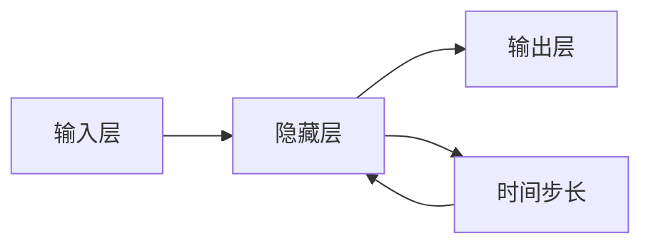

## 1.背景介绍

循环神经网络 (Recurrent Neural Networks, RNN) 是一种强大的人工神经网络，它的独特之处在于，它可以处理具有时间序列的数据，这使得 RNN 在处理诸如语音识别、自然语言处理、时间序列预测等任务时具有优势。

## 2.核心概念与联系

循环神经网络的主要特点是网络结构中存在着“循环”，这个循环使得网络可以维持一种状态，这种状态可以被理解为是网络的“记忆”。这种记忆使得网络在处理当前输入的同时，也考虑到了过去的信息。



这种结构使得 RNN 可以处理序列数据。例如，在处理语音或文本数据时，RNN 可以考虑到前后文的信息，从而做出更准确的预测。

## 3.核心算法原理具体操作步骤

RNN 的工作原理可以分为以下几个步骤：

1. 将输入数据分解为序列，每个时间步长 (timestep) 对应序列中的一个元素。
2. 在每个时间步长，网络会先计算隐藏层的状态，这个状态是基于当前的输入和前一时间步长的隐藏层状态计算得出的。
3. 然后，基于隐藏层的状态，网络会计算输出。
4. 以上过程会在每个时间步长重复进行，直到整个序列处理完毕。

## 4.数学模型和公式详细讲解举例说明

RNN 的数学模型可以用以下公式表示：

在时间步长 t，隐藏层的状态 $h_t$ 可以表示为：

$$h_t = \sigma(W_{hh}h_{t-1} + W_{xh}x_t + b_h)$$

其中，$W_{hh}$ 是隐藏层到隐藏层的权重，$W_{xh}$ 是输入到隐藏层的权重，$h_{t-1}$ 是前一时间步长的隐藏层状态，$x_t$ 是当前时间步长的输入，$\sigma$ 是激活函数，$b_h$ 是隐藏层的偏置。

输出 $y_t$ 可以表示为：

$$y_t = W_{hy}h_t + b_y$$

其中，$W_{hy}$ 是隐藏层到输出层的权重，$b_y$ 是输出层的偏置。

## 5.项目实践：代码实例和详细解释说明

以下是一个使用 Python 和 PyTorch 实现的简单 RNN 的例子：

```python
import torch
import torch.nn as nn

class SimpleRNN(nn.Module):
    def __init__(self, input_size, hidden_size, output_size):
        super(SimpleRNN, self).__init__()
        self.hidden_size = hidden_size
        self.i2h = nn.Linear(input_size + hidden_size, hidden_size)
        self.i2o = nn.Linear(input_size + hidden_size, output_size)
        self.softmax = nn.LogSoftmax(dim=1)

    def forward(self, input, hidden):
        combined = torch.cat((input, hidden), 1)
        hidden = self.i2h(combined)
        output = self.i2o(combined)
        output = self.softmax(output)
        return output, hidden

    def initHidden(self):
        return torch.zeros(1, self.hidden_size)
```

## 6.实际应用场景

RNN 在许多实际应用场景中都有广泛的应用，例如：

- 语音识别：RNN 可以处理语音信号，识别出其中的语音内容。
- 自然语言处理：RNN 可以处理文本数据，进行情感分析、文本生成、机器翻译等任务。
- 时间序列预测：RNN 可以处理时间序列数据，预测未来的数据趋势。

## 7.工具和资源推荐

- PyTorch：一个强大的深度学习框架，支持动态计算图，适合研究和开发。
- TensorFlow：Google 开发的深度学习框架，支持静态计算图，适合生产环境。

## 8.总结：未来发展趋势与挑战

虽然 RNN 在处理序列数据方面有优势，但是它也存在一些问题，例如梯度消失和梯度爆炸问题，这使得 RNN 在处理长序列时效果不佳。为了解决这些问题，研究者提出了一些改进的 RNN 结构，例如长短期记忆网络 (LSTM) 和门控循环单元 (GRU)。

随着深度学习的发展，我们可以预见，更多的改进的 RNN 结构和训练技巧将会被提出，使得 RNN 在更多的应用场景中发挥作用。

## 9.附录：常见问题与解答

- 问题1：RNN 为什么可以处理序列数据？

答：RNN 的网络结构中存在着“循环”，这个循环使得网络可以维持一种状态，这种状态可以被理解为是网络的“记忆”。这种记忆使得网络在处理当前输入的同时，也考虑到了过去的信息，因此 RNN 可以处理序列数据。

- 问题2：RNN 有哪些常见的改进结构？

答：为了解决 RNN 的梯度消失和梯度爆炸问题，研究者提出了一些改进的 RNN 结构，例如长短期记忆网络 (LSTM) 和门控循环单元 (GRU)。

作者：禅与计算机程序设计艺术 / Zen and the Art of Computer Programming