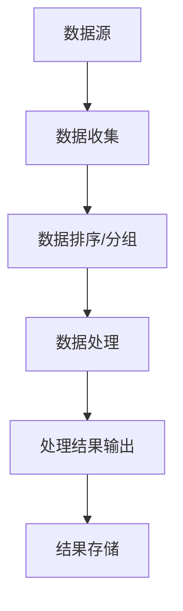

批处理（Batch Processing）是一种处理数据的方式，通过将多个任务组合成一个批次进行处理，从而提高处理效率。批处理技术在计算机科学中有着广泛的应用，尤其是在大数据处理、数据挖掘和人工智能等领域。

## 1. 背景介绍

批处理技术起源于20世纪50年代的计算机科学领域，当时的计算机资源非常有限，处理能力较弱。为了提高处理效率，人们将多个任务组合成一个批次进行处理。随着计算机硬件和软件技术的不断发展，批处理技术已经成为大数据处理的主要手段之一。

## 2. 核心概念与联系

批处理技术的核心概念是将多个任务组合成一个批次进行处理，从而提高处理效率。批处理技术与并行处理、分布式处理等技术有着密切的联系。批处理技术可以与并行处理技术结合，实现多台计算机同时处理数据，从而提高处理速度。此外，批处理技术还可以与分布式处理技术结合，实现数据在多台计算机之间的分布式存储和处理，从而提高处理能力。

## 3. 核心算法原理具体操作步骤

批处理算法的基本原理是将多个任务组合成一个批次进行处理。具体操作步骤如下：

1. 将多个任务收集成一个批次。
2. 对批次进行排序或分组，以便更有效地处理数据。
3. 使用适当的算法对批次进行处理。
4. 将处理结果输出为一个新的批次。
5. 将处理结果存储在数据库或其他存储系统中。

## 4. 数学模型和公式详细讲解举例说明

批处理技术的数学模型通常是基于数据流的。数据流模型描述了数据从一个阶段到另一个阶段的流动过程。在批处理系统中，数据通常以批次的形式流动。以下是一个简单的批处理系统的数据流图：



## 5. 项目实践：代码实例和详细解释说明

以下是一个简单的批处理程序的代码示例，使用Python编写：

```python
import pandas as pd

def batch_processing(data):
    # 对数据进行排序
    sorted_data = data.sort_values(by='column_name')
    
    # 对数据进行分组
    grouped_data = sorted_data.groupby('column_name')
    
    # 对分组后的数据进行处理
    processed_data = []
    for group in grouped_data:
        # 对每个分组进行处理
        processed_data.append(process_group(group))
    
    # 输出处理结果
    return processed_data

def process_group(group):
    # 对分组的数据进行处理
    # ...
    return processed_group

# 数据收集
data = pd.read_csv('data.csv')

# 批处理
result = batch_processing(data)

# 结果存储
for r in result:
    r.to_csv('result.csv', index=False)
```

## 6.实际应用场景

批处理技术在许多实际应用场景中得到了广泛应用，以下是一些典型的应用场景：

1. 数据清洗：将大量的数据从不同来源收集到一个地方，并对数据进行清洗、处理和转换。
2. 数据分析：对大量数据进行统计分析、模式识别和预测。
3. 数据挖掘：通过对数据的深入分析，发现隐藏的模式和关系，实现知识提取和决策支持。
4. 人工智能：利用批处理技术训练机器学习模型，实现数据预处理、特征提取和模型评估等功能。

## 7.工具和资源推荐

对于批处理技术的学习和实践，以下是一些建议的工具和资源：

1. Python：Python是一种流行的编程语言，具有丰富的数据处理库，如Pandas和NumPy，可以用于批处理技术的学习和实践。
2. 数据库：数据库是批处理技术的重要组成部分，可以用于存储和处理数据。常见的数据库有MySQL、PostgreSQL和MongoDB等。
3. 数据可视化：数据可视化工具可以帮助我们更好地理解数据和分析结果。常见的数据可视化工具有Tableau、Power BI和D3.js等。

## 8.总结：未来发展趋势与挑战

批处理技术在计算机科学领域具有广泛的应用前景。随着数据量的持续增长，批处理技术的需求也将逐渐增加。未来，批处理技术将与大数据、人工智能等技术紧密结合，实现更高效的数据处理和分析。然而，批处理技术也面临着一些挑战，如数据安全、实时性和性能等。

## 9.附录：常见问题与解答

1. Q：批处理技术与其他数据处理技术的区别是什么？
A：批处理技术与其他数据处理技术的主要区别在于处理方式。批处理技术将多个任务组合成一个批次进行处理，从而提高处理效率。而其他数据处理技术如实时处理和流处理则关注于对数据进行实时处理和分析。
2. Q：批处理技术在哪些领域有广泛应用？
A：批处理技术在大数据处理、数据挖掘和人工智能等领域有广泛应用。具体来说，批处理技术可以用于数据清洗、数据分析、数据挖掘和机器学习等任务。
3. Q：如何选择合适的批处理算法？
A：选择合适的批处理算法需要根据具体的任务需求和数据特点进行评估。通常情况下，可以根据数据规模、数据类型和处理需求来选择合适的批处理算法。

作者：禅与计算机程序设计艺术 / Zen and the Art of Computer Programming