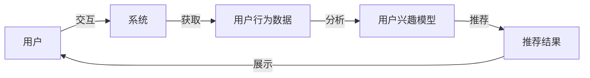

推荐系统（Recommender Systems）是人工智能领域的一个重要分支，它的主要目标是根据用户的历史行为和兴趣为用户推荐合适的内容。推荐系统已经广泛应用于电商、社交媒体、视频播放平台等各种场景，帮助用户发现更符合自己需求的内容。

## 1. 背景介绍

推荐系统的发展可以追溯到20世纪60年代的信息过滤技术（Information Filtering）。最初的推荐系统主要依赖于用户的行为数据，如点击、收藏、购买等。随着大数据和机器学习技术的发展，推荐系统逐渐演变为基于协同过滤（Collaborative Filtering）和内容过滤（Content-Based Filtering）两种方法的混合系统。

## 2. 核心概念与联系

推荐系统的核心概念包括：

1. 用户：系统中的一个个体，具有特定的兴趣和需求。
2. 项：系统中的一种内容，如商品、文章、视频等。
3. 推荐：系统根据用户的兴趣和需求推荐合适的项。

推荐系统的核心任务是根据用户的历史行为和兴趣，预测用户对未知项的喜好，从而进行推荐。推荐系统的核心概念与联系可以用下面的Mermaid流程图表示：



## 3. 核心算法原理具体操作步骤

推荐系统的核心算法原理主要包括协同过滤（Collaborative Filtering）和内容过滤（Content-Based Filtering）两种方法。

1. 协同过滤：协同过滤主要依赖于用户之间的相似性。根据已知用户的喜好，找到与之相似的用户，然后推荐这些用户喜欢但自己还未知好的内容。协同过滤分为两种：用户协同过滤（User-based Collaborative Filtering）和物品协同过滤（Item-based Collaborative Filtering）。
2. 内容过滤：内容过滤主要依赖于项之间的相似性。根据用户的历史喜好，找到与之相关的项，然后推荐与之相似的内容。内容过滤主要采用的是基于特征的方法，如文本特征、图像特征等。

## 4. 数学模型和公式详细讲解举例说明

在推荐系统中，常用的数学模型有线性回归（Linear Regression）和矩阵分解（Matrix Factorization）等。

1. 线性回归：线性回归是一种简单的数学模型，可以用来预测用户对未知项的喜好。其基本思想是通过拟合用户行为数据来学习一个线性模型。线性回归的公式为：$$y = \sum_{i=1}^{n}w_ix_i + b$$，其中$y$表示用户对未知项的喜好，$w_i$表示权重，$x_i$表示特征，$n$表示特征数量，$b$表示偏置。
2. 矩阵分解：矩阵分解是一种用于解决线性方程组的方法，可以用来分解用户行为数据中的潜在因素。矩阵分解的基本思想是将用户行为数据表示为一个三维矩阵，并将其分解为一个用户特征矩阵和一个物品特征矩阵的乘积。矩阵分解的公式为：$$R = U \cdot V^T + E$$，其中$R$表示原始矩阵，$U$表示用户特征矩阵，$V$表示物品特征矩阵，$E$表示残差矩阵。

## 5. 项目实践：代码实例和详细解释说明

以下是一个简单的推荐系统项目实践，使用Python和Scikit-learn库实现。我们将使用协同过滤的方法为用户推荐未知的电影。

1. 首先，需要准备一个电影评分数据集。这里我们使用MovieLens数据集，其中包含一组用户的电影评分数据。数据集可以从[MovieLens](http://grouplens.org/datasets/movielens/)网站下载。
2. 接下来，需要将数据集加载到Python中，并对其进行预处理。我们可以使用Pandas库来完成这个任务。以下是一个简单的数据加载和预处理示例：
```python
import pandas as pd

ratings = pd.read_csv('ratings.csv')
movies = pd.read_csv('movies.csv')

user_item_matrix = ratings.pivot_table(index='userId', columns='movieId', values='rating')
user_item_matrix = user_item_matrix.fillna(0)
```
1. 现在，我们可以使用Scikit-learn库中的Surprise模块来实现协同过滤推荐系统。以下是一个简单的代码示例：
```python
from surprise import Dataset, Reader, KNNWithMeans
from surprise.model_selection import train_test_split
from surprise import accuracy

# 加载数据
data = Dataset.load_from_df(user_item_matrix.values, Reader(rating_scale=(0.5, 5)))

# 切分数据
trainset, testset = train_test_split(data, test_size=0.2)

# 使用KNNWithMeans算法进行协同过滤
algo = KNNWithMeans(sim_options={'name': 'cosine', 'user_based': True})

# 训练模型
algo.fit(trainset)

# 预测
predictions = algo.test(testset)

# 计算准确率
accuracy.rmse(predictions)
```
## 6. 实际应用场景

推荐系统广泛应用于各种场景，如：

1. 电商：根据用户的购物历史和喜好，为用户推荐相似商品。
2. 社交媒体：根据用户的朋友和关注者，推荐用户可能感兴趣的文章或视频。
3. 视频播放平台：根据用户的观看历史和喜好，为用户推荐相似视频。

## 7. 工具和资源推荐

以下是一些建议推荐的工具和资源，以帮助读者更好地了解和学习推荐系统：

1. Scikit-learn：Python机器学习库，包含许多用于建模和预测的算法。
2. Surprise：Python库，专门用于推荐系统的建模和评估。
3. 《推荐系统：一项改善生活的技术》（Recommender Systems: The Technology of Articulate Life）：一本关于推荐系统的经典书籍，介绍了推荐系统的原理、技术和实际应用。
4. 《推荐系统实践》（Recommender Systems Handbook）：一本关于推荐系统实践的权威书籍，涵盖了推荐系统的各种技术和实际应用。

## 8. 总结：未来发展趋势与挑战

推荐系统是人工智能领域的一个重要分支，随着数据量和用户需求的增加，推荐系统的重要性日益凸显。未来推荐系统的发展趋势主要有：

1. 数据驱动：推荐系统需要依赖于丰富的数据，以提高推荐质量和准确性。
2. 个性化：推荐系统需要根据用户的个性化需求进行推荐，以提高用户满意度和粘性。
3. 智能化：推荐系统需要采用更先进的算法和技术，以提高推荐的智能化水平。

推荐系统面临的主要挑战有：

1. 数据质量：推荐系统需要依赖于高质量的数据，以提高推荐的准确性和有效性。
2. 数据隐私：用户隐私保护是推荐系统开发的重要方面，需要遵循相关法律法规。
3. 矛盾性：推荐系统需要在多个目标之间进行权衡，如推荐质量、用户体验和商业利益等。

## 9. 附录：常见问题与解答

以下是一些建议推荐的常见问题和解答，以帮助读者更好地了解和学习推荐系统：

1. Q：推荐系统的主要目的是什么？
A：推荐系统的主要目的是根据用户的历史行为和兴趣，为用户推荐合适的内容，以提高用户满意度和粘性。
2. Q：协同过滤和内容过滤有什么区别？
A：协同过滤主要依赖于用户之间的相似性，根据已知用户的喜好，找到与之相似的用户，然后推荐这些用户喜欢但自己还未知好的内容。内容过滤主要依赖于项之间的相似性，根据用户的历史喜好，找到与之相关的项，然后推荐与之相似的内容。
3. Q：线性回归和矩阵分解有什么区别？
A：线性回归是一种数学模型，可以用来预测用户对未知项的喜好。矩阵分解是一种用于解决线性方程组的方法，可以用来分解用户行为数据中的潜在因素。线性回归主要用于拟合用户行为数据，而矩阵分解主要用于分解潜在因素。

以上就是本篇文章的全部内容。希望这篇文章能帮助读者更好地了解推荐系统的原理、技术和实际应用。如果您有任何问题或建议，请随时联系我们。