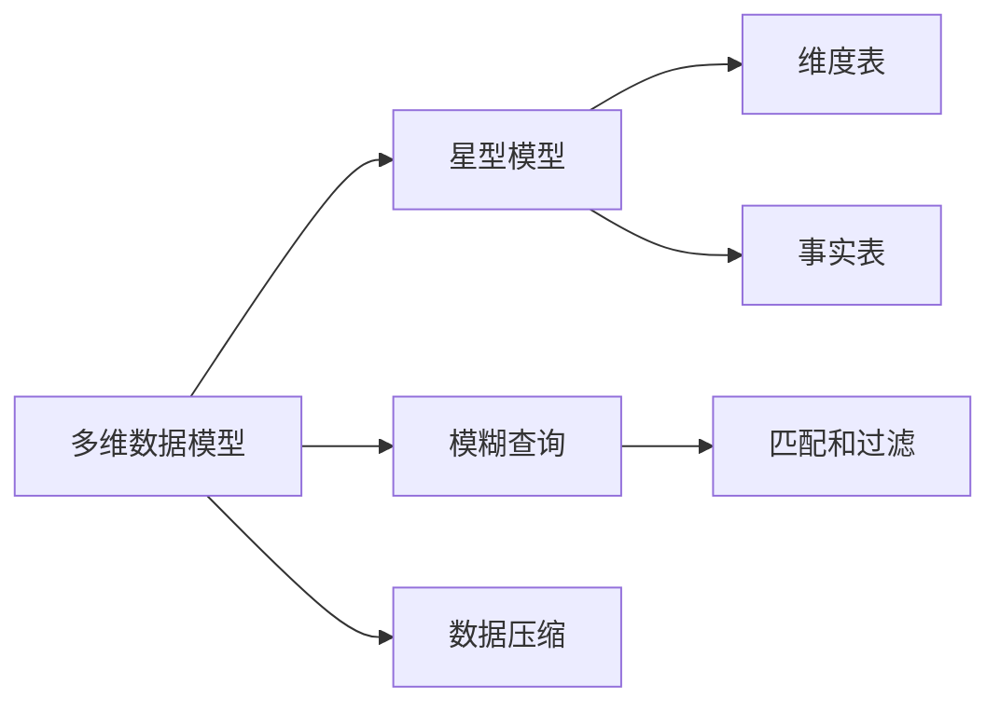

数据仓库是一种用于存储、管理和分析大量数据的系统。它的主要目的是为了提供快速、有效的数据查询和分析功能。数据仓库是企业决策支持系统的核心组成部分，帮助企业决策者更好地了解企业的业务状况、竞争力和市场机会。

## 1. 背景介绍

数据仓库的概念起源于20世纪80年代，随着数据量的不断增长，传统的数据库系统已经无法满足企业的需求。数据仓库系统应运而生，它采用了多维数据模型，提供了更高效的数据查询和分析功能。

数据仓库系统包括多个数据源，数据从这些源中提取（Extract）、转换（Transform）并加载（Load）到数据仓库中。这种过程被称为ETL（Extract, Transform, Load）。

## 2. 核心概念与联系

数据仓库的核心概念有：

1. 多维数据模型：数据仓库采用多维数据模型，允许用户从多个维度对数据进行查询和分析。这些维度包括行（事实）、列（维度）、时间和级别。
2. 星型模型：星型模型是数据仓库中最常用的多维数据模型之一。它将维度数据存储在一个中心的维度表中，与事实表关联。事实表包含了度量数据。
3. 模糊查询：数据仓库支持模糊查询，允许用户对数据进行模糊匹配和过滤。
4. 数据压缩：数据仓库采用数据压缩技术，降低数据存储和传输的成本。

数据仓库的核心概念与关系图：

## 3. 核心算法原理具体操作步骤

数据仓库的核心算法原理包括：

1. 数据提取：从数据源中提取数据。
2. 数据转换：将提取到的数据转换为数据仓库所需的格式。
3. 数据加载：将转换后的数据加载到数据仓库中。

具体操作步骤如下：

1. 数据提取：使用ETL工具从数据源中提取数据。常用的ETL工具有Informatica、Microsoft SQL Server Integration Services（SSIS）和IBM InfoSphere DataStage等。
2. 数据转换：在ETL过程中，数据需要进行转换。例如，将CSV格式的数据转换为Excel格式，或者将数据库中的数据转换为数据仓库所需的格式。
3. 数据加载：将转换后的数据加载到数据仓库中。数据仓库的数据库管理系统（DBMS）包括Oracle、Microsoft SQL Server、IBM DB2和SAP HANA等。

## 4. 数学模型和公式详细讲解举例说明

数据仓库的数学模型主要包括多维数据模型和聚合函数。

1. 多维数据模型：多维数据模型将数据按维度划分为多个维度，形成一个多维空间。例如，可以按照时间、地域和产品维度对销售数据进行分析。
2. 聚合函数：数据仓库的聚合函数用于计算多维数据的总和、平均值、最大值、最小值等。例如，可以计算每个产品的总销售额、平均销售额、最大销售额和最小销售额。

## 5. 项目实践：代码实例和详细解释说明

下面是一个简单的数据仓库项目实践，使用Python和Pandas库进行数据提取、转换和加载。

```python
import pandas as pd

# 数据提取
url = "https://raw.githubusercontent.com/jbrownlee/Datasets/master/housing.csv"
data = pd.read_csv(url)

# 数据转换
data['RM'] = data['RM'].astype('float')
data['LSTAT'] = data['LSTAT'].astype('float')

# 数据加载
data.to_csv('housing.csv', index=False)
```

## 6. 实际应用场景

数据仓库的实际应用场景有：

1. 营销分析：数据仓库可以用于分析客户行为、产品销售情况和市场趋势，为营销决策提供支持。
2. 财务管理：数据仓库可以用于分析企业财务报表，帮助企业识别潜在问题并制定改进措施。
3. 人力资源管理：数据仓库可以用于分析员工表现、薪资水平和离职原因，为人力资源决策提供支持。

## 7. 工具和资源推荐

数据仓库的工具和资源推荐有：

1. 数据仓库软件：Oracle、Microsoft SQL Server、IBM DB2和SAP HANA等。
2. ETL工具：Informatica、Microsoft SQL Server Integration Services（SSIS）和IBM InfoSphere DataStage等。
3. 数据分析工具：Python、R和Tableau等。

## 8. 总结：未来发展趋势与挑战

数据仓库的未来发展趋势与挑战有：

1. 大数据：随着数据量的不断增长，数据仓库需要能够处理大数据。数据仓库需要采用分布式架构和高效的数据处理技术。
2. 数据湖：数据湖是一种新的数据管理方法，它允许数据仓库与其他数据源共存。数据仓库需要与数据湖进行集成，以实现更高效的数据分析。
3. 人工智能：数据仓库需要与人工智能技术进行集成，以实现更高效的数据分析和决策支持。

## 9. 附录：常见问题与解答

1. 数据仓库与传统数据库的区别是什么？

数据仓库与传统数据库的主要区别在于数据模型和查询方式。传统数据库采用关系型数据模型，支持SQL查询语言。数据仓库采用多维数据模型，支持多维查询语言。

1. 数据仓库的优缺点是什么？

数据仓库的优点是能够提供快速、有效的数据查询和分析功能。缺点是数据仓库需要采用复杂的ETL过程，数据维护成本较高。

1. 数据仓库与数据湖的区别是什么？

数据仓库是一种用于存储、管理和分析数据的系统。数据湖是一种新的数据管理方法，它允许数据仓库与其他数据源共存。数据仓库需要采用多维数据模型，数据湖需要采用分布式文件系统。