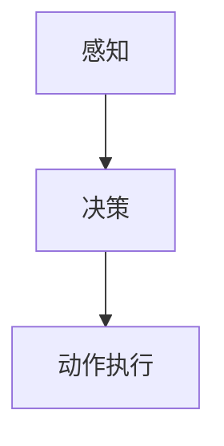

## 1.背景介绍

随着人工智能和机器学习技术的不断发展，机器人学（Robotics）也在迅速发展。机器人学是一门研究机器人及其行为、能力、运动和交互的学科，它涉及到计算机科学、机械工程、电子工程、控制工程、人工智能等多个领域。下面我们将探讨机器人学的核心概念、原理、算法，以及实际应用场景和未来发展趋势。

## 2.核心概念与联系

首先，让我们来了解一下机器人学的核心概念：

- **机器人**：是一种能够执行任务的自动装置，通常由机械、电子、软件和控制系统组成。
- **运动控制**：是指如何控制机器人移动或姿态。
- **感知**：是指机器人对环境和物体的感知能力。
- **决策**：是指机器人根据感知到的环境和目标，做出决策。
- **动作执行**：是指机器人根据决策结果，执行相应的动作。

这些概念之间相互关联，共同构成了机器人学的基本框架。

## 3.核心算法原理具体操作步骤

接下来，我们将讨论机器人学的核心算法原理，以及具体的操作步骤。以下是一个简化的流程图：



### 3.1 感知

感知是机器人学的第一步，主要包括视觉、听觉、触觉等多种感知方式。例如，机器人可以通过摄像头获取环境的图像信息，通过麦克风获取声音信息，通过触觉传感器获取触感信息。

### 3.2 决策

在感知到环境信息后，机器人需要根据这些信息做出决策。决策算法可以是基于规则的、基于概率的，或者是基于深度学习的。例如，机器人可以通过深度学习算法对图像进行分类，判断是否存在危险物体。

### 3.3 动作执行

最后，机器人根据决策结果执行相应的动作。动作执行可以是机械运动，例如旋转、前进、后退等，也可以是电子操作，例如打开关灯等。

## 4.数学模型和公式详细讲解举例说明

在机器人学中，数学模型和公式是非常重要的，它们可以帮助我们理解和描述机器人行为的原理。以下是一个简单的例子：

### 4.1 位姿估计

位姿估计（Pose estimation）是机器人学的一个重要问题，它涉及到计算机视觉和机器学习领域。以下是一个简单的位姿估计的数学模型：

$$
\mathbf{T}_{\text{world}}^{\text{camera}} = \mathbf{T}_{\text{world}}^{\text{camera}} \mathbf{T}_{\text{camera}}^{\text{object}}
$$

其中，$$\mathbf{T}$$表示变换矩阵，表示世界坐标系到相机坐标系的变换，表示相机坐标系到物体坐标系的变换。

### 4.2 路径规划

路径规划（Path planning）是机器人在环境中移动的关键问题。以下是一个简单的路径规划的数学模型：

$$
\min_{\mathbf{p}} \sum_{i=1}^{N} \|\mathbf{p}_i - \mathbf{p}_{i-1}\|
$$

其中，$$\mathbf{p}$$表示路径点集合，$$\|\mathbf{p}_i - \mathbf{p}_{i-1}\|$$表示路径点间的距离。

## 5.项目实践：代码实例和详细解释说明

在本节中，我们将通过一个实际项目来展示如何使用机器人学的原理和算法。我们将实现一个简单的机器人，能够在二维平面上移动并避免障碍物。

```python
import numpy as np
import matplotlib.pyplot as plt

# 机器人初始位置
start = np.array([0, 0])
# 机器人目标位置
goal = np.array([10, 10])
# 障碍物位置
obstacles = np.array([[2, 2], [4, 4], [6, 6], [8, 8]])

# 路径规划函数
def path_planning(start, goal, obstacles):
    path = []
    # 机器人当前位置
    current_position = start
    # 机器人当前方向
    direction = np.array([1, 0])
    # 机器人移动速度
    speed = 1
    # 机器人移动距离
    distance = 0
    # 机器人移动次数
    steps = 0

    while current_position != goal:
        # 计算机器人到障碍物的距离
        distances = np.linalg.norm(obstacles - current_position, axis=1)
        # 找到最近的障碍物
        nearest_obstacle = obstacles[distances.argmin()]
        # 计算机器人到最近障碍物的距离
        nearest_distance = np.linalg.norm(current_position - nearest_obstacle)
        # 计算机器人到目标的距离
        goal_distance = np.linalg.norm(goal - current_position)
        # 机器人移动的方向
        if nearest_distance < goal_distance:
            # 向最近障碍物方向移动
            direction = nearest_obstacle - current_position
        else:
            # 向目标方向移动
            direction = goal - current_position

        # 机器人移动
        current_position = current_position + direction * speed
        path.append(current_position)
        steps += 1

    return path

# 生成路径
path = path_planning(start, goal, obstacles)

# 绘制路径
plt.plot(*zip(*path), label='Path')
plt.scatter(*zip(*obstacles), label='Obstacles')
plt.scatter(*start, label='Start')
plt.scatter(*goal, label='Goal')
plt.legend()
plt.show()
```

## 6.实际应用场景

机器人学在实际应用中有很多场景，例如：

- **工业自动化**：机器人可以用于工业生产线上的零部件装配、测试等任务。
- **家居清洁**：机器人可以用于家居清洁，如扫地、抹地等。
- **医疗保健**：机器人可以用于医疗保健领域，如手术辅助、病例诊断等。
- **探索与救援**：机器人可以用于探险领域，如火山口探测、海洋探测等，也可以用于救援领域，如地震灾区救援等。

## 7.工具和资源推荐

在学习机器人学时，以下一些工具和资源可能会对你有帮助：

- **编程语言**：Python、C++、MATLAB 等。
- **机器学习库**：TensorFlow、PyTorch、Scikit-learn 等。
- **机器人模拟器**：Gazebo、V-REP 等。
- **机器人硬件**：Arduino、Raspberry Pi 等。
- **开源项目**：ROS（Robotic Operating System）等。
- **课程与书籍**：Coursera、Udacity、MIT OpenCourseWare 等。

## 8.总结：未来发展趋势与挑战

未来，机器人学将会不断发展，以下是一些未来发展趋势与挑战：

- **人工智能与机器学习**：未来机器人将会越来越依赖人工智能和机器学习技术，实现更高级别的决策和行为。
- **物联网与云计算**：未来机器人将会与物联网和云计算技术紧密结合，实现更高效的数据处理和共享。
- **人机交互**：未来机器人将会更加关注人机交互，实现更自然、直观的与人类交流。
- **安全与可靠性**：未来机器人将会更加关注安全与可靠性，实现更稳定的系统性能。

## 9.附录：常见问题与解答

在学习机器人学时，可能会遇到一些常见问题，以下是一些解答：

Q: 机器人学与人工智能有什么区别？
A: 机器人学是研究机器人及其行为、能力、运动和交互的学科，而人工智能是研究如何让计算机模拟人类的智能行为和思维过程的学科。机器人学可以说是人工智能的一个应用领域。

Q: 什么是机器学习？
A: 机器学习是人工智能的一个分支，研究如何让计算机通过数据和经验学习，自动发现数据模式并做出决策。它涉及到数学、统计、概率和计算机科学等多个领域。

Q: 什么是深度学习？
A: 深度学习是机器学习的一个子领域，它使用深度神经网络来学习和表示数据。深度学习可以实现更高级别的特征提取和决策，具有更强的表现能力。

作者：禅与计算机程序设计艺术 / Zen and the Art of Computer Programming