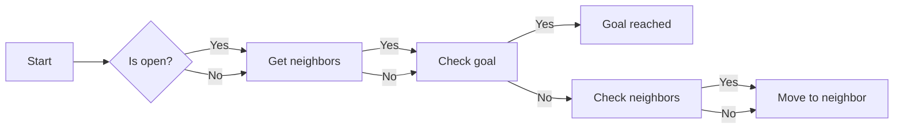

## 1.背景介绍

机器人是未来科技发展的重要组成部分，它们在各个领域中的应用也越来越广泛。机器人的整体设计是其核心技术之一，涉及到机械结构、电气系统、软件架构、视觉和算法系统等多个方面。本文将从这些方面入手，探讨机器人的整体设计原理和实践。

## 2.核心概念与联系

机器人整体设计的核心概念包括：

1. 机械结构：机器人身体的外部结构，负责承载和执行任务。
2. 电气系统：负责机器人身体的动力和控制。
3. 软件架构：机器人智能和决策的基础设施。
4. 视觉系统：机器人感知环境的能力。
5. 算法系统：机器人理解和处理信息的方法。

这些概念之间相互联系，共同构成了机器人的整体设计。机械结构决定了电气系统的设计；软件架构支持电气系统的运行；视觉系统与算法系统相互依存。

## 3.核心算法原理具体操作步骤

机器人的算法系统主要包括：

1. 感知算法：机器人通过传感器获取环境信息。
2. 位置定位算法：确定机器人在环境中的位置。
3. 映射算法：将感知到的环境信息映射到机器人内部的坐标系。
4. 路径规划算法：计算出机器人从起点到终点的最短路径。
5. 控制算法：执行路径规划结果，并控制机器人移动。

这些算法相互依存，共同完成机器人的任务。

## 4.数学模型和公式详细讲解举例说明

1. 位姿估计模型：$$
\mathbf{T}_{world}^{camera} = \mathbf{R}_{world}^{camera} \cdot \mathbf{p}_{world}^{camera}
$$

1. 映射模型：$$
\mathbf{M}_{map} = \mathbf{M}_{sensor} \cdot \mathbf{M}_{camera} \cdot \mathbf{M}_{world}
$$

1. A* 路径规划算法：



## 5.项目实践：代码实例和详细解释说明

机器人整体设计的项目实践涉及到多种编程语言和工具。以下是一个使用 Python 编写的简单机器人路径规划程序的代码示例：

```python
import numpy as np

def heuristic(a, b):
    return np.linalg.norm(np.array(a) - np.array(b))

def astar(start, goal, neighbors, cost_matrix):
    open_list = []
    closed_list = set()

    start_node = {'parent': None, 'position': start, 'f': 0, 'g': 0, 'h': 0}
    open_list.append(start_node)

    while len(open_list) > 0:
        current_node = open_list[0]
        current_index = open_list.pop(0)

        if current_node['position'] == goal:
            path = []
            while current_node is not None:
                path.append(current_node['position'])
                current_node = current_node['parent']
            return path[::-1]

        closed_list.add(current_node['position'])

        for neighbor in neighbors(current_node['position']):
            if neighbor in closed_list:
                continue

            tentative_g_score = current_node['g'] + cost_matrix[current_node['position']][neighbor]
            neighbor_node = {'parent': current_node, 'position': neighbor, 'f': tentative_g_score + heuristic(neighbor, goal), 'g': tentative_g_score, 'h': heuristic(neighbor, goal)}

            if neighbor_node in open_list:
                if tentative_g_score < neighbor_node['g']:
                    neighbor_node['g'] = tentative_g_score
                    neighbor_node['f'] = tentative_g_score + heuristic(neighbor, goal)

            open_list.append(neighbor_node)

    return None
```

## 6.实际应用场景

机器人在各个领域中具有广泛的应用前景，包括工业生产、医疗护理、家居服务等。通过机器人整体设计的优化和改进，进一步提升机器人的应用效率和可靠性。

## 7.工具和资源推荐

1. 机械设计工具：AutoCAD、SolidWorks、CATIA 等。
2. 电气系统仿真软件：MATLAB/Simulink、PSpice、LTspice 等。
3. 编程语言：Python、C++、Java 等。
4. 开源机器人平台：ROS、Gazebo、Panda3D 等。

## 8.总结：未来发展趋势与挑战

未来机器人整体设计将继续发展，以更高效、更智能的机器人为目标。随着技术的不断进步，机械结构、电气系统、软件架构、视觉和算法系统等方面将得到不断优化和创新。同时，机器人面临的挑战包括安全性、可靠性、适应性等方面，需要持续关注和解决。

## 9.附录：常见问题与解答

Q: 什么是机器人的视觉系统？

A: 机器人的视觉系统是指机器人通过摄像头等传感器获取环境信息的能力。视觉系统可以用于定位、识别、跟踪等任务，帮助机器人完成其任务。

Q: 机器人路径规划算法的主要目的是什么？

A: 机器人路径规划算法的主要目的是计算出机器人从起点到终点的最短路径，保证机器人在环境中高效移动。

Q: 什么是 A* 算法？

A: A* 算法是一种常用的路径规划算法，结合了启发式搜索和最短路径计算。它可以在给定的环境中计算出最短路径，并确保路径的可行性。

作者：禅与计算机程序设计艺术 / Zen and the Art of Computer Programming