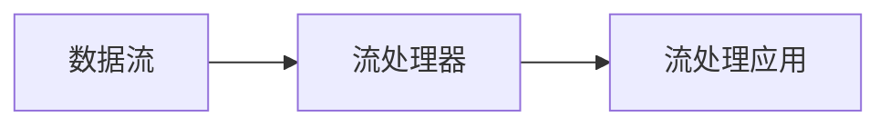

流处理（Stream Processing）是指在数据流经由计算机网络或其他设备时，对其进行实时处理的技术。流处理可以在数据生成或传输过程中，实时地对数据进行分析、过滤、聚合、转换等操作。流处理技术广泛应用于各个领域，如物联网、金融、电力、交通等。

## 1. 背景介绍

流处理技术的出现，主要是为了应对大数据时代所带来的数据处理挑战。传统的数据处理技术，如批处理（Batch Processing）和存储式处理（Stored Processing），主要针对固定数据集进行处理，而流处理则可以实时地处理数据流，满足大数据时代的需求。

流处理技术的代表产品有 Apache Flink、Apache Storm、Apache Kafka 等。这些产品提供了强大的流处理能力，帮助企业解决了各类问题。

## 2. 核心概念与联系

流处理技术的核心概念包括数据流（Data Stream）、流处理器（Stream Processor）和流处理应用（Stream Processing Application）等。

数据流：数据流指的是数据在计算机网络或其他设备间流动的数据序列。数据流可以是来自各种数据源，如 IoT 设备、服务器日志、社交媒体等。

流处理器：流处理器是一种计算机硬件或软件系统，用于对数据流进行处理。流处理器可以通过各种算法和操作对数据流进行分析、过滤、聚合、转换等处理。

流处理应用：流处理应用是指利用流处理器对数据流进行处理的具体应用。流处理应用可以是实时数据分析、实时数据清洗、实时数据聚合等。

流处理技术的核心概念和联系如图所示：



## 3. 核心算法原理具体操作步骤

流处理的核心算法原理包括数据收集、数据清洗、数据分析、数据输出等。以下是流处理的具体操作步骤：

1. 数据收集：流处理器需要从各种数据源收集数据流。数据收集可以通过各种方式实现，如 HTTP 请求、文件读取、数据库查询等。

2. 数据清洗：数据清洗是指对收集到的数据流进行过滤、转换、填充等操作，以使数据更符合流处理的要求。数据清洗可以通过各种方法实现，如正则表达式匹配、数据类型转换、数据格式转换等。

3. 数据分析：数据分析是指对数据流进行各种分析操作，如统计分析、机器学习分析等。数据分析可以通过各种算法和方法实现，如计数、平均值、协方差等。

4. 数据输出：数据输出是指将数据分析结果输出到目标系统，如数据库、文件系统、消息队列等。数据输出可以通过各种方式实现，如 HTTP 响应、文件写入、消息发送等。

## 4. 数学模型和公式详细讲解举例说明

流处理的数学模型主要包括概率模型、线性模型、神经网络模型等。以下是流处理的数学模型举例说明：

1. 概率模型：概率模型可以用于对数据流进行概率分析，如伯努利分布、正态分布、泊松分布等。例如，一个社交媒体平台的点赞事件可以用泊松分布进行建模。

2. 线性模型：线性模型可以用于对数据流进行线性关系分析，如多元线性回归、主成分分析等。例如，一个电商平台的销量可以用多元线性回归模型进行预测。

3. 神经网络模型：神经网络模型可以用于对数据流进行复杂关系分析，如卷积神经网络、循环神经网络等。例如，一个语音识别系统可以用卷积神经网络进行训练。

## 5. 项目实践：代码实例和详细解释说明

以下是一个流处理项目的代码实例和详细解释说明：

1. 代码实例：使用 Apache Flink 创建一个流处理应用，实现对 HTTP 请求数据流的计数。

```java
import org.apache.flink.api.common.functions.MapFunction;
import org.apache.flink.streaming.api.datastream.DataStream;
import org.apache.flink.streaming.api.environment.StreamExecutionEnvironment;

public class HttpCount {

    public static void main(String[] args) throws Exception {
        StreamExecutionEnvironment env = StreamExecutionEnvironment.getExecutionEnvironment();

        DataStream<String> inputStream = env.addSource(new FlinkKafkaConsumer<>("http", new SimpleStringSchema(), properties));

        DataStream<String> wordStream = inputStream.flatMap(new TokenizerFunction());

        DataStream<String> wordCountStream = wordStream.keyBy(new WordCountFunction()).sum(new WordCountSumFunction());

        wordCountStream.print();

        env.execute("Http Count");
    }
}
```

1. 详细解释说明：此代码实例使用 Apache Flink 创建了一个流处理应用，实现了对 HTTP 请求数据流的计数。代码中首先定义了一个 `FlinkKafkaConsumer`，用于从 Kafka Topic "http" 中读取 HTTP 请求数据流。然后使用 `flatMap` 函数将数据流分解为单词。接着使用 `keyBy` 函数对单词进行分组，并使用 `sum` 函数计算每个单词的计数。最后使用 `print` 函数输出结果。

## 6. 实际应用场景

流处理技术广泛应用于各个领域，如物联网、金融、电力、交通等。以下是流处理的一些实际应用场景：

1. 物联网：对 IoT 设备产生的实时数据进行处理和分析，实现设备状态监控、故障预警、设备管理等。

2. 金融：对金融数据流进行实时处理和分析，实现交易监控、风险管理、投资决策等。

3. 电力：对电力数据流进行实时处理和分析，实现电力消耗监控、电力故障检测、电力预测等。

4. 交通：对交通数据流进行实时处理和分析，实现交通状况监控、交通事故预警、交通规划等。

## 7. 工具和资源推荐

以下是一些流处理工具和资源的推荐：

1. 流处理工具：Apache Flink、Apache Storm、Apache Kafka、Apache Samza、Apache Beam 等。

2. 流处理资源：数据流处理教程、流处理实践指南、流处理案例分析等。

## 8. 总结：未来发展趋势与挑战

流处理技术在大数据时代具有重要作用。未来，流处理技术将继续发展，面临以下挑战：

1. 数据量扩展：随着数据量的持续增长，流处理系统需要保持高性能和高可用性。

2. 数据质量保障：流处理系统需要具备强大的数据清洗和数据质量保障能力。

3. 模型复杂度：流处理系统需要能够处理复杂的数据分析任务，包括深度学习和强化学习等。

4. 数据安全与隐私：流处理系统需要具备数据安全和数据隐私保护能力。

## 9. 附录：常见问题与解答

以下是一些流处理常见问题及其解答：

1. Q: 流处理与批处理有什么区别？

A: 流处理与批处理的主要区别在于处理方式。批处理是对固定数据集进行处理，而流处理是对数据流进行实时处理。流处理具有实时性、动态性和高吞吐量等优势。

2. Q: 流处理的应用场景有哪些？

A: 流处理广泛应用于各个领域，如物联网、金融、电力、交通等。流处理可以用于数据监控、数据预警、数据分析等任务。

3. Q: Apache Flink 和 Apache Storm 的区别是什么？

A: Apache Flink 和 Apache Storm 都是流处理框架，但它们的设计哲学和实现方式有所不同。Flink 是一种数据流处理框架，它支持高吞吐量、高容错和状态管理等特性。Storm 是一种分布式流处理框架，它支持高可靠性、高可用性和便于扩展等特性。

以上就是关于流处理原理与代码实例讲解的文章。希望对读者有所帮助。