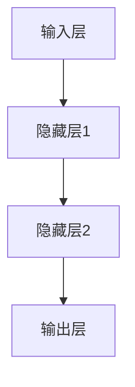
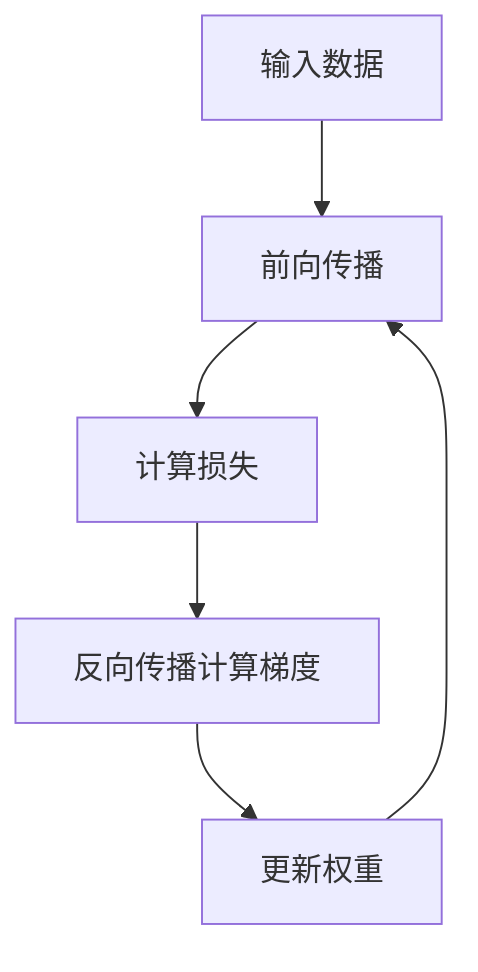
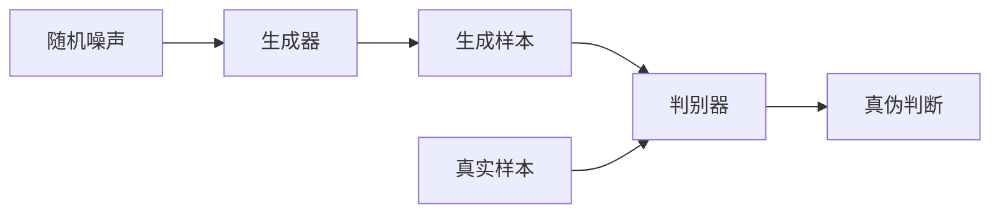

# 深度学习(Deep Learning) - 原理与代码实例讲解

## 1.背景介绍

深度学习(Deep Learning)作为机器学习的一个新的研究热点,近年来受到了广泛关注和应用。它是一种基于对数据进行表示学习的机器学习方法,通过对数据的特征进行多层次非线性变换来学习数据的分布式特征表示,从而使机器能够更好地解决手工遇到的特征工程问题。

深度学习的概念源于人工神经网络的研究,它模仿了人类大脑神经元相互连接的网络结构和信息传递规则,通过构建多层次的神经网络模型来实现对复杂数据的高效处理和模式识别。与传统的机器学习算法相比,深度学习具有自动学习数据特征表示的能力,不需要人工设计特征,从而避免了复杂的特征工程过程。

深度学习的发展经历了三个主要阶段:

1. **浅层神经网络时期(1940s-1990s)**: 研究人员提出了最初的神经网络模型,如感知器(Perceptron)和多层感知器(Multi-Layer Perceptron),但由于计算能力有限和训练算法的缺陷,这些模型只能解决简单的线性可分问题。

2. **深度神经网络的兴起(1990s-2010s)**: 通过提出新的训练算法(如反向传播算法)和激活函数(如ReLU),研究人员开始探索深度神经网络模型,如卷积神经网络(CNN)和循环神经网络(RNN),取得了在图像识别、语音识别等领域的突破性进展。

3. **深度学习的全面应用(2010s-至今)**: 随着大数据时代的到来和计算能力的飞速提升,深度学习得到了广泛的应用,涉及计算机视觉、自然语言处理、语音识别、推荐系统等多个领域。同时,新的深度学习模型和训练算法不断被提出,推动着这一领域的快速发展。

## 2.核心概念与联系

深度学习涉及了多个核心概念,这些概念之间存在着密切的联系,共同构建了深度学习的理论基础和实践框架。以下是一些重要的核心概念:

### 2.1 人工神经网络(Artificial Neural Network)

人工神经网络是深度学习的基础模型,它由多个神经元(节点)和连接它们的权重组成。每个神经元接收来自前一层的输入,经过加权求和和非线性激活函数的处理,产生输出传递给下一层。通过反复调整神经网络中的权重,可以学习到能够很好地拟合训练数据的模型。

### 2.2 反向传播算法(Backpropagation)

反向传播算法是训练深度神经网络的核心算法,它通过计算损失函数对网络权重的梯度,并使用优化算法(如梯度下降)来更新权重,从而使模型在训练数据上的性能不断提高。反向传播算法的提出解决了深度神经网络训练的关键问题,是深度学习发展的重要里程碑。

### 2.3 卷积神经网络(Convolutional Neural Network, CNN)

卷积神经网络是深度学习在计算机视觉领域的重要应用,它通过卷积层和池化层来自动学习图像的特征表示,具有对平移、缩放等变换的稳健性。CNN在图像分类、目标检测、语义分割等任务中表现出色,是当前计算机视觉的主流模型。

### 2.4 循环神经网络(Recurrent Neural Network, RNN)

循环神经网络是处理序列数据(如文本、语音)的有力工具,它通过引入循环连接来捕获序列数据中的长期依赖关系。RNN及其变体(如LSTM、GRU)在自然语言处理、语音识别等领域有广泛应用。

### 2.5 生成对抗网络(Generative Adversarial Network, GAN)

生成对抗网络是一种通过对抗训练的方式来学习数据分布的生成模型,它包含一个生成器(Generator)和一个判别器(Discriminator),两者相互对抗,最终使生成器能够生成与真实数据无法区分的样本。GAN在图像生成、语音合成等领域有重要应用。

这些核心概念相互关联、相互影响,共同构建了深度学习的理论框架和实践应用。掌握这些概念对于理解和应用深度学习至关重要。

## 3.核心算法原理具体操作步骤

深度学习的核心算法主要包括前向传播(Forward Propagation)和反向传播(Backpropagation)两个步骤,以及相关的优化算法。下面将详细介绍这些算法的具体操作步骤。

### 3.1 前向传播

前向传播是深度神经网络进行预测的过程,它将输入数据通过网络的各层传递,最终得到输出结果。具体步骤如下:

1. **输入层**: 将输入数据 $X$ 传递给第一层(输入层)的神经元。

2. **隐藏层**: 对于每一个隐藏层,执行以下操作:
   - 计算每个神经元的加权输入 $z = \sum_{i} w_i x_i + b$,其中 $w_i$ 是连接权重, $x_i$ 是上一层神经元的输出, $b$ 是偏置项。
   - 通过激活函数 $f(z)$ 计算神经元的输出 $a = f(z)$。常用的激活函数包括 Sigmoid、ReLU 等。
   - 将输出 $a$ 传递给下一层的神经元。

3. **输出层**: 在输出层,根据具体任务计算损失函数 $L(y, \hat{y})$,其中 $y$ 是真实标签, $\hat{y}$ 是模型预测输出。

通过前向传播,我们可以获得模型在给定输入下的预测输出和损失值。但是,为了使模型能够学习到更好的参数,我们需要进行反向传播来更新权重。

### 3.2 反向传播

反向传播是通过计算损失函数相对于网络权重的梯度,并使用优化算法来更新权重,从而最小化损失函数的过程。具体步骤如下:

1. **计算输出层梯度**: 根据损失函数 $L$ 对输出层神经元的输出 $\hat{y}$ 求偏导,得到输出层梯度 $\delta^L = \frac{\partial L}{\partial \hat{y}}$。

2. **反向传播梯度**: 从输出层开始,依次计算每一层的梯度:
   - 对于输出层之前的每一层 $l$,计算该层梯度 $\delta^l = (\sum_{j} w_j^{l+1} \delta_j^{l+1}) \odot f'(z^l)$,其中 $w_j^{l+1}$ 是连接到下一层的权重, $\delta_j^{l+1}$ 是下一层的梯度, $f'(z^l)$ 是该层激活函数的导数。
   - 通过链式法则,计算该层每个权重 $w_i^l$ 和偏置 $b_i^l$ 的梯度:$\frac{\partial L}{\partial w_i^l} = a_i^{l-1} \delta_i^l$ 和 $\frac{\partial L}{\partial b_i^l} = \delta_i^l$,其中 $a_i^{l-1}$ 是上一层的输出。

3. **更新权重**: 使用优化算法(如梯度下降、Adam 等)根据计算得到的梯度来更新网络中的权重和偏置:
   - $w_i^l \leftarrow w_i^l - \eta \frac{\partial L}{\partial w_i^l}$
   - $b_i^l \leftarrow b_i^l - \eta \frac{\partial L}{\partial b_i^l}$
   
   其中 $\eta$ 是学习率,控制了更新的步长。

通过反复执行前向传播和反向传播,神经网络可以不断调整权重,使得在训练数据上的损失函数最小化,从而学习到能够很好地拟合数据的模型。

## 4.数学模型和公式详细讲解举例说明

深度学习中涉及到许多数学模型和公式,这些公式反映了深度学习的理论基础和算法原理。下面将详细讲解一些核心的数学模型和公式,并给出具体的例子说明。

### 4.1 神经网络模型

神经网络是深度学习的基础模型,它由多个神经元(节点)和连接它们的权重组成。每个神经元接收来自前一层的输入,经过加权求和和非线性激活函数的处理,产生输出传递给下一层。

对于一个单层神经网络,其数学模型可以表示为:

$$
y = f\left(\sum_{i=1}^{n} w_i x_i + b\right)
$$

其中:
- $x_i$ 是第 $i$ 个输入特征
- $w_i$ 是第 $i$ 个输入特征对应的权重
- $b$ 是偏置项
- $f$ 是非线性激活函数,如 Sigmoid 函数或 ReLU 函数

对于多层神经网络,每一层的输出将作为下一层的输入,形成一个层层传递的过程。

例如,对于一个两层神经网络,其数学模型可以表示为:

$$
h = f_1\left(\sum_{i=1}^{n} w_i^{(1)} x_i + b^{(1)}\right)
$$

$$
y = f_2\left(\sum_{j=1}^{m} w_j^{(2)} h_j + b^{(2)}\right)
$$

其中:
- $h$ 是隐藏层的输出
- $f_1$ 和 $f_2$ 分别是隐藏层和输出层的激活函数
- $w^{(1)}$ 和 $w^{(2)}$ 分别是输入层到隐藏层和隐藏层到输出层的权重
- $b^{(1)}$ 和 $b^{(2)}$ 分别是隐藏层和输出层的偏置项

通过调整神经网络中的权重和偏置,我们可以使模型在训练数据上的损失函数最小化,从而学习到能够很好地拟合数据的模型。

### 4.2 反向传播算法

反向传播算法是训练深度神经网络的核心算法,它通过计算损失函数对网络权重的梯度,并使用优化算法(如梯度下降)来更新权重,从而使模型在训练数据上的性能不断提高。

假设我们有一个单层神经网络,输入为 $X$,输出为 $y$,真实标签为 $t$,损失函数为 $L(y, t)$。我们需要计算损失函数相对于权重 $w_i$ 和偏置 $b$ 的梯度,以便更新参数。

根据链式法则,我们有:

$$
\frac{\partial L}{\partial w_i} = \frac{\partial L}{\partial y} \cdot \frac{\partial y}{\partial w_i}
$$

$$
\frac{\partial L}{\partial b} = \frac{\partial L}{\partial y} \cdot \frac{\partial y}{\partial b}
$$

其中:
- $\frac{\partial L}{\partial y}$ 是损失函数相对于输出的梯度,可以根据具体的损失函数计算得到。
- $\frac{\partial y}{\partial w_i}$ 和 $\frac{\partial y}{\partial b}$ 分别是输出相对于权重和偏置的梯度,可以通过链式法则和激活函数的导数计算得到。

例如,对于平方损失函数 $