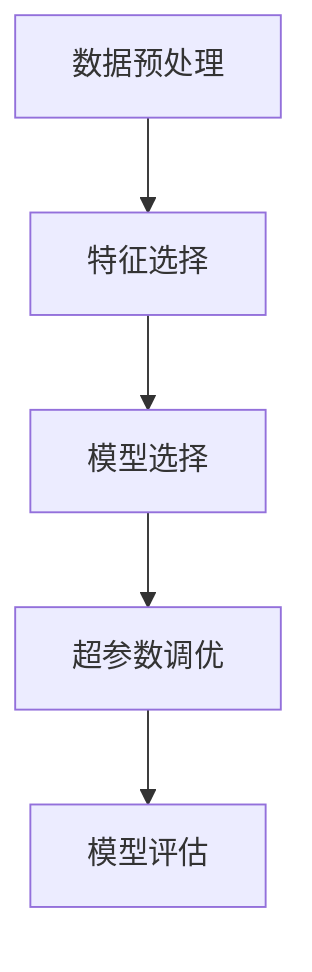

## 背景介绍

随着人工智能（AI）和机器学习（ML）的不断发展，自动机器学习（AutoML）也成为了一种热门的研究方向。自动机器学习致力于自动化机器学习过程，将机器学习的过程从人工操作变为一种自动化的过程。这种自动化可以包括从数据中自动发现最佳的特征和模型，也可以包括自动选择和调整模型的超参数。

## 核心概念与联系

自动机器学习可以分为两大类：一是自动特征选择（Auto Feature Selection），二是自动模型选择（Auto Model Selection）。自动特征选择可以帮助我们自动选择最有价值的特征，而自动模型选择则可以帮助我们自动选择最合适的模型。

自动机器学习的核心概念是自动化机器学习过程。自动化可以包括从数据中自动发现最佳的特征和模型，也可以包括自动选择和调整模型的超参数。自动机器学习可以帮助我们提高模型的准确性和效率，降低开发和部署的门槛。

## 核心算法原理具体操作步骤

自动机器学习的核心算法原理可以分为以下几个步骤：

1. 数据预处理：将原始数据进行清洗、标准化、归一化等处理，确保数据质量。

2. 特征选择：自动选择最有价值的特征，减少过拟合的风险。

3. 模型选择：自动选择最合适的模型，提高模型的准确性和效率。

4. 超参数调优：自动调整模型的超参数，进一步优化模型性能。

## 数学模型和公式详细讲解举例说明

自动机器学习的数学模型和公式可以使用以下几个关键词来描述：

1. 数据清洗：数据清洗的过程可以使用以下公式进行描述：

$$
clean\_data = f(data)
$$

其中，$data$表示原始数据，$clean\_data$表示清洗后的数据。

2. 特征选择：特征选择的过程可以使用以下公式进行描述：

$$
selected\_features = f(data, features)
$$

其中，$data$表示原始数据，$features$表示所有可能的特征，$selected\_features$表示选出的最有价值的特征。

3. 模型选择：模型选择的过程可以使用以下公式进行描述：

$$
model = f(data, models)
$$

其中，$data$表示原始数据，$models$表示所有可能的模型，$model$表示选出的最合适的模型。

4. 超参数调优：超参数调优的过程可以使用以下公式进行描述：

$$
optimized\_parameters = f(model, parameters)
$$

其中，$model$表示选出的最合适的模型，$parameters$表示所有可能的超参数，$optimized\_parameters$表示调优后的超参数。

## 项目实践：代码实例和详细解释说明

自动机器学习的项目实践可以使用以下几个流程图来描述：

## 实际应用场景

自动机器学习的实际应用场景有以下几个方面：

1. 数据清洗：自动机器学习可以帮助我们自动清洗数据，提高数据质量。

2. 特征选择：自动机器学习可以帮助我们自动选择最有价值的特征，减少过拟合的风险。

3. 模型选择：自动机器学习可以帮助我们自动选择最合适的模型，提高模型的准确性和效率。

4. 超参数调优：自动机器学习可以帮助我们自动调整模型的超参数，进一步优化模型性能。

## 工具和资源推荐

自动机器学习的工具和资源有以下几点推荐：

1. TensorFlow：TensorFlow是一个开源的机器学习和深度学习框架，可以用于自动机器学习。

2. scikit-learn：scikit-learn是一个开源的Python机器学习库，可以用于自动机器学习。

3. AutoML：AutoML是一种自动机器学习的技术，可以用于自动化机器学习过程。

## 总结：未来发展趋势与挑战

自动机器学习的未来发展趋势和挑战有以下几点：

1. 数据清洗：自动机器学习需要解决数据清洗的问题，提高数据质量。

2. 特征选择：自动机器学习需要解决特征选择的问题，减少过拟合的风险。

3. 模型选择：自动机器学习需要解决模型选择的问题，提高模型的准确性和效率。

4. 超参数调优：自动机器学习需要解决超参数调优的问题，进一步优化模型性能。

## 附录：常见问题与解答

自动机器学习的常见问题与解答有以下几点：

1. 数据清洗的问题：数据清洗是一个重要的过程，可以使用各种方法进行处理，例如去除重复数据、填充缺失值、删除异常值等。

2. 特征选择的问题：特征选择是一个关键步骤，可以使用各种方法进行处理，例如筛选重要特征、删除无关特征、使用主成分分析（PCA）等。

3. 模型选择的问题：模型选择是一个关键步骤，可以使用各种方法进行处理，例如使用交叉验证选择最佳模型、使用贝叶斯优化选择最佳模型等。

4. 超参数调优的问题：超参数调优是一个关键步骤，可以使用各种方法进行处理，例如使用随机搜索选择最佳超参数、使用梯度下降优化超参数等。

作者：禅与计算机程序设计艺术 / Zen and the Art of Computer Programming