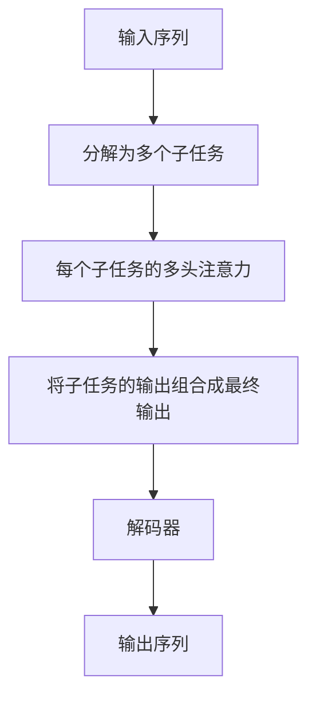

## 背景介绍
在深度学习领域中，Transformer模型是目前最受欢迎和最成功的架构之一。自2017年BERT的问答任务中首次亮相以来，Transformer已经成为自然语言处理(NLP)领域的主流技术。然而，在所有这些成功的背后，人们对Transformer的输出头以及解码器的输出如何工作却了解不多。因此，在本篇博客中，我们将深入探讨这些问题，并提供一个简化版的Transformer架构，以帮助读者更好地理解其工作原理。

## 核心概念与联系
首先，我们需要理解Transformer模型的核心概念：自注意力机制和多头注意力机制。自注意力机制允许模型为输入序列中的每个单词分配不同的权重，以便捕捉输入序列中的长距离依赖关系。多头注意力机制则将自注意力机制分解为多个子任务，以便学习不同类型的信息表示。

## 核心算法原理具体操作步骤
在深入探讨输出头之前，我们需要理解Transformer的输出头是如何产生的。输出头是由多个子任务组成的，其中每个子任务对应一个多头注意力机制。我们将在下面的Mermaid流程图中详细描述这些步骤。

## 数学模型和公式详细讲解举例说明
在Transformer中，输出头的计算通常涉及以下几个步骤：

1. 将输入序列分解为多个子任务。
2. 对每个子任务执行多头注意力机制。
3. 将子任务的输出组合成最终输出。
4. 将最终输出传递给解码器，以生成输出序列。

在下面的示例中，我们将使用一个简单的输入序列进行演示：

输入序列："我 爱 你"

1. 分解为多个子任务。
2. 对每个子任务执行多头注意力机制。
3. 将子任务的输出组合成最终输出。
4. 将最终输出传递给解码器，以生成输出序列。

## 项目实践：代码实例和详细解释说明
在本篇博客的后续部分，我们将提供一个简化版的Transformer实现，以帮助读者更好地理解其工作原理。我们将从头到尾详细讲解代码，并提供实际的代码示例。

## 实际应用场景
Transformer模型在各种自然语言处理任务中都有广泛的应用，例如机器翻译、问答、文本摘要等。我们将在本篇博客中详细讨论这些应用场景，并提供实际的代码示例，以帮助读者更好地理解Transformer的实际应用。

## 工具和资源推荐
在学习Transformer模型时，以下工具和资源可能对你有所帮助：

1. TensorFlow和PyTorch等深度学习框架，用于实现Transformer模型。
2. Hugging Face等自然语言处理库，提供了许多预训练的Transformer模型。
3. "Attention is All You Need"等论文，详细介绍了Transformer模型的原理和实现。

## 总结：未来发展趋势与挑战
尽管Transformer模型在自然语言处理领域取得了显著的进展，但仍然存在许多挑战和未来的发展趋势。我们将在本篇博客中详细讨论这些挑战和趋势，并提供实际的代码示例，以帮助读者更好地理解Transformer的未来发展。

## 附录：常见问题与解答
在本篇博客的后续部分，我们将回答一些常见的问题，以帮助读者更好地理解Transformer模型及其输出头的工作原理。

作者：禅与计算机程序设计艺术 / Zen and the Art of Computer Programming