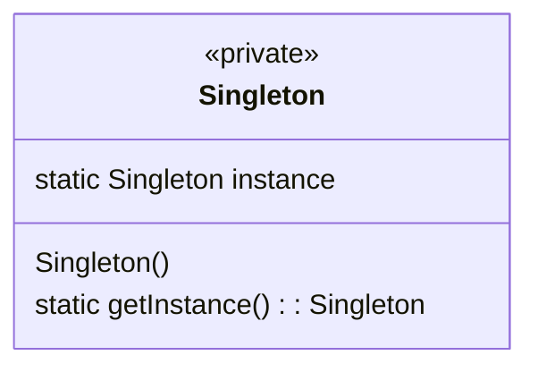
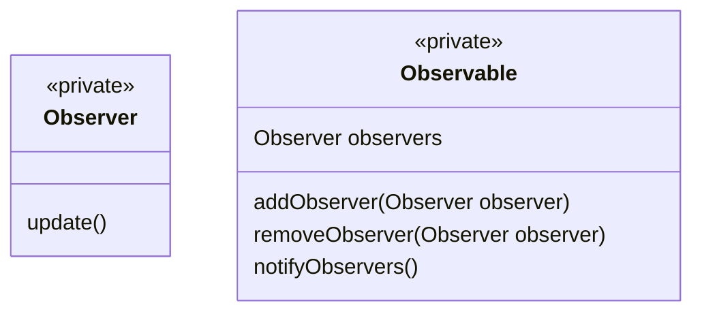

## 1.背景介绍

随着软件开发的不断发展，各种不同的设计模式和软件架构原理不断涌现出来，以满足不同阶段的软件开发需求。在本篇博客中，我们将深入探讨设计模式和软件架构原理的核心概念，以及它们在实际项目中的应用。同时，我们将结合实际代码案例进行详细的讲解，以帮助读者更好地理解这些概念。

## 2.核心概念与联系

### 2.1 设计模式

设计模式（Design Patterns）是针对常见软件设计问题的解决方案，它们为软件设计提供了一种可靠的方法。在软件开发过程中，设计模式可以帮助我们更好地组织代码，提高代码的可读性、可维护性和可扩展性。

### 2.2 软件架构原理

软件架构原理（Software Architecture Principles）是指导软件架构设计的基本原则，它们规定了软件架构的构建和演化过程。软件架构原理为软件开发提供了一种抽象层次，使得开发人员能够更好地理解系统的整体结构和组件之间的关系。

## 3.核心算法原理具体操作步骤

在本节中，我们将详细介绍设计模式和软件架构原理的核心算法原理及其具体操作步骤。

### 3.1 单例模式

单例模式（Singleton Pattern）是一种创建型设计模式，它保证在整个系统中只有一个类的实例。这个实例可以被全局访问。

1. 私有构造函数，防止外部创建多个实例。
2. 私有静态变量，存储唯一的实例。
3. 提供公有静态方法，返回唯一实例。



### 3.2 观察者模式

观察者模式（Observer Pattern）是一种行为型设计模式，它定义了对象间的一种相互依赖关系，使得当一个对象发生改变时，其他依赖其的对象也会受到影响。

1. 定义观察者接口，包含更新方法。
2. 定义被观察对象接口，包含通知观察者方法。
3. 在被观察对象中维护一个观察者列表。
4. 当被观察对象发生改变时，通知所有观察者更新自身。



## 4.数学模型和公式详细讲解举例说明

在本节中，我们将通过数学模型和公式详细讲解设计模式和软件架构原理的具体应用。

### 4.1 单例模式数学模型

假设我们有一个需要全局唯一的计数器，单例模式可以帮助我们实现这一功能。

1. 私有静态变量存储唯一实例。
2. 提供公有静态方法，返回唯一实例并增加计数。

```latex
\begin{equation}
  Singleton.getInstance().count()
\end{equation}
```

### 4.2 观察者模式数学模型

假设我们有一个温度传感器，通过观察者模式将温度数据推送给多个观察者。

1. 定义观察者接口，包含更新方法。
2. 定义被观察对象接口，包含通知观察者方法。
3. 在被观察对象中维护一个观察者列表。
4. 当被观察对象发生改变时，通知所有观察者更新自身。

```latex
\begin{equation}
  Observer.update()
  \newline
  Observable.notifyObservers()
\end{equation}
```

## 5.项目实践：代码实例和详细解释说明

在本节中，我们将通过具体的代码实例来讲解设计模式和软件架构原理的应用。

### 5.1 单例模式项目实践

```python
class Singleton:
    _instance = None

    def __new__(cls, *args, **kwargs):
        if not cls._instance:
            cls._instance = super(Singleton, cls).__new__(cls, *args, **kwargs)
        return cls._instance

    def __init__(self):
        self.count = 0

    def increment(self):
        self.count += 1

singleton = Singleton()
singleton.increment()
print(singleton.count) # 输出 1
```

### 5.2 观察者模式项目实践

```python
class Observer:
    def update(self, observable, *args, **kwargs):
        pass

class Observable:
    def __init__(self):
        self._observers = []

    def add_observer(self, observer):
        self._observers.append(observer)

    def remove_observer(self, observer):
        self._observers.remove(observer)

    def notify_observers(self, *args, **kwargs):
        for observer in self._observers:
            observer.update(self, *args, **kwargs)

class TemperatureSensor(Observable):
    def __init__(self):
        super(TemperatureSensor, self).__init__()

    def set_temperature(self, temperature):
        self.temperature = temperature
        self.notify_observers(temperature)

class Display(Observer):
    def update(self, observable, *args, **kwargs):
        print(f"Display: Temperature updated to {args[0]}")

sensor = TemperatureSensor()
display = Display()
sensor.add_observer(display)

sensor.set_temperature(25) # 输出 Display: Temperature updated to 25
```

## 6.实际应用场景

在本节中，我们将通过实际应用场景来讲解设计模式和软件架构原理的价值。

### 6.1 单例模式实际应用场景

单例模式常见的应用场景包括：

1. 全局唯一的配置对象，例如日志配置、缓存配置等。
2. 全局唯一的计数器，例如计时器、计数器等。
3. 全局唯一的资源管理器，例如数据库连接池、线程池等。

### 6.2 观察者模式实际应用场景

观察者模式常见的应用场景包括：

1. 系统监控，例如监控服务器性能、网络流量等。
2. 用户界面更新，例如响应用户操作、更新UI组件等。
3. 数据推送，例如推送新闻、推送消息等。

## 7.工具和资源推荐

在本节中，我们将推荐一些工具和资源，以帮助读者更好地理解设计模式和软件架构原理。

1. [Refactoring.Guru](https://refactoring.guru/design-patterns)：提供了设计模式的详细解释和代码示例。
2. [GitHub](https://github.com)：提供了大量开源项目，以帮助读者了解实际项目中的设计模式和软件架构原理。
3. [Design Patterns: Elements of Reusable Object-Oriented Software](https://www.amazon.com/Design-Patterns-Elements-Reusable-Object-Oriented/dp/0201633612)：这是一本经典的设计模式书籍，提供了深入的设计模式理论和实际案例。

## 8.总结：未来发展趋势与挑战

在本节中，我们将总结设计模式和软件架构原理的未来发展趋势与挑战。

### 8.1 未来发展趋势

随着技术的不断发展，设计模式和软件架构原理将越来越重要。未来，设计模式将越来越多地应用于分布式系统、云计算、大数据等领域。同时，软件架构原理将更加关注可扩展性、可维护性和安全性等方面。

### 8.2 挑战

在未来，设计模式和软件架构原理面临以下挑战：

1. 技术演变：随着技术的发展，设计模式和软件架构原理需要不断更新和改进，以适应新的技术趋势。
2. 复杂性：随着系统规模的扩大，设计模式和软件架构原理需要更加复杂的解决方案，以满足系统的需求。
3. 安全性：随着网络和数据的越来越重要，设计模式和软件架构原理需要更加关注安全性问题。

## 9.附录：常见问题与解答

在本节中，我们将回答一些常见的问题，以帮助读者更好地理解设计模式和软件架构原理。

### 9.1 设计模式与软件架构原理的区别

设计模式是一种解决特定问题的通用解决方案，而软件架构原理是一组指导软件架构设计的基本原则。设计模式主要关注代码层面的结构和组织，而软件架构原理关注系统层面的结构和组织。

### 9.2 设计模式与软件架构的关系

设计模式和软件架构是紧密相关的。设计模式可以作为软件架构的组成部分，以帮助实现软件架构原理所规定的设计目标。

### 9.3 设计模式与软件开发流程的关系

设计模式与软件开发流程是互相影响的。设计模式可以指导软件开发流程，以提高开发效率和代码质量。而软件开发流程也可以影响设计模式的选择和应用。

作者：禅与计算机程序设计艺术 / Zen and the Art of Computer Programming