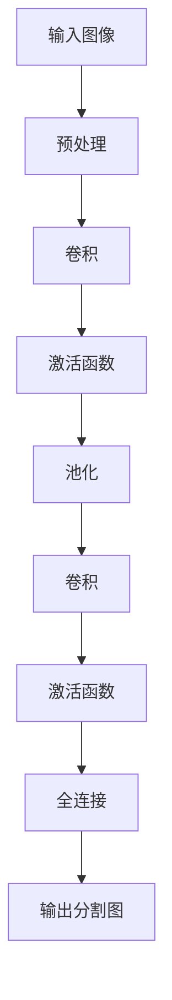

## 背景介绍

语义分割是一种计算机视觉任务，旨在将输入图像中每个像素都分配一个类别标签。与传统的像素级分类不同，语义分割关注的是整个图像或图像区域的内容，能够生成更为抽象的分割图。语义分割在自动驾驶、机器人视觉、图像编辑等领域具有广泛的应用前景。

本文将从以下几个方面探讨语义分割原理与代码实例：

1. 核心概念与联系
2. 核心算法原理具体操作步骤
3. 数学模型和公式详细讲解举例说明
4. 项目实践：代码实例和详细解释说明
5. 实际应用场景
6. 工具和资源推荐
7. 总结：未来发展趋势与挑战
8. 附录：常见问题与解答

## 核心概念与联系

语义分割任务可以看作是一种多类别图像分类问题。与传统图像分类不同的是，语义分割需要对图像进行分割，得到一个分割图。分割图表示了每个像素所属的类别。语义分割的目标是生成一个高质量的分割图，从而能够准确地识别图像中的物体、背景等内容。

## 核心算法原理具体操作步骤

语义分割的主要算法包括卷积神经网络（CNN）和全卷积网络（FCN）。CNN是一种深度学习算法，通过堆叠多层卷积和激活函数来学习图像特征。FCN则是一种改进的CNN算法，通过将全连接层替换为卷积层来实现空间金字塔Pooling操作，从而保留空间关系。

下面是一个简化的FCN算法流程图：

## 数学模型和公式详细讲解举例说明

在本部分，我们将详细讲解FCN的数学模型和公式。

### 卷积

卷积是一种局部连接的操作，将输入图像中的小区域与神经网络中的滤波器进行相乘，并对其进行累积求和。数学公式为：

$$
y_{ij} = \sum_{k=1}^{K} \sum_{m=1}^{M} \sum_{n=1}^{N} W_{k,m,n} \cdot x_{i+k-1,j+m-1,n} + b
$$

其中，$y_{ij}$表示输出图像的像素值，$x_{i,j,n}$表示输入图像的像素值，$W_{k,m,n}$表示滤波器的权重，$b$表示偏置。

### 池化

池化是一种 subsampling 操作，将输入图像中的大区域聚合成一个小区域。常用的池化方法有Max Pooling和Average Pooling。Max Pooling选择每个池化窗口内的最大值作为输出，而Average Pooling则是选择平均值。

### 全连接

全连接层是一种常见的深度学习层，用于将卷积层或池化层的输出展平为一维向量，然后与输出层之间进行连接。全连接层的权重参数需要进行初始化，以避免过拟合。

## 项目实践：代码实例和详细解释说明

在本部分，我们将通过一个简单的语义分割项目实例来详细解释代码实现。

### 数据集与预处理

为了评估语义分割模型，我们可以使用公开的Pascal VOC数据集。数据集包含21个类别，包括背景和物体等。预处理步骤包括图像裁剪、缩放、翻转等操作，以增强数据集大小。

### 模型构建

我们将使用TensorFlow和Keras库来构建语义分割模型。模型结构如下：

1. 输入层：接受输入图像，并将其转换为固定大小的图像。
2. 卷积层：堆叠多个卷积层，学习图像特征。
3. 池化层：使用Max Pooling操作进行subsampling。
4. 激活函数：使用ReLU激活函数进行非线性变换。
5. 全连接层：将卷积层和池化层的输出展平为一维向量，并与输出层进行连接。
6. 输出层：使用softmax函数将输出分割为21个类别。

### 训练与评估

训练过程中，我们将使用交叉熵损失函数进行优化，并使用Adam优化器进行更新。评估模型性能时，我们可以使用像素级准确率（Pixel Accuracy）和交割准确率（Intersection over Union，IoU）等指标。

## 实际应用场景

语义分割技术在许多实际应用场景中具有广泛的应用前景，例如：

1. 自动驾驶：通过语义分割技术，汽车可以识别周围环境中的行人、车辆等物体，从而实现安全的自动驾驶。
2. 机器人视觉：机器人可以通过语义分割技术识别周围环境，实现物体跟踪、避让等功能。
3. 图像编辑：语义分割技术可以用于图像分割，实现对图像进行更精细的编辑操作。

## 工具和资源推荐

为了学习和实践语义分割技术，以下是一些建议的工具和资源：

1. TensorFlow：一种流行的深度学习框架，提供了许多预训练模型和工具，方便快速实现语义分割任务。
2. Keras：一种高级神经网络API，基于TensorFlow构建，易于使用，适合初学者。
3. Pascal VOC：公开的语义分割数据集，包含21个类别，可以用于评估和训练模型。
4. Semantic Segmentation with Deep Learning：一本介绍语义分割技术的深度学习书籍，包含许多实例和代码。

## 总结：未来发展趋势与挑战

语义分割技术在计算机视觉领域具有广泛的应用前景。随着深度学习技术的不断发展，语义分割模型的性能也在不断提高。然而，未来仍然面临诸多挑战，如数据稀疏、计算复杂性等。我们相信，随着技术的不断进步，语义分割技术将在更多领域得到广泛应用。

## 附录：常见问题与解答

1. 语义分割与像素级分类的区别？

语义分割和像素级分类都是计算机视觉任务，但它们的区别在于分割粒度。像素级分类关注每个像素点的类别，而语义分割关注整个图像或图像区域的内容。

2. 语义分割模型中常用的算法有哪些？

语义分割模型中常用的算法有卷积神经网络（CNN）和全卷积网络（FCN）。CNN是一种深度学习算法，通过堆叠多层卷积和激活函数来学习图像特征。FCN则是一种改进的CNN算法，通过将全连接层替换为卷积层实现空间金字塔Pooling操作，从而保留空间关系。

3. 如何解决语义分割中的数据稀疏问题？

解决数据稀疏问题的一种方法是通过数据增强技术，如图像翻转、裁剪等操作，将数据集大小扩大，从而提高模型性能。另一种方法是使用生成对抗网络（GAN）生成更多的数据样本。

作者：禅与计算机程序设计艺术 / Zen and the Art of Computer Programming