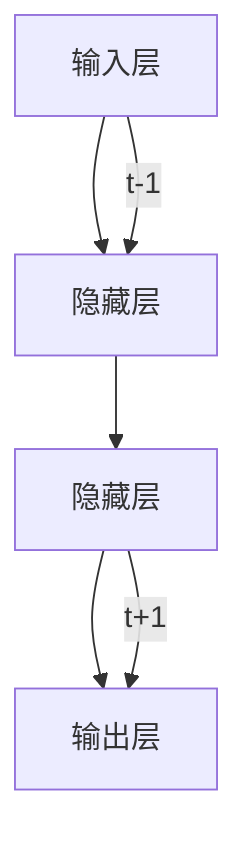

## 1. 背景介绍

递归神经网络（RNN, Recurrent Neural Network）是深度学习中一种特殊的神经网络，它具有处理序列数据的能力。与传统的神经网络不同，递归神经网络的结构允许信息在不同时间步上进行传播，这使得它们非常适合处理自然语言处理（NLP）和时间序列数据等任务。

本文将详细介绍递归神经网络的原理、核心算法及其数学模型，以及实际项目中的代码实例和应用场景。同时，我们还将讨论递归神经网络的未来发展趋势和挑战。

## 2. 核心概念与联系

递归神经网络的核心概念是其结构允许信息在不同时间步上进行传播。这种网络的每个节点都可以连接到其他节点，形成一个循环结构。这使得递归神经网络能够处理序列数据，并捕捉到时间依赖关系。

递归神经网络的主要组成部分包括：

1. 输入层：接受序列数据的输入；
2. 隐藏层：负责处理和传播信息；
3. 输出层：输出预测结果或分类标签。

递归神经网络的核心概念与联系可以用以下流程图进行概括：



## 3. 核心算法原理具体操作步骤

递归神经网络的核心算法原理是通过递归计算隐藏层节点的激活值。具体操作步骤如下：

1. 将输入序列分为若干个时间步；
2. 为每个时间步的输入节点计算激活值；
3. 递归地计算隐藏层节点的激活值，直到达到最大递归深度；
4. 将隐藏层节点的激活值作为输入，计算输出层节点的激活值；
5. 通过损失函数计算预测值和实际值之间的误差；
6. 使用反向传播算法更新网络权重。

## 4. 数学模型和公式详细讲解举例说明

递归神经网络的数学模型主要包括前向传播和反向传播两个部分。我们将分别对它们进行详细讲解。

### 4.1 前向传播

前向传播是递归神经网络的核心过程，用于计算隐藏层节点的激活值。数学公式如下：

$$
h_t = f(Ux_t + Wh_{t-1} + b)
$$

其中：

* $h_t$ 表示时间步 $t$ 的隐藏层节点激活值；
* $U$ 表示输入节点到隐藏层节点的权重矩阵；
* $x_t$ 表示时间步 $t$ 的输入节点激活值；
* $Wh_{t-1}$ 表示时间步 $t-1$ 的隐藏层节点激活值经过权重矩阵 $W$ 乘以的结果；
* $b$ 表示偏置项；
* $f$ 表示激活函数。

### 4.2 反向传播

反向传播是递归神经网络的另一个核心过程，用于计算损失函数和实际值之间的误差，并更新网络权重。数学公式如下：

$$
\Delta W = \frac{\partial L}{\partial W} = \frac{\partial L}{\partial h_t} \frac{\partial h_t}{\partial W}
$$

其中：

* $\Delta W$ 表示权重矩阵的更新值；
* $L$ 表示损失函数；
* $h_t$ 表示时间步 $t$ 的隐藏层节点激活值；
* $W$ 表示权重矩阵。

## 5. 项目实践：代码实例和详细解释说明

在本节中，我们将通过一个实际项目的代码实例来详细解释递归神经网络的原理。我们将使用 Python 语言和 Keras 库实现一个简单的递归神经网络来进行文字分类任务。

### 5.1 数据预处理

首先，我们需要准备一个数据集。我们将使用 Python 的 NumPy 库从一个 CSV 文件中加载数据。

```python
import numpy as np

data = np.loadtxt('data.csv', delimiter=',')
X = data[:, :-1]
y = data[:, -1]
```

### 5.2 模型定义

接下来，我们将使用 Keras 库定义一个简单的递归神经网络模型。

```python
from keras.models import Sequential
from keras.layers import Embedding, SimpleRNN, Dense

model = Sequential()
model.add(Embedding(input_dim=100, output_dim=50))
model.add(SimpleRNN(units=50, return_sequences=True))
model.add(SimpleRNN(units=50))
model.add(Dense(units=1, activation='sigmoid'))
```

### 5.3 编译和训练

最后，我们将编译和训练模型。

```python
model.compile(optimizer='rmsprop', loss='binary_crossentropy', metrics=['accuracy'])
model.fit(X, y, epochs=10, batch_size=32)
```

## 6.实际应用场景

递归神经网络广泛应用于各种自然语言处理和时间序列预测任务。以下是一些典型的应用场景：

1. 文本生成：如生成摘要、评论和聊天机器人等；
2. 语义角色标注：如识别句子中的主语、宾语和谓语等；
3. 情感分析：如对文本进行情感分core和情感强度评分等；
4. 图像序列识别：如视频对象识别和动作识别等；
5. 财务预测：如预测股票价格、销售额和利润等。

## 7. 工具和资源推荐

以下是一些关于递归神经网络的工具和资源推荐：

1. Keras:一个开源的深度学习框架，支持递归神经网络的快速实现和部署。
2. TensorFlow:一个开源的深度学习平台，提供了丰富的递归神经网络的实现和优化工具。
3. 《Deep Learning》:一个关于深度学习的经典书籍，涵盖了递归神经网络的理论和实践。
4. Coursera:提供了许多关于递归神经网络的在线课程和学习资源。

## 8. 总结：未来发展趋势与挑战

递归神经网络在自然语言处理和时间序列预测等领域具有广泛的应用前景。随着计算能力的不断提高和算法的不断改进，递归神经网络将在未来发展趋势中继续发挥重要作用。然而，递归神经网络也面临着一些挑战，如计算效率、训练时间和过拟合等。解决这些挑战将是未来研究的重点。

## 9. 附录：常见问题与解答

1. Q: 递归神经网络的主要优势是什么？

A: 递归神经网络的主要优势是它可以处理序列数据，捕捉时间依赖关系，并且能够捕捉长距离依赖关系。

1. Q: 递归神经网络的主要缺点是什么？

A: 递归神经网络的主要缺点是它的计算效率和训练时间相对较慢，还容易过拟合。

1. Q: 递归神经网络可以处理哪些类型的数据？

A: 递归神经网络可以处理序列数据，如自然语言、图像序列和时间序列等。

1. Q: 递归神经网络的应用场景有哪些？

A: 递归神经网络广泛应用于自然语言处理（如文本生成、语义角色标注和情感分析等）和时间序列预测（如图像序列识别和财务预测等）等领域。

## 结束语

递归神经网络是一种非常有趣和实用的一种神经网络，它具有处理序列数据的独特能力。通过本文的讲解，您应该对递归神经网络的原理、核心算法、数学模型以及实际应用场景有了更深入的了解。在未来的研究和实践中，您可以尝试将递归神经网络应用到您感兴趣的领域，以解决实际问题和提高技能。

作者：禅与计算机程序设计艺术 / Zen and the Art of Computer Programming