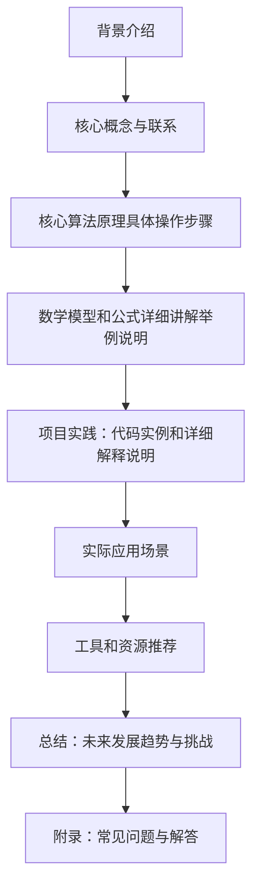

## 背景介绍

逻辑回归（Logistic Regression）是机器学习中的一种分类算法，其主要用于处理二分类问题。与线性回归不同，逻辑回归输出结果是一个概率值，而不是具体的数值。通过将概率值阈值化，可以得到最终的分类结果。

## 核心概念与联系

逻辑回归的核心概念是基于 logistic 函数，通过 logistic 函数将线性回归的输出结果进行转换，从而得到一个概率值。逻辑回归的联系在于，它可以将多种特征的线性组合作为输入，并输出一个概率值。

## 核心算法原理具体操作步骤

1. 初始化权值和偏置
2. 前向传播计算预测值
3. 计算损失函数
4. 后向传播计算梯度
5. 更新权值和偏置
6. 迭代训练

## 数学模型和公式详细讲解举例说明

### 1. logistic 函数

$$
sigmoid(x) = \frac{1}{1 + e^{-x}}
$$

### 2. 预测值计算

$$
y = sigmoid(WX + b)
$$

### 3. 损失函数

$$
J(\theta) = -\frac{1}{m}\sum_{i=1}^{m} [y^{(i)} \log(\hat{y}^{(i)}) + (1 - y^{(i)}) \log(1 - \hat{y}^{(i)})]
$$

### 4. 梯度计算

$$
\frac{\partial J}{\partial W} = -\frac{1}{m}X(T - \hat{y})^T
$$

$$
\frac{\partial J}{\partial b} = -\frac{1}{m}(T - \hat{y})
$$

### 5. 参数更新

$$
W := W - \alpha \frac{\partial J}{\partial W}
$$

$$
b := b - \alpha \frac{\partial J}{\partial b}
$$

### 6. 迭代训练

## 项目实践：代码实例和详细解释说明

在这个部分，我们将通过 Python 语言和 scikit-learn 库来实现逻辑回归的实际项目。我们将使用一个简单的示例数据集来演示逻辑回归的基本使用方法。

### 1. 导入库

```python
import numpy as np
import matplotlib.pyplot as plt
from sklearn.datasets import make_classification
from sklearn.linear_model import LogisticRegression
from sklearn.model_selection import train_test_split
from sklearn.metrics import accuracy_score
```

### 2. 加载数据集

```python
X, y = make_classification(n_samples=1000, n_features=20, n_informative=2, n_redundant=0, n_clusters_per_class=1, random_state=42)
X_train, X_test, y_train, y_test = train_test_split(X, y, test_size=0.3, random_state=42)
```

### 3. 训练逻辑回归模型

```python
lr = LogisticRegression()
lr.fit(X_train, y_train)
```

### 4. 测试模型性能

```python
y_pred = lr.predict(X_test)
accuracy = accuracy_score(y_test, y_pred)
print("Accuracy:", accuracy)
```

## 实际应用场景

逻辑回归在实际应用中广泛使用，如电子商务平台的用户行为分析、医疗诊断、金融欺诈检测等。通过对这些领域的实际应用案例分析，我们可以更好地理解逻辑回归在实际生产环境中的优势和局限性。

## 工具和资源推荐

- scikit-learn: Python 机器学习库，提供了 LogisticRegression 类和相关功能，方便用户快速尝试逻辑回归算法。
- Elements of Statistical Learning: 该书籍详细介绍了逻辑回归的理论基础和实际应用，非常值得一读。

## 总结：未来发展趋势与挑战

随着数据量的不断增加和数据特征的多样化，逻辑回归在实际应用中的应用范围和深度将得到进一步扩大。然而，逻辑回归在处理多类别问题和高维数据时仍然存在一定局限。未来，逻辑回归的发展趋势将是不断优化算法，提高准确性和效率，同时解决复杂问题。

## 附录：常见问题与解答

- Q: 逻辑回归的输出结果为什么是概率值？
A: 逻辑回归的输出结果是概率值，因为它采用了 logistic 函数进行处理。通过 logistic 函数，将线性回归的输出结果进行转换，从而得到一个概率值。

- Q: 逻辑回归在多类别问题中的应用？
A: 逻理回归主要用于二分类问题。对于多类别问题，可以使用多个独立的逻辑回归模型，或者使用 softmax 回归进行解决。

- Q: 如何处理逻辑回归中的过拟合问题？
A: 对于逻辑回归中的过拟合问题，可以尝试使用正则化（如 L1 正则化或 L2 正则化）来限制模型复杂度，或者增加训练数据。

[mermaid]
