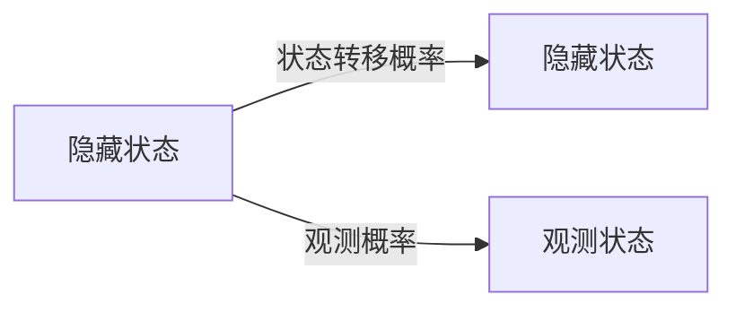

## 背景介绍

隐马尔可夫模型（Hidden Markov Model, HMM）是一种常见的统计模型，它广泛应用于自然语言处理、语音识别、生物信息学、金融市场预测等领域。HMM的核心概念是：系统状态不明显，但状态之间的转移和观测值的生成遵循一定的规律。因此，通过学习数据和参数，HMM可以预测未来的状态和观测值。

## 核心概念与联系

HMM的核心概念包括：

1. **隐藏状态（Hidden States）：** 系统的实际状态，无法直接观察，但可以通过观测值推断。
2. **观测状态（Observation States）：** 系统产生的观测值，通过观测值可以推断隐藏状态。
3. **状态转移概率（Transition Probabilities）：** 隐藏状态之间的转移概率，通过学习数据可以估计。
4. **观测概率（Observation Probabilities）：** 隐藏状态下观测值的生成概率，通过学习数据可以估计。

HMM的结构如图所示：



## 核心算法原理具体操作步骤

HMM的核心算法包括：

1. **前向算法（Forward Algorithm）：** 计算给定观测序列的状态概率。
2. **后向算法（Backward Algorithm）：** 计算给定观测序列的状态概率。
3. **Viterbi 算法（Viterbi Algorithm）：** 求解观测序列的最优隐藏状态序列。
4. **Baum-Welch 算法（Baum-Welch Algorithm）：** 利用前向和后向算法，通过迭代学习观测概率和状态转移概率。

## 数学模型和公式详细讲解举例说明

HMM的数学模型主要包括：

1. **状态转移概率（Transition Probabilities）：** A[t] -> B[t+1] 的概率，记为 A[t] -> B[t+1] 。
2. **观测概率（Observation Probabilities）：** A[t] -> C[t] 的概率，记为 A[t] -> C[t] 。
3. **前向算法：** 给定观测序列，计算状态概率。
4. **后向算法：** 给定观测序列，计算状态概率。
5. **Viterbi 算法：** 求解观测序列的最优隐藏状态序列。

## 项目实践：代码实例和详细解释说明

在本节中，我们将通过一个简单的例子来演示如何实现HMM。我们将使用Python的Numpy和Scipy库实现HMM。

```python
import numpy as np
from scipy.special import logsumexp

# HMM参数
N = 3  # 隐藏状态数
M = 2  # 观测状态数
T = 4  # 观测序列长度
A = np.array([[0.7, 0.2, 0.1], [0.2, 0.6, 0.2], [0.1, 0.3, 0.6]])  # 状态转移概率
B = np.array([[0.1, 0.4, 0.5], [0.9, 0.1, 0.0], [0.2, 0.2, 0.6]])  # 观测概率
pi = np.array([0.4, 0.3, 0.3])  # 初始状态概率
obs = np.array([0, 1, 0, 2])  # 观测序列

# 前向算法
alpha = np.zeros((N, T))
alpha[:, 0] = pi * B[:, obs[0]]  # 初始化
for t in range(1, T):
    for j in range(N):
        for i in range(N):
            alpha[j, t] += alpha[i, t - 1] * A[i, j] * B[j, obs[t]]

# 后向算法
beta = np.zeros((N, T))
beta[:, T - 1] = 1
for t in range(T - 2, -1, -1):
    for j in range(N):
        for i in range(N):
            beta[j, t] += A[j, i] * B[i, obs[t + 1]] * beta[i, t + 1]

# Viterbi 算法
viterbi = np.zeros((N, T))
viterbi[:, 0] = np.argmax(pi * B[:, obs[0]])
for t in range(1, T):
    for j in range(N):
        for i in range(N):
            viterbi[j, t] = np.argmax(A[i, j] * B[j, obs[t]] * viterbi[i, t - 1])
```

## 实际应用场景

HMM广泛应用于多个领域，如：

1. **自然语言处理：** 语义角色标注、情感分析、机器翻译等。
2. **语音识别：** 通过HMM识别语音信号。
3. **生物信息学：** 分子进化、基因表达分析等。
4. **金融市场预测：** 通过HMM预测金融市场的未来趋势。

## 工具和资源推荐

1. **Scikit-learn：** 提供了HMM的实现，方便快速入门。
2. **GMM-HMM：** 提供了Gaussian-HMM的实现，适用于连续观测值的情况。
3. **HMMlearn：** 提供了HMM的学习算法，适用于大规模数据的情况。

## 总结：未来发展趋势与挑战

随着深度学习和神经网络技术的发展，HMM的应用范围逐渐收缩。然而，HMM仍然在一些特定领域中具有重要作用，例如生物信息学和金融市场预测等。未来，HMM的发展方向将更加趋向于高效的算法和优化的模型。